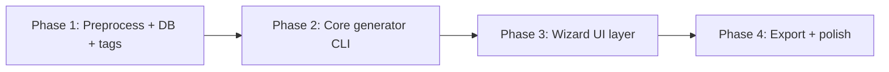

# Architecture options

Architectures for a **cross-platform** local tool (CLI + web). All assume **preprocessed oracle data in a local SQLite database**.

## Option A — CLI-first monolith (recommended for v1)

```
┌─────────────────────────────────────┐
│  CLI wizard (Python or .NET)        │
│  prompts → DeckCriteria → generator │
└─────────────────┬───────────────────┘
                  │
┌─────────────────▼───────────────────┐
│  Core library (pure logic)          │
│  filter · tag · score · slots ·     │
│  mana base · validate               │
└─────────────────┬───────────────────┘
                  │
┌─────────────────▼───────────────────┐
│  SQLite                             │
│  cards · tags · prices · indices    │
└─────────────────────────────────────┘
```

| Pros | Cons |
| --- | --- |
| Fastest path to working deck output | Less discoverable for casual users |
| Easy to test core logic | Multi-step UX limited by terminal |
| Same core library powers future UI | |

**Best when:** You want to prove slot-filling and tagging before investing in UI.

---

## Option B — Local / hosted web app (**selected for UX7**)

```
Browser (desktop + mobile)  ←→  FastAPI  ←→  service/  ←→  Engine  ←→  SQLite
        packages/web SPA
```

| Pros | Cons |
| --- | --- |
| Cross-platform without native ports | Requires API process (`serve`) |
| Mobile-first UX; card images via Scryfall CDN | Card images need network (engine does not) |
| Same stack works locally and on simple PaaS hosting | Single-writer SQLite — one user per instance |

**Best when:** Interactive dashboards, swap/lock, and charts matter (UX7, UX10, UX11).

Detail: [specs/web/architecture.md](../specs/web/architecture.md).

---

## Option C — Desktop GUI (native or hybrid)

```
WPF / WinUI / Tauri shell  ←→  Core library  ←→  SQLite
```

**Status:** Deferred. Web UI (Option B) covers desktop and mobile; revisit Tauri only for installable offline shell.

---

## Option D — Unified service layer (companion to B)

CLI and web share **`service/`** facades over the same engine:

```
CLI (in-process) ──→ service/ ──→ builder · rules · …
Web (HTTP)       ──→ api/     ──→ service/
```

| Pros | Cons |
| --- | --- |
| One implementation of orchestration + DTOs | Refactor CLI entrypoints incrementally |
| OpenAPI contract for frontend | Optional `--api-url` adds test surface |
| Dogfood unchanged (in-process CLI) | |

**Status:** **UX7 MVP shipped** — `service/`, `api/`, and `packages/web/` in tree; CLI uses in-process facades.

---

## Recommended phasing



1. **Preprocess** — Import JSON → SQLite, run tagger, build indices
2. **CLI vertical slice** — `deck-tools generate --commander "..." --tags aristocrats,tokens`
3. **Interactive wizard** — Add UI (CLI enhanced with questionary/Inquirer, or local web)
4. **Polish** — Export formats, deck stats dashboard, swap suggestions

## Component boundaries

| Module | Responsibility |
| --- | --- |
| `importer` | JSON → normalized rows, layout normalization |
| `tagger` | Apply taxonomy rules → tag table |
| `rules` | Commander legality validation |
| `criteria` | Wizard output model |
| `pool` | Filtered candidate queries |
| `scorer` | Rank cards for a slot |
| `builder` | Slot fill orchestration |
| `manabase` | Land count + color split |
| `export` | Text / CSV / Archidekt-ish format |

Keep **`builder` + `rules` UI-agnostic** so CLI and GUI share the same engine.

## Preprocessing vs. runtime

| Concern | Preprocess | Runtime |
| --- | --- | --- |
| Parse JSON | ✓ | |
| Mechanic tagging | ✓ | |
| Commander eligibility flags | ✓ | |
| Pip extraction | ✓ | |
| User criteria | | ✓ |
| Slot filling | | ✓ |
| Budget tracking | | ✓ |
| Validation | | ✓ |

Preprocessing runs when oracle bulk updates (~minutes once). Runtime deck build should complete in **< 2 seconds** on typical hardware.

## Alternative: embedded search engine

Instead of hand-rolled SQL filters, index cards in **SQLite FTS5** on `oracle_text` + `name` for theme search, while structured filters stay as columns.

Hybrid query example:

```sql
SELECT c.* FROM cards c
JOIN card_mechanic_tags t ON t.oracle_id = c.oracle_id
WHERE t.tag IN ('aristocrats')
  AND c.cmc <= 4
  AND c.color_identity <= ?
ORDER BY synergy_score DESC
LIMIT 50;
```

FTS is optional for v1 if curated tags cover user-facing mechanics.
