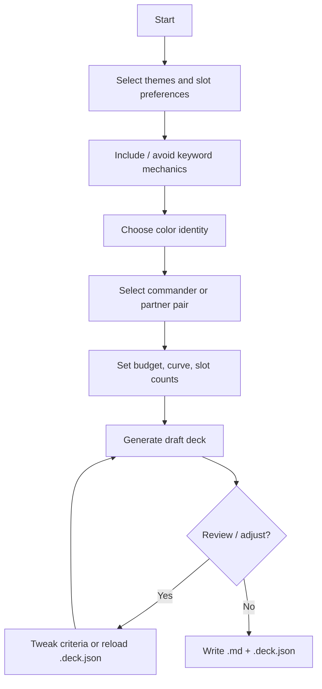

# Goals and Scope

## Problem

Building a Commander deck involves many interdependent choices: commander identity, color identity, mechanical themes, mana curve, land count, budget, and card synergy. Existing tools (EDHREC, Archidekt, Moxfield) help browse and refine decks but rarely **guide** a user from vague intent ("I want a Golgari aristocrats deck under $150") to a **complete, legal, playable** 100-card list.

## Goal

A **local, cross-platform** utility (CLI + optional HTTP API today; web SPA planned) that:

1. Walks the user through selection criteria (mechanics, types, themes, colors, CMC ranges, commander choice, budget, etc.)
2. Uses Scryfall oracle card data as the card library
3. Applies Commander format rules from the Comprehensive Rules
4. Outputs a 100-card deck list (commander + 99 unique cards) that is structurally playable (including a sensible mana base)

## Target audience and data freshness

**Product assumption:** Users are building with **older, used cards** (roughly **six months or more** on the secondary market), not chasing day-one Standard or Commander precon lists. For this audience:

| Implication | Decision |
| --- | --- |
| Latest printings / set releases | **Not important** for v1 product value |
| Card library | **Static** Scryfall oracle bulk snapshot bundled or imported once per release cycle |
| Prices | Point-in-time USD from bulk import; stale prices are acceptable |
| Updating `cards.db` and companion data | **Manual, explicit** maintainer step — not automatic background sync |
| Availability heuristics | Favor **established, tradable** cards; deprioritize obscure — see [card-availability.md](card-availability.md) |

The tool should not optimize for “newest cards” or frequent Scryfall polling. Version-stamp the bulk file and derived DB in metadata so users know which snapshot they are on. See [data-sources.md](../architecture/data-sources.md) for refresh workflow.

**Engineering consequence:** Dependency inventory (`card_effects`, feasibility indexes, `dependency-profiles.yaml` calibration) is computed against the **same static snapshot** as the builder. Re-running audit + import together on upgrade is fine; incremental daily updates are out of scope.

## Commander format constraints (hard rules)

From CR 903 ([`resources/mtg/MagicCompRules 20260417.txt`](../resources/mtg/MagicCompRules%2020260417.txt)):

| Rule | Requirement |
| --- | --- |
| 903.5a | Exactly **100 cards** including commander |
| 903.5b | **Singleton** — no duplicate English names (except basic lands) |
| 903.5c | Every card's **color identity** ⊆ commander's color identity |
| 903.5d | Nonbasic lands must only produce colors in commander's identity |
| 903.3 | Commander is legendary creature, Vehicle, Spacecraft (with P/T), or "can be your commander" |
| 702.124 | **Partner** variants allow two commanders (combined color identity) |

## Out of scope for v1 (unless promoted)

- Sideboards (not used in Commander)
- Brawl / Commander Draft variants
- Collection ownership tracking
- Real-time Scryfall API sync (static bulk JSON per release is sufficient for offline)
- Automatic or scheduled card-data updates (manual bulk refresh only)
- Third-party site export (Moxfield/Archidekt) — v2; v1 uses Markdown + `.deck.json`
- Related **token card** companion list in deck output (acquisition aid; not part of 100-card count) — planned; [deck-output-format.md](deck-output-format.md)
- **Deck composition metrics** (CMC distribution report/visualization; optional curve advisories) — planned UX10; [deck-output-format.md](deck-output-format.md), [user-experience.md](../specs/dependency-engine/user-experience.md)
- **GUI deck editor** (per-card lock; swap selected cards under current build rules) — **UX11 shipped**; [user-experience.md](../specs/dependency-engine/user-experience.md)

## Success criteria for v1

- [x] User completes a multi-step wizard and receives a legal Commander deck
- [x] Wizard order: theme → colors → commander (including partner pairs)
- [x] Deck respects color identity, singleton, and 100-card count
- [x] Land count is computed from deck characteristics (not a fixed 33%)
- [x] Cards match user-selected theme tags, slot targets, and include/avoid mechanics
- [x] Budget cap honored when prices known; null prices flagged (allow with warning)
- [x] Commander synergy influences card ranking within slots
- [x] Dual export: Markdown summary + `.deck.json` for reload/modification
- [x] Runs fully offline after initial data import

### v1 closure (2026-05-30)

Dogfood pass (`seed=42`, five commanders, varied budgets) — outputs under `output/dogfood-v1-closure/`:

| Commander | Budget | Filters | Validation | Est. deck |
| --- | ---: | --- | --- | ---: |
| Dragonlord Dromoka | $150 | $5/card max | **PASSED** | $86.91 |
| Jetmir, Nexus of Revels | $150 | $5/card max | **PASSED** | $82.30 |
| Pantlaza, Sun-Favored | $75 | $3/card max, strict + prefer-available | **PASSED** | $65.50 |
| Yawgmoth, Thran Physician | $150 | $5/card max, aristocrats | **PASSED** | $93.49 |
| Dragonlord Dromoka | none | — | **PASSED** | $374.80 |

Also verified: `.deck.json` full regen and `--refill-slot synergy`; 142 automated tests passing. Known edge case: very thin pools (e.g. mono-B + prefer-available + narrow themes) can under-fill slots — use `--strict-budget` / relax availability filters or broaden themes.

## User workflow

## Guided slot template (preferred approach)

Instead of optimizing all 99 cards at once, v1 fills **named slots** with target counts. Example starting template (tunable):

| Slot | Typical count | Notes |
| --- | ---: | --- |
| Lands | 33–38 | Dynamic — see mana base section |
| Ramp | 8–12 | Mana rocks, dorks, land ramp |
| Card draw | 8–10 | |
| Removal | 6–10 | Targeted + board wipes |
| Protection / recursion | 4–6 | Optional slot group |
| Synergy pieces | 25–35 | Match mechanic tags + commander |
| Win conditions | 3–5 | |
| Flex / flavor | 5–10 | Theme cards |

Total non-land slots + lands = 99 (commander separate).

The wizard lets users shift slot counts within bounds; the engine validates totals and adjusts land count last.
