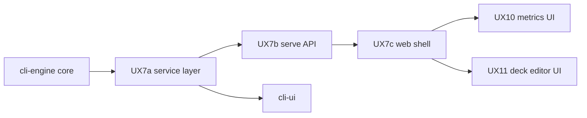

# Active roadmap (unified)

**Single register** of work selected for immediate delivery across all components. Parked work lives under [backlog/](backlog/). Shipped history: [milestones.md](../history/milestones.md) · [changelog.md](../history/changelog.md).

Status as of 2026-06-04.

## Components

| Component | Code / package | Backlog |
| --- | --- | --- |
| **cli-engine** | `src/mtg_deck_tools/` (import, builder, rules, effects, analyze) | [backlog/cli-engine.md](backlog/cli-engine.md) |
| **cli-ui** | `src/mtg_deck_tools/cli/`, `wizard/` | [backlog/cli-ui.md](backlog/cli-ui.md) |
| **web-ui** | `packages/web/` | [backlog/web-ui.md](backlog/web-ui.md) |
| **product-data** | Cross-cutting data, export, formats | [backlog/product-data.md](backlog/product-data.md) |

---

## Active task register

| ID | Component | Task | Status | Depends on | Parallel OK with |
| --- | --- | --- | --- | --- | --- |
| **UX7** | web-ui | Cross-platform web shell (mobile-first); `service/` + FastAPI + `packages/web` — [specs/web/architecture.md](../specs/web/architecture.md) | **Selected — P1** | Architecture spec (linked); UX7a service extraction before full SPA | **ENG-MAINT**, doc-only |
| **ENG-MAINT** | cli-engine | Threshold tuning vs latest `dependency-audit` when adding profiles | Ongoing | — | **UX7** (different paths), dogfood gate |
| **GATE** | cli-engine | `analyze run --fail-on-expect` (**30/30**) after engine changes | Always | Fresh `import` after bulk refresh | Other work if gate unchanged |

**Not active:** No **cli-engine** expansion rows (P7 remainder, new profiles) — see [backlog/cli-engine.md](backlog/cli-engine.md). Promote via table below before starting.

---

## Dependency graph



- **UX7** does not block **ENG-MAINT** (engine-only PRs).
- **UX10 / UX11** (backlog) should not start until **UX7** shell exists ([backlog/web-ui.md](backlog/web-ui.md)).
- New **cli-engine** dependency profiles should not run in parallel with a large **UX7** API refactor on the same modules without coordination.

---

## Suggested focus

1. **UX7** — primary product thread ([user-experience.md](../specs/dependency-engine/user-experience.md), [packages/web/README.md](../packages/web/README.md)).
2. **ENG-MAINT** — as needed when touching profiles / dogfood.
3. Optional **cli-engine** expansion only after explicit promotion from [backlog/cli-engine.md](backlog/cli-engine.md) into the register above.

---

## Parallel work streams (today)

| Stream | Owner component | Safe in parallel with |
| --- | --- | --- |
| A — Web scaffold + API design | web-ui | ENG-MAINT, planning/docs, cli-ui idle |
| B — Engine maintenance / dogfood | cli-engine | Stream A if no conflicting `src/` edits |
| C — CLI feature work | cli-ui | *None active* — backlog only |

---

## Promote / demote workflow

1. Add row to this register from the relevant [backlog/](backlog/) file.
2. Fill **Depends on** and **Parallel OK with** before coding.
3. On ship (implementation complete): remove row here → [changelog.md](../history/changelog.md); update specs/inventory per [DOC-MAP.md](../DOC-MAP.md). Planning steps: [agent-phases.md](../sdlc/agent-phases.md).

---

## Maintainer gate

```bash
mtg-deck-tools analyze run --fail-on-expect
```

Config: [`config/dogfood-matrix.yaml`](../../config/dogfood-matrix.yaml) · Runner: [deck-analysis.md](../specs/deck-analysis.md) · Dependency ship checklist: [dependency-validation.md](../sdlc/dependency-validation.md).
