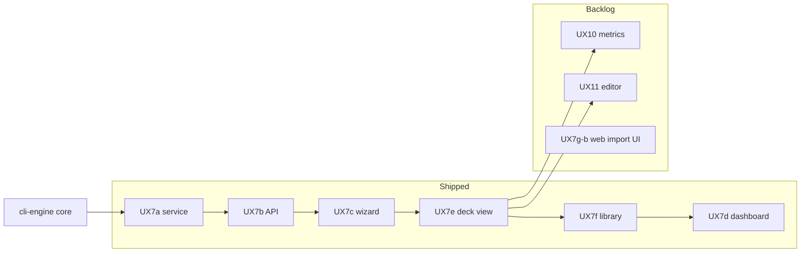

# Active roadmap

**Single register** of work selected for immediate delivery. Parked work: [backlog/](backlog/). Shipped record: [changelog.md](../history/changelog.md) · [milestones.md](../history/milestones.md).

*Last updated: 2026-06-25.*

---

## Current focus

| Priority | What | Why now |
| --- | --- | --- |
| **ENG-MAINT** | Engine profile tuning | As needed when touching dependency rules or dogfood matrix |
| **GATE** | Dogfood gate | Required after any engine change |

**Primary thread:** None selected — **UX7 MVP complete** (UX7a–UX7d shipped). Promote next web work from [backlog/web-ui.md](backlog/web-ui.md) (**UX10**, **UX11**, or **UX7g-b**).

---

## Active task register

| ID | Component | Task | Status | Depends on | Parallel OK with |
| --- | --- | --- | --- | --- | --- |
| **ENG-MAINT** | cli-engine | Threshold tuning vs latest `dependency-audit` when adding profiles | Ongoing | — | doc-only, dogfood gate |
| **GATE** | cli-engine | `analyze run --fail-on-expect` (**30/30**) after engine changes | Always | Fresh `import` after bulk refresh | Other work if gate unchanged |

**Not active:** No web-ui rows (UX7 MVP shipped). No cli-engine expansion rows (P7 remainder, new profiles). Promote from [backlog/](backlog/) before starting.

---

## UX7 context (MVP complete)

UX7 is the cross-platform web shell. All sub-phases **UX7a–UX7d** are **shipped** — see [changelog.md](../history/changelog.md).

| Sub-phase | Deliverable | Status |
| --- | --- | --- |
| UX7a | `service/` extraction + OpenAPI | Shipped |
| UX7b | `mtg-deck-tools serve` | Shipped |
| UX7c | Build wizard + result | Shipped |
| UX7e | Enhanced deck view | Shipped |
| UX7f | Saved deck library | Shipped |
| UX7d | Dependency dashboard | Shipped |

Post-MVP web work (UX10, UX11, UX7g-b): [backlog/web-ui.md](backlog/web-ui.md). Server DB bootstrap (UX7g-a) shipped with `serve` / Docker.

---

## Dependency graph



- **UX10 / UX11** may be promoted from [backlog/web-ui.md](backlog/web-ui.md) — UX7 MVP is complete.
- New cli-engine dependency profiles should not run in parallel with a large web API refactor on the same modules without coordination.

---

## Parallel work streams

| Stream | Component | Safe in parallel with |
| --- | --- | --- |
| A — Engine maintenance / dogfood | cli-engine | doc-only, planning |
| B — CLI feature work | cli-ui | *None active* — [backlog/cli-ui.md](backlog/cli-ui.md) only |

---

## Promote / demote workflow

1. Add row to this register from the relevant [backlog/](backlog/) file.
2. Fill **Depends on** and **Parallel OK with** before coding.
3. On ship: remove row here → [changelog.md](../history/changelog.md); update specs/inventory per [DOC-MAP.md](../DOC-MAP.md).

Planning steps: [agent-phases.md](../sdlc/agent-phases.md).

---

## Maintainer gate

```bash
mtg-deck-tools analyze run --fail-on-expect
```

Config: [`config/dogfood-matrix.yaml`](../../config/dogfood-matrix.yaml) · Runner: [deck-analysis.md](../specs/deck-analysis.md) · Dependency ship checklist: [dependency-validation.md](../sdlc/dependency-validation.md).
