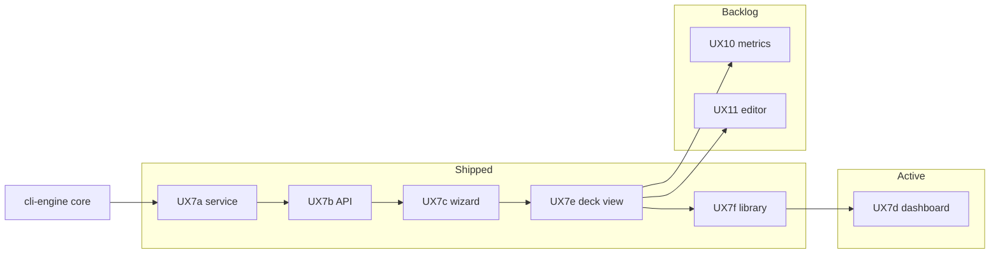

# Active roadmap

**Single register** of work selected for immediate delivery. Parked work: [backlog/](backlog/). Shipped record: [changelog.md](../history/changelog.md) · [milestones.md](../history/milestones.md).

*Last updated: 2026-06-25.*

---

## Current focus

| Priority | What | Why now |
| --- | --- | --- |
| **P1 — UX7d** | Web dependency dashboard | Last UX7 MVP slice; library (**UX7f**) shipped so persisted decks can be inspected |
| **ENG-MAINT** | Engine profile tuning | As needed when touching dependency rules or dogfood matrix |
| **GATE** | Dogfood gate | Required after any engine change |

**Primary thread:** web-ui **UX7d** — [specs/web/README.md](../specs/web/README.md), [user-experience.md](../specs/dependency-engine/user-experience.md).

---

## Active task register

| ID | Component | Task | Status | Depends on | Parallel OK with |
| --- | --- | --- | --- | --- | --- |
| **UX7d** | web-ui | Dependency dashboard — D5 drill-down on `dependency_report` for library decks | **Selected — P1** | UX7f (shipped), D5 | **ENG-MAINT**, doc-only |
| **ENG-MAINT** | cli-engine | Threshold tuning vs latest `dependency-audit` when adding profiles | Ongoing | — | **UX7d** (different paths), dogfood gate |
| **GATE** | cli-engine | `analyze run --fail-on-expect` (**30/30**) after engine changes | Always | Fresh `import` after bulk refresh | Other work if gate unchanged |

**Not active:** No cli-engine expansion rows (P7 remainder, new profiles). Promote from [backlog/cli-engine.md](backlog/cli-engine.md) before starting.

---

## UX7 context (MVP nearly complete)

UX7 is the cross-platform web shell. Sub-phases **UX7a–UX7c**, **UX7e**, and **UX7f** are **shipped** — see [changelog.md](../history/changelog.md). **UX7d** is the remaining MVP item in the register above.

| Sub-phase | Deliverable | Status |
| --- | --- | --- |
| UX7a | `service/` extraction + OpenAPI | Shipped |
| UX7b | `mtg-deck-tools serve` | Shipped |
| UX7c | Build wizard + result | Shipped |
| UX7e | Enhanced deck view | Shipped |
| UX7f | Saved deck library | Shipped |
| **UX7d** | Dependency dashboard | **Active — P1** |

Post-MVP web work (UX10, UX11, UX7g): [backlog/web-ui.md](backlog/web-ui.md).

---

## Dependency graph



- **UX7d** does not block **ENG-MAINT** (engine-only PRs).
- **UX10 / UX11** should not start until **UX7d** closes the UX7 MVP — see [backlog/web-ui.md](backlog/web-ui.md).
- New cli-engine dependency profiles should not run in parallel with a large web API refactor on the same modules without coordination.

---

## Parallel work streams

| Stream | Component | Safe in parallel with |
| --- | --- | --- |
| A — UX7d dashboard | web-ui | ENG-MAINT, planning/docs |
| B — Engine maintenance / dogfood | cli-engine | Stream A if no conflicting `src/` edits |
| C — CLI feature work | cli-ui | *None active* — [backlog/cli-ui.md](backlog/cli-ui.md) only |

---

## Promote / demote workflow

1. Add row to this register from the relevant [backlog/](backlog/) file.
2. Fill **Depends on** and **Parallel OK with** before coding.
3. On ship: remove row here → [changelog.md](../history/changelog.md); update specs/inventory per [DOC-MAP.md](../DOC-MAP.md).

Planning steps: [agent-phases.md](../sdlc/agent-phases.md).

---

## Maintainer gate

```bash
mtg-deck-tools analyze run --fail-on-expect
```

Config: [`config/dogfood-matrix.yaml`](../../config/dogfood-matrix.yaml) · Runner: [deck-analysis.md](../specs/deck-analysis.md) · Dependency ship checklist: [dependency-validation.md](../sdlc/dependency-validation.md).
