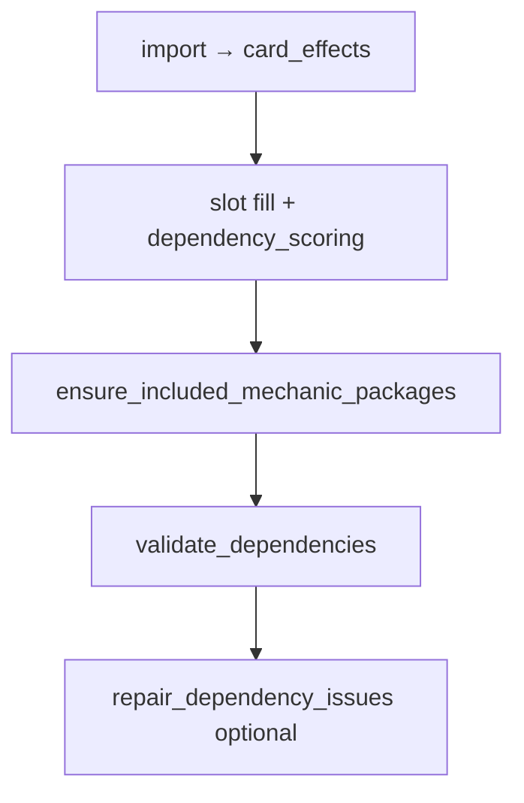

# Dependency engine — shipped inventory (spec)

Reference for **what the engine implements today**: pipeline participation, `effect_kind` atoms, `rule_id` validators, and post-fill packages. Roadmap and delivery history live under `docs/roadmap/dependency/` and `docs/history/`.

Related: [overview.md](overview.md) · [`config/effect-patterns.yaml`](../../../config/effect-patterns.yaml) · [`config/dependency-profiles.yaml`](../../../config/dependency-profiles.yaml) · [dependency-validation.md](../../sdlc/dependency-validation.md).

Status as of 2026-06-04.

---

## How dependencies participate in deck build

1. **Import** — `effect-patterns.yaml` → `card_effects` (required; rules no-op if table empty).
2. **Pick time (D3/D4)** — `dependency_scoring.py` biases or excludes candidates using partial-deck stats.
3. **Post-fill packages** — `mechanic_packages.py` swaps cards to meet profile floors when user intent or card-driven rules apply.
4. **Post-build (D2/D5)** — `validate_dependencies` emits warnings; `--repair-dependencies` attempts targeted swaps.

**Theme tags** (`card_mechanic_tags`) drive slot scoring and taxonomy; **dependency rules** primarily use **oracle-derived atoms**, not tags alone.

---

## Effect kinds in `card_effects`

| `effect_kind` | Role |
| --- | --- |
| `search_library` | Tutor / search predicates (land, creature, artifact, enchantment, aura, CMC min/max, colored creature, land subtype, creature or planeswalker, any card) |
| `energy_produce` / `energy_consume` | Energy counter balance |
| `experience_produce` / `experience_consume` | Experience counter balance |
| `blood_produce` / `blood_consume` | Blood counter balance (player counters) |
| `rad_produce` / `rad_consume` | Rad counter balance (player radiation) |
| `oil_produce` / `oil_consume` | Oil counter balance (Phyrexia / permanent) |
| `charge_produce` / `charge_consume` | Charge counter balance (artifacts / generic) |
| `plus_one_produce` / `plus_one_consume` | +1/+1 counter producers vs payoffs |
| `sacrifice_outlet` / `sacrifice_payoff` / `sacrifice_fodder` | Aristocrats package roles (`token_produce` counts as fodder) |
| `sacrifice_opponent` | Grave Pact-style forced sacrifice (not an outlet) |
| `death_recursion` | Persist, undying, escape-from-graveyard (supports payoffs without outlets) |
| `buff_subtype` | “Other Elves …” (and similar) subtype lords |
| `whenever_cast_type` | “Whenever you cast an Artifact spell …” |
| `whenever_cast_aura` | “Whenever you cast an Aura spell …” (voltron / aura support trigger) |
| `whenever_cast_enchantment` | “Whenever you cast an enchantment spell …” (enchantress / non-voltron) |
| `type_line_aura` | Aura on type line (extraction aid) |
| `token_produce` / `token_payoff` / `token_buff_subtype` | Producers with subtype payload, generic payoffs, subtype buffs |
| `type_line_vehicle` | Vehicle on type line (crew density checks) |
| `type_line_equipment` | Equipment on type line (equip depth checks) |
| `whenever_equipped` | “Whenever equipped” / equip payoff triggers |
| `reanimate` | Return target from graveyard to battlefield/hand |
| `graveyard_cost` | Delve / flashback (needs graveyard fodder over time) |
| `mill_enabler` | Self-mill, library→GY, surveil, discover, looting-style discard |
| `graveyard_payoff` | “For each … in your graveyard” and similar payoffs |
| `landfall_payoff` | Landfall keyword triggers |
| `land_ramp` | Spells that put lands onto the battlefield |

---

## Validation rules (`rule_id`)

| Rule | Trigger | Scoped by |
| --- | --- | --- |
| `TUTOR_TARGET_EXISTS` | Tutor with zero matching targets in deck + commander pool | Always (card-driven) |
| `ENERGY_BALANCE` | Producers without consumers or reverse | `include_mechanics: [energy]` or ≥2 imbalanced cards |
| `EXPERIENCE_BALANCE` | Experience producers without consumers or reverse | `include_mechanics: [experience]` or ≥2 imbalanced cards |
| `BLOOD_BALANCE` | Blood producers without consumers or reverse | `include_mechanics: [blood]` or ≥2 imbalanced cards |
| `RAD_BALANCE` | Rad producers without consumers or reverse | `include_mechanics: [rad]` or ≥2 imbalanced cards |
| `OIL_BALANCE` | Oil producers without consumers or reverse | `include_mechanics: [oil]` or ≥3 imbalanced cards |
| `CHARGE_BALANCE` | Charge producers without consumers or reverse | `include_mechanics: [charge]` or ≥5 imbalanced cards |
| `PLUS_ONE_BALANCE` | +1/+1 producers without consumers or reverse | `include_mechanics: [counters]` or ≥2 imbalanced cards |
| `SACRIFICE_BALANCE` | Outlets without payoffs or reverse | `themes: [aristocrats]` or ≥2 imbalanced cards |
| `TOKEN_BALANCE` | Producers without payoffs or reverse | `themes: [tokens]` or ≥2 imbalanced cards |
| `TOKEN_SUBTYPE_BUFF_SUPPORT` | Dominant token subtype without matching buff or generic anthem | `themes: [tokens]` or ≥3 producers sharing a subtype |
| `VEHICLE_BALANCE` | Vehicle count or crew creatures below floor | `include_mechanics: [vehicles]`, Vehicle lord in deck, or ≥2 vehicles |
| `EQUIPMENT_BALANCE` | Equipment count, carrier creatures, or equip payoffs without pieces | `include_mechanics: [equip]`, `themes: [voltron]`, whenever-equipped payoffs, or ≥2 Equipment |
| `TYPE_SYNERGY_MIN` | Subtype lord or type-matters payoff below suggested minimum | Card-driven (lord / cast trigger in deck) |
| `AURA_SUPPORT_MIN` | Aura count below floor | `themes: [voltron]`, aura tutors, or `whenever_cast_aura` payoffs |
| `ENCHANTMENT_SUPPORT_MIN` | Enchantment count below floor | `themes: [enchantress]`, enchantment tutors, or `whenever_cast_enchantment` payoffs |
| `REANIMATION_SUPPORT` | Reanimation without creature density / curve | Card-driven when `reanimate` in deck |
| `GRAVEYARD_COST_SUPPORT` | Delve/flashback with thin nonland count | Card-driven when ≥2 `graveyard_cost` cards |
| `SELF_MILL_BALANCE` | Mill enablers vs graveyard payoffs | `themes: [recursion]` or ≥2 imbalanced cards |
| `LANDFALL_BALANCE` | Landfall payoffs without land ramp | `themes: [landfall]` or ≥2 landfall payoffs |

---

## Mechanic packages (post-fill swaps)

| Package | Activation | Floors (defaults) |
| --- | --- | --- |
| Energy | `include_mechanics: [energy]` | ≥2 producers, ≥2 consumers |
| Experience | `include_mechanics: [experience]` | ≥1 producer, ≥2 consumers |
| Blood | `include_mechanics: [blood]` | ≥2 producers, ≥2 consumers |
| Rad | `include_mechanics: [rad]` | ≥2 producers, ≥1 consumer |
| Oil | `include_mechanics: [oil]` | ≥2 producers, ≥2 consumers |
| Charge | `include_mechanics: [charge]` | ≥2 producers, ≥2 consumers |
| +1/+1 counters | `include_mechanics: [counters]` | ≥3 producers, ≥2 consumers |
| Sacrifice / aristocrats | `themes: [aristocrats]` | ≥2 outlets, ≥3 payoffs, ≥8 fodder |
| Auras | Voltron theme or card-driven aura check | ≥6 Aura spells |
| Enchantments | `themes: [enchantress]` or enchantment cast payoff / tutor in deck | ≥8 enchantments |
| Artifacts | `include_mechanics: [equip, vehicles]` or artifact cast payoff in deck | ≥8 artifacts |
| Subtype lords | Any `buff_subtype` lord detected | Per-subtype minimums in profile (Elf default 5) |
| Tokens | `themes: [tokens]` | ≥5 producers, ≥3 payoffs |
| Vehicles | `include_mechanics: [vehicles]` or Vehicle lord in deck | ≥3 Vehicles, ≥25 crew creatures |
| Equipment | `include_mechanics: [equip]` or `themes: [voltron]` or equip payoffs in deck | ≥4 Equipment, ≥22 carrier creatures |

---

## Explicit non-goals (out of `card_effects` for now)

| Concern | Why deferred | Where handled today |
| --- | --- | --- |
| Removal / wipe density | Slot template, not oracle atoms | `slot-templates.yaml`, themes |
| Curve / land count | Mana base planner | `mana_base.py`, validation |
| Deck-wide CMC distribution | Post-build metrics, not atoms | **UX10 shipped** (UX10a–c) — [deck-output-format.md](../../product/deck-output-format.md), [user-experience.md](user-experience.md) |
| Curve advisories | Post-build warn-only heuristics | **UX10c** — [`config/curve-advisories.yaml`](../../../config/curve-advisories.yaml), `curve_advisories.py` |
| Named combo pairs | Needs external combo data | — |
| Power level / salt | No simple dial | [open-questions.md](../../product/open-questions.md) |
| Aura removal risk | Not statically provable | UX note in [user-experience.md](user-experience.md) |
| Commander partners / companion | Construction layer | `validate.py`, commander pick |
| In-game timing / stack | Non-goal per [overview.md](overview.md) | — |

---

## References

- Deferred stances: [`resources/dependency/hard-cases.yaml`](../../../resources/dependency/hard-cases.yaml)
- Profile thresholds: [`config/dependency-profiles.yaml`](../../../config/dependency-profiles.yaml)
- Curve advisory thresholds: [`config/curve-advisories.yaml`](../../../config/curve-advisories.yaml)
- Locked v1 scope: [decisions.md](decisions.md)
