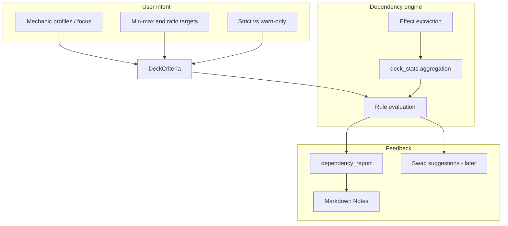
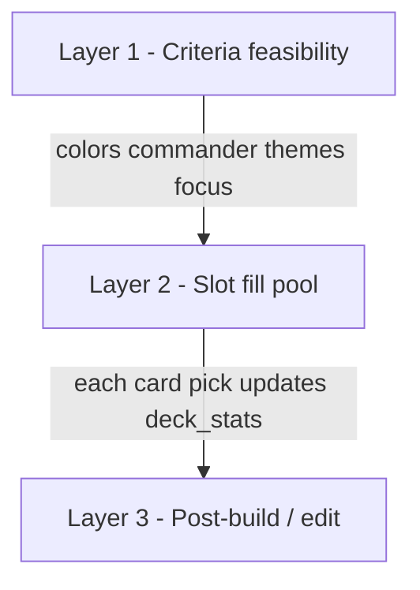

# Dependency engine — user experience and control model

Planning for **how users discover, constrain, and refine** card-dependency behavior alongside the technical engine in [overview.md](overview.md).

**Status (2026-06-27):** Engine **D0–D5 shipped**. UX1–UX5 and **UX7a–UX7d + UX7g shipped**. **UX10** deck composition metrics **shipped** (UX10a–**UX10c**). **UX11** GUI deck editor **shipped**. Post-MVP web backlog: [backlog/web-ui.md](../../roadmap/backlog/web-ui.md).

**UX2 scope expanded (2026-06-03):** Dependency expansion Priorities 1–6 shipped 13 additional profiles (rad, oil, charge, experience, blood, +1/+1, sacrifice, tokens, vehicles, equipment, enchantments, graveyard, landfall). The engine and schema already support focus levels for all of them (`DeckCriteria.mechanic_focus` is a generic dict; `dependency_scope.py` checks every profile). UX2 now covers focus presets for **every profile activated by the user's theme and `include_mechanics` selections**, not only energy and auras.

This document is intentionally **UI-agnostic at the core** (criteria + reports in `.deck.json`) but evaluates **terminal CLI vs richer UI** per interaction type, and defines schema hooks the engine must support so any future shell can reuse the same logic.

---

## Relationship to the dependency engine

| Concern | Owner doc | Notes |
| --- | --- | --- |
| What atoms exist, how they are extracted, validation rules | [overview.md](overview.md) | D0–D5 implementation phases |
| What users can **ask for**, **see**, and **change** | **This doc** | Drives `DeckCriteria` extensions and `dependency_report` shape |
| Deck file contract | [deck-output-format.md](../../product/deck-output-format.md) | `criteria`, Notes groups, future swap metadata |

**Design principle:** The engine evaluates **facts** (producers, consumers, tutor predicates). The UX layer expresses **intent** (which mechanics matter, how “focused” the deck should be). Keep intent in `DeckCriteria` / YAML profiles; keep evaluation in `rules/dependencies.py` + `card_effects`.



---

## What users are trying to control

Users rarely think in “effect atoms.” They think in **mechanics**, **roles**, and **how much** of the deck should revolve around them.

| User mental model | Engine mapping | Example |
| --- | --- | --- |
| “I want an energy deck” | `PRODUCES_RESOURCE` + `CONSUMES_RESOURCE` for `energy` | Aether Hub + payoffs |
| “Don’t make energy the whole deck” | **Focus cap** on energy-tagged cards (e.g. ≤12% of nonlands) | 4–5 energy cards, not 15 |
| “I need auras for this commander” | `SEARCH_FOR` + `REQUIRES_TYPE` for Aura | Tutors + enchantment density |
| “Enough elves for my lord” | `TYPE_SYNERGY_MIN` for subtype Elf | ≥5 other elves |
| “Strict — no dead tutors” | `strict_dependencies` + pick-time filter | Exclude tutors with 0 targets |

Three control dimensions:

1. **Enablement** — which dependency *classes* and *mechanics* are in scope for this build.
2. **Balance** — min/max counts and ratios for producers, consumers, and type payoffs.
3. **Enforcement** — warn in Notes vs block picks / fail validation.

---

## Mechanic and dependency catalog (user-facing)

Below is a **curated catalog** for UX copy and profile presets. The engine may implement subsets per phase (see doc 10); the UI should still list deferred items as “coming soon” only if exposed.

### Resource counters (produce / consume)

| Mechanic | Producer signal | Consumer signal | Typical user goal |
| --- | --- | --- | --- |
| **Energy** | `{E}`, “energy counter(s)” | “pay {E}”, “you may pay {E}” | Both sides present; 3–6 total cards often feels “supported” without dominating |
| **Experience** | “experience counter(s)” | “pay … experience” | Commander-centric; often 1–3 payoffs |
| **Rad counters** | “rad counter(s)” | “pay … rad” | Similar to energy; smaller card pool |
| **Oil / charge / brick** | set-specific oracle | spend counters | Lower priority unless theme selected |
| **Blood** (counters on players) | “blood counter” on opponent | cards that care about blood | Niche; warn-only unless user enables `blood` profile |
| **+1/+1 counters** | “put a +1/+1 counter” | “remove … counter”, “with a +1/+1 counter” | Often overlaps `counters` theme; use **type synergy** not just resource balance |

**User-facing knob:** “Energy focus” — *light* (incidental), *supported* (3–6 cards), *focused* (7–12), *engine* (13+). Maps to min/max nonland slots with energy atoms or `energy` tag.

### Tutors and search (target must exist)

| Pattern | User cares because | Default strictness |
| --- | --- | --- |
| Search for **land** | Obvious failure if 0 lands | Warn (should never happen) |
| Search for **Aura** | Enchantress / Voltron | Warn; strict optional |
| Search for **creature** with CMC cap | Toolbox / reanimator | Warn |
| Search for **artifact** / **enchantment** | Narrow tutors | Warn |
| **Any card** | Hard to validate | Skip or soft warn |

**User-facing knob:** “Honor tutor targets” (on/off) + per-type minimum targets in deck (usually ≥1).

### Type / subtype payoffs (“each other X”)

| Pattern | Example | Suggested min (nonland) when theme selected |
| --- | --- | --- |
| Subtype lord | “Other Elves get +1/+1” | 5–8 other Elves |
| Type matters | “Whenever you cast an Artifact spell” | 8–12 artifacts |
| **Vehicle** + crew | Vehicles without creatures | Vehicles ≥3, creatures ≥25 |
| **Aura** density | “Whenever you cast an Aura” | Auras ≥6–8 |

**User-facing knob:** “Synergy density” — *low* / *medium* / *high* maps to threshold multipliers (see Balance model).

### Sacrifice / aristocrats (paired roles)

Overlaps `aristocrats` theme but dependency engine can count:

| Role | Examples |
| --- | --- |
| **Fodder** | creatures that die easily, tokens |
| **Outlet** | “sacrifice a creature” |
| **Payoff** | “whenever a creature you control dies” |

**User-facing knob:** “Sacrifice package” — ensure ≥1 outlet and ≥1 payoff when fodder theme is on.

### Auras and equipment (Voltron / enchantress)

| Concern | Dependency |
| --- | --- |
| Aura tutors | `SEARCH_FOR` → Aura in library |
| Aura payoffs | `REQUIRES_TYPE` / cast triggers |
| **Aura removal risk** | Not a static dependency; UX note only |

**User-facing knob:** “Aura support” — min aura count + tutor target check.

### Graveyard / zone (soft, v1)

Delve, escape, reanimation — often **warning-only** with heuristics (creature count, mill). Defer strict balance to later phases.

---

## Balance model: counts, ratios, and “deck dominance”

### Problem

Including `energy` in **include mechanics** today boosts any card tagged `energy` but does **not**:

- Distinguish producers vs consumers.
- Cap how many energy cards appear.
- Tell the user when the deck is **too thin** (1 producer, 0 payoffs) or **too thick** (9 producers, 1 payoff — mechanic dominates).

### Proposed metrics (computed in `deck_stats`)

For each **mechanic profile** `M` (e.g. `energy`, `auras`, `elves`):

| Metric | Definition |
| --- | --- |
| `producers(M)` | Cards with `PRODUCES_RESOURCE` or profile-specific atom |
| `consumers(M)` | Cards with `CONSUMES_RESOURCE` |
| `payoffs(M)` | Type/subtype amplifiers, “whenever you …” for M |
| `tutors(M)` | `SEARCH_FOR` predicates referencing M |
| `total(M)` | Union of above (dedupe by `oracle_id`) |
| `share(M)` | `total(M) / nonland_count` (excludes commander from 99 if desired) |

### Default targets (configurable)

Store defaults in **`config/dependency-profiles.yaml`** (new), not hard-coded in Python:

```yaml
# Illustrative — balances are starting points for feedback text
profiles:
  energy:
  label: Energy counters
  roles: [producer, consumer]
  defaults:
    producer_min: 2
    producer_max: 6
    consumer_min: 2
    consumer_max: 8
    share_max: 0.12        # 12% of nonlands ≈ 7–8 cards at 60 nonlands
    consumer_per_producer_min: 0.5
  aura_support:
  label: Auras
  roles: [aura_spell, aura_tutor_target]
  defaults:
    aura_spell_min: 6
    aura_spell_max: 15
    share_max: 0.18
```

**Focus presets** (user selects one per profile or globally):

| Preset | `share_max` (approx) | Producer/consumer band | User message tone |
| --- | --- | --- | --- |
| **Incidental** | 5% | 1–2 each | “A splash of energy — don’t expect a full engine” |
| **Supported** | 10% | 2–5 producers, 2–6 consumers | “Energy should work when you draw it” |
| **Focused** | 15% | 3–6 / 3–8 | “Energy is a main plan” |
| **Engine** | 20%+ | User accepts dominance | “This deck is built around energy” |

### Ratio rules

| Rule | Condition | Severity |
| --- | --- | --- |
| `ONE_SIDED_RESOURCE` | producers ≥ 1 and consumers == 0 | Warn (Fail if strict) |
| `CONSUMER_WITHOUT_PRODUCER` | consumers ≥ 2 and producers == 0 | Warn |
| `IMBALANCED_RATIO` | consumers < 0.5 × producers (when producers ≥ 3) | Warn — “too much setup, not enough payoffs” |
| `OVER_CAP` | total(M) > profile.share_max × nonlands | Warn — “deck may feel one-note” |
| `UNDER_FLOOR` | user set `mechanic_focus[M]=supported` but total(M) < floor | Warn — “you asked for energy support but only 1 card” |

Thresholds should **scale with themes**: if `tokens` + `energy` both selected, apply the **stricter** share cap or sum caps with a global `max_themed_share`.

---

## User feedback: too little, too much, conflicting intent

### Feedback channels (all phases)

| Channel | When | Content |
| --- | --- | --- |
| **Post-build `dependency_report`** | Always (D2+) | Structured pass/warn/fail per rule |
| **Markdown Notes → “Deck dependencies”** | Always | Human summary + card names |
| **Wizard / CLI inline** | During criteria entry | Prevent impossible combos before generate |
| **Pick-time hints** | D3+ (optional verbose) | “Adding this leaves 0 aura targets for …” |

### Example messages (tone: actionable, not judgmental)

| Situation | Message |
| --- | --- |
| Too little energy | “You selected **Supported energy** but the list has 1 producer and 0 payoffs. Add 2–4 `{E}` payoffs or lower focus to Incidental.” |
| Too much energy | “12 cards reference energy (~20% of nonlands). Consider raising focus to **Engine** or removing 4–5 setup cards.” |
| Tutor gap | “**Enlightened Tutor** searches for enchantments; only 2 auras in the deck. Add auras or remove the tutor.” |
| Conflicting criteria | “**Avoid artifacts** conflicts with **Artifact synergy** thresholds. Artifact payoffs will be excluded from the pool.” |
| Strict mode block | “Generation skipped **Vampiric Tutor** — no creature with MV ≤3 in the remaining pool.” |

### “Spec health” preflight (before generate)

Run a lightweight **criteria linter** (no full deck):

| Check | Example |
| --- | --- |
| Conflicting include/avoid | include `energy` + avoid same tag |
| Unreachable profile | `aura_support: focused` with colors that ban enchantments |
| Over-constrained budget | strict budget + high rare minimum + 3 focused profiles |
| Too many focused profiles | >2 profiles at `focused` or `engine` → warn “deck may not have room for all plans” |

Return `criteria_warnings: []` in wizard output and optionally block until acknowledged.

---

## User control surface (criteria schema)

Extend `DeckCriteria` (and `.deck.json` `criteria`) in phases. Names are illustrative.

```python
# Illustrative Pydantic fields — align with implementation PRs
class MechanicFocus(BaseModel):
    profile_id: str           # energy, aura_support, elves, ...
    level: Literal["off", "incidental", "supported", "focused", "engine"]
    producer_min: int | None = None   # override preset
    consumer_min: int | None = None
    share_max: float | None = None

class DependencyPreferences(BaseModel):
    enabled: bool = True
    strict: bool = False              # maps to strict_dependencies
    honor_tutor_targets: bool = True
    mechanic_focus: list[MechanicFocus] = []
    disabled_rule_ids: list[str] = [] # power users
```

| Field | CLI v1 | Rich UI later |
| --- | --- | --- |
| `strict` | `--strict-dependencies` flag | Toggle |
| `mechanic_focus[]` | Subcommand or wizard step 2b | Sliders / presets per mechanic |
| Per-profile overrides | JSON edit in `.deck.json` | Advanced panel |
| `disabled_rule_ids` | Hidden / env var | Expert mode |

**Important:** Wizard step 2 today is flat **include/avoid mechanics** ([`mechanic-taxonomy.yaml`](../config/mechanic-taxonomy.yaml)). Do **not** replace it; **add** an optional “Synergy focus” step or flags so casual users stay on simple checkboxes.

---

## Understanding and swapping dependencies (future)

Not required for first engine release, but the **data model should not block** interactive editing.

### Transparency (what did the builder assume?)

Each card in `.deck.json` may gain optional:

```json
{
  "name": "Aether Hub",
  "dependency_roles": ["energy_producer"],
  "satisfies": ["rule:ENERGY_BALANCE.producer"],
  "introduces_gaps": []
}
```

Deck-level `dependency_report`:

```json
{
  "profiles": [
    {
      "id": "energy",
      "producers": 4,
      "consumers": 2,
      "share": 0.10,
      "status": "warn",
      "messages": ["consumers < recommended minimum (4)"]
    }
  ],
  "rules": [
    {
      "id": "TUTOR_TARGET_EXISTS",
      "card": "Enlightened Tutor",
      "status": "warn",
      "detail": "No Aura card in deck matches search"
    }
  ]
}
```

### Swap workflow (user replaces a dependency “package”)

| Step | Action |
| --- | --- |
| 1 | User opens dependency summary → selects “Energy package (6 cards)” |
| 2 | UI offers **alternatives** with same role histogram (4 prod / 2 cons) |
| 3 | `generate --from deck.json --swap-profile energy --seed N` or UI button |
| 4 | Re-run validator; show diff |

Engine requirements for swaps:

- Tag cards with **profile membership** at build time.
- Repair pass (D5) searches pool preserving `deck_stats` deltas per role.
- Swaps should prefer same **slot** (`synergy`, `flex`) before cross-slot.

---

## Is the terminal CLI appropriate?

### Summary

| Interaction | CLI fit | Recommendation |
| --- | --- | --- |
| On/off strict dependencies | **Good** | Flag on `generate` |
| Include/avoid mechanics (existing) | **Good** | Keep as-is |
| Post-build dependency report | **Good** | Markdown Notes + JSON |
| Deck composition metrics (CMC histogram) | **Good** | Markdown table / ASCII bars; JSON `stats` histogram fields (UX10a) |
| Curve advisories (warn-only) | **Good** | Markdown **Curve advisories** + JSON `stats.curve_advisories` (UX10c); thresholds in `config/curve-advisories.yaml` |
| CMC curve visualization (interactive) | **Poor** | **UX10b shipped** — web deck view bar chart |
| Focus presets (incidental → engine) | **Adequate** | Wizard step with numbered menu |
| Per-mechanic min/max overrides | **Poor** | JSON edit or defer to UI |
| Visual tutor target preview | **Poor** | Needs card images / list UI |
| Multi-profile balance dashboard | **Poor** | Web or desktop |
| Swap dependency package | **Poor** | Interactive selection |
| Swap selected card(s) | **Poor** | **Swap** button — UX11 |
| Per-card lock on refill | **Poor** | **Lock** flag — UX11; stretch `--keep-locked` on CLI |

**Conclusion:** CLI remains the **right shell** for automation and dogfood. The **web UI** is the primary interactive product for build, view, and iterate workflows — reuse Option B/C from [pipeline-and-components.md](../../architecture/pipeline-and-components.md) without forking the engine.

### Phased UX roadmap

| Phase | UX deliverable | Engine dependency |
| --- | --- | --- |
| **UX0** | Document + `dependency-profiles.yaml` skeleton | None |
| **UX1** | Notes + `dependency_report`; `--strict-dependencies` | D2 |
| ~~**UX2**~~ | ~~Wizard: “Synergy strictness” prompts (`strict_dependencies`, `repair_dependencies`) + focus-level presets (incidental/supported/focused/engine) for every profile activated by the user’s theme/mechanic selections~~ — **Shipped 2026-06-03** (`wizard` step 3) | D2–D3 |
| ~~**UX3**~~ | ~~`criteria` linter warnings in wizard~~ — **Shipped 2026-06-04** (`rules/criteria_linter.py`, wizard preflight after step 7) | D2 + profiles |
| ~~**UX4**~~ | ~~**Wizard step back-navigation** — return to earlier steps to revise selections~~ — **Shipped 2026-06-04** | None (wizard orchestration) |
| ~~**UX5**~~ | ~~Wizard prepopulate on regen~~ — **Shipped 2026-06-04** | `.deck.json` criteria round-trip |
| **UX6** | `.deck.json` per-card `dependency_roles` | D2 |
| **UX7** | Cross-platform web (mobile-first): ~~`service/` + FastAPI~~ **UX7a shipped**; ~~`serve`~~ **UX7b shipped**; ~~build wizard **UX7c**~~ **shipped**; ~~deck view **UX7e**~~ **shipped**; ~~library **UX7f**~~ **shipped**; ~~dashboard **UX7d**~~ **shipped**; iterate **UX11** | D5 + [specs/web/](../web/) |
| **UX8** | **Progressive constraints** — restrict wizard/build choices as criteria commit | D1 + inventory audit + D3–D4 |
| **UX9** | Web constraint panel + pick preview (interactive build) | D3–D4 + UX7 shell |
| **UX10** | **Deck composition metrics** — CMC distribution report + YAML curve advisories; CLI MD/JSON + web charts | **Shipped** — `deck_metrics.py`, `curve_advisories.py`, `output.py`, `DeckMetricsPanel` |
| **UX11** | **GUI deck editor** — per-card **lock** + **swap** selection; refill/swap respect `DeckCriteria` and validation | `reload.py`, `filler.py`, `.deck.json` schema; **UX7e** deck view |

### UX7c — Web build wizard (shipped)

**Status:** **Shipped** — [routes.md](../web/routes.md), [screens.md](../web/screens.md), [navigation.md](../web/navigation.md), [packages/web/README.md](../../packages/web/README.md).

**Product role:** Web is the primary interactive shell. **Build** mode uses the wizard **once** for a new deck. **Iterate** and **View** modes do not re-run the wizard (see **UX7e**, **UX7f**, **UX11**). Modes and flow: [architecture.md](../web/architecture.md) § Product modes.

### Scope

**In scope (UX7c):**

- Home with **Build new deck** (disabled when DB missing).
- Linear wizard: CLI steps 1–7 + **review** (preflight) + **generate** → `/deck/:id` (no standalone MD result screen).
- Server-side wizard helpers ([wizard-api.md](../web/wizard-api.md)); SPA holds `DeckCriteria` draft only (`sessionStorage` key `mtg-wizard-draft`).
- Random **seed** at generate; stored in `deck.criteria.seed` when auto-saved to library (**UX7f**).

**Out of scope (UX7c):** partner commander picker; custom slot editor; JSON download; enhanced deck view; saved decks; iterate; dependency dashboard; charts; dark mode. *(DB import UI shipped separately as **UX7g**.)*

**Slices:**

| Slice | Deliverable |
| --- | --- |
| **UX7c-a** | App shell, DB gate, home, wizard API, steps 1–7 (Next/Back; optional back-swipe) — **shipped** |
| **UX7c-b** | Review screen (inline preflight warnings), generate → `/deck/:id` — **shipped** |
| **UX7c-c** | Loading/error polish, 375px layout pass — **shipped** |

Delivery order: [backlog/web-ui.md](../../roadmap/backlog/web-ui.md).

### UX7c decisions

| Topic | Decision |
| --- | --- |
| Steps | CLI parity: 7 wizard steps + **review** + **generate** → `/deck/:id` |
| Navigation | [navigation.md](../web/navigation.md) — linear Next/Back; optional back-swipe |
| Preflight | Inline warnings on review; Generate allowed with warnings |
| Step 1 slots | Defaults only |
| Step 3 focus | Stepper per activated profile (− / + through Default → Engine); level definitions at top of section |
| Step 6 commander | Search-as-you-type; `exact` / `includes` toggle (**exact** default); **no** partners |
| Result | Generate success → `/deck/:id` (enhanced deck view); `/build/result` is compat redirect only |
| DB missing | Hard block; home banner with **Download card data**; **UX7g-a:** `serve` auto-bootstrap when `MTG_AUTO_DOWNLOAD=1`; **UX7g-b:** in-browser import + optional refresh — **shipped** |
| Visual design | [design.md](../web/design.md) |

### UX7e — Enhanced deck view (shipped)

**Status:** **Shipped** — [screens.md](../web/screens.md) § Enhanced deck view, [packages/web/README.md](../../packages/web/README.md).

**Goal:** Replace the raw MD result as the primary post-build surface. Inspect the generated `.deck.json` with filters, summaries, dependency notes, and card art — without re-running the wizard.

#### Scope

**In scope (UX7e):**

- Route `/deck/:id` for the session-active deck (and future library loads in **UX7f**).
- Generate success → navigate to `/deck/:id` (see decisions).
- Commander header, filterable card list, summary panel, compact analysis, Scryfall thumbnails + lightbox.
- Collapsible Markdown preview (same MD→HTML path as UX7c result).
- Home **View last deck** when a session deck exists.

**Out of scope (UX7e):** saved library (**UX7f**); JSON download; swap / lock / regen (**UX11**); dependency drill-down dashboard (**UX7d** — shipped separately); CMC histogram charts (**UX10**); new analyze HTTP endpoints; server-side deck persistence.

**Slices:**

| Slice | Deliverable |
| --- | --- |
| **UX7e-a** | Session deck store (UUID + payload); `/deck/:id` route; redirect guards; commander header + read-only card list |
| **UX7e-b** | Filter chips (slot, type, color); summary panel (counts, price, avg CMC) |
| **UX7e-c** | Analysis section (`dependency_report` + strengths heuristic); row thumbs + lightbox; collapsible MD preview; home resume CTA; generate → deck redirect |

Delivery order: [backlog/web-ui.md](../../roadmap/backlog/web-ui.md).

#### UX7e decisions

| Topic | Decision |
| --- | --- |
| Persistence / `:id` | **Client UUID** assigned at generate; full `GenerateResponse` (including `deck`) stored in `sessionStorage` keyed by id. **No server store** until **UX7f**. Same id shape reused when library lands. |
| Generate handoff | **Primary:** review Generate success → `/deck/:id`. **`/build/result`:** redirect to active deck id when session has one (compat); otherwise `/`. |
| Data source | **Client-only** — render from inline `GenerateResponse.deck` already returned by `POST /api/v1/generate`. **No new HTTP endpoints** in UX7e. |
| Routing | **Path-based** (existing SPA router in `packages/web/`). |
| Unknown `/deck/:id` | Redirect to `/` — no placeholder page. |
| UX7d boundary | Show **compact list** of `dependency_report.issues` (rule id + message). **No** profile drill-down dashboard or repair actions. |
| UX10 boundary | Slot counts, type breakdown, and `stats.*` from JSON only. **No** CMC histogram or interactive charts. |
| UX11 boundary | Card rows **read-only**. **No** swap, lock, slot regen, or selection chrome. |
| Filters | **Slot** and **Type** chip groups; **Color** uses wizard WUBRG pip controls + void (∅). Nonlands: casting-cost pips; lands: `produced_mana` → basic land type names → `color_identity` — lands are never void. Multi-select within each group uses **AND** (all selected colors must appear on the card); filter groups combine with **AND** (slot + type + color). Clear-all per group. |
| Summaries | Always-visible panel below commander: slot table, estimated price, unpriced count, `avg_cmc_nonland`, type counts. |
| Analysis | **Areas to review:** warn-level `dependency_report.issues`. **Looks good:** `dependency_report.passed` or no warn issues (one-line positive copy). No new server rubric in UX7e. |
| Card art | Commander **hero** image + **row thumbnail** per card (`image_uri`); tap → lightbox (reuse UX7c `CardLightbox` pattern). |
| MD preview | **Collapsed** `<details>` at bottom — "Markdown preview"; same renderer as UX7c result. |
| Home | **View last deck** secondary CTA when session has active deck id; **Library** hidden until **UX7f**. |
| Build another | Footer action clears wizard draft + session deck → `/` or `/build/1`. |
| Visual design | [design.md](../web/design.md) — light theme, 375px baseline. |

Wireframe scope: [wireframes/README.md](../web/wireframes/README.md) § UX7e wireframe scope.

**Implementation notes (post-UX7f):** Deck view footer shows fixed **Library** and **Home** buttons (not a single context-sensitive **Back** label). `returnTo` in session cache (`mtg-deck-cache-{id}`) is used for **delete** redirect only. Markdown preview removed — render from JSON only. Canonical store is server library; cache is a read-through helper.

### UX7f — Saved deck library (shipped)

**Status:** **Shipped (2026-06-24)** — [library-api.md](../web/library-api.md), [screens.md](../web/screens.md) § Saved deck library.

**Goal:** Server-side saved deck library so decks survive browser restarts and self-hosted deployments. `.deck.json` is the sole persisted payload; the web UI renders from JSON, not stored Markdown.

#### Scope

**In scope (UX7f):**

- Route `/library` — card grid, search, sort; tap card to open deck view.
- Server persistence via new library API (`GET/PATCH/DELETE /api/v1/decks`, extended `POST /api/v1/generate`).
- **Auto-save on generate** — new wizard build creates a new library entry (new UUID).
- Load library entry → write deck to **session cache** → `/deck/:id`.
- Home **View last deck** → most recently saved library deck.
- Home **Saved library** CTA enabled when DB ready.
- Deck view renders from **JSON deck payload** (replaces UX7e `sessionStorage` + markdown dependency).
- Persist `criteria.seed` and `dependency_report` in deck JSON.

**Out of scope (UX7f):** JSON download; import uploaded `.deck.json`; folders/collections; save-as / clone / duplicate; regen / refill UI (**UX11**); wiring library → `POST /api/v1/generate/from-deck`; migration from legacy `sessionStorage` deck stores.

**Slices:**

| Slice | Deliverable |
| --- | --- |
| **UX7f-a** | `service/` library store + HTTP API; `generate` auto-save; `GenerateResponse` web shape (`id` + `deck`; no path fields) |
| **UX7f-b** | `/library` screen — tappable card grid, search, sort (rename/delete on deck view) |
| **UX7f-c** | Deck view + home wired to library API; session cache on load; drop UX7e session deck persistence |

Delivery order: [backlog/web-ui.md](../../roadmap/backlog/web-ui.md).

#### UX7f decisions

| Topic | Decision |
| --- | --- |
| Persistence tier | **Server-side** — canonical store on deployment; client session cache only for active `/deck/:id` |
| Persisted payload | **`.deck.json` document only** — no `json_path`, `md_path`, or markdown in the library record |
| Markdown | **Derivative / CLI export** — not persisted; web deck view does not depend on stored markdown (collapsible MD preview removed or on-demand export only — implementation detail) |
| Seed | Stored in `deck.criteria.seed` when assigned at generate |
| `dependency_report` | Stored in deck JSON when present |
| Save model | **Auto-save on generate**; updates to an existing entry are **in-place** (same `id`) |
| New UUID | Only when user starts a **new** deck through the wizard |
| Save-as / clone | **Deferred** — no duplicate action in UX7f |
| Organize | **List/sort, rename, delete, search** in v1 |
| Folders / import | **Deferred** |
| Load handoff | `GET /api/v1/decks/{id}` → session cache → `/deck/:id` |
| View last deck | **Most recent library deck** by `saved_at` (not session-only) |
| Session migration | **None** — drop UX7e `sessionStorage` deck persistence; no import of old session data |
| Unknown `/deck/:id` | Redirect to `/` |
| DB gate | **Hard block** — library, deck view, and wizard all unavailable when DB missing (same as UX7c) |
| Library layout | **Card grid** — commander art/metadata cards |
| Row actions | Library: tap card to open; deck view: pencil rename + footer delete + Back/Home — **no Download** in UX7f |
| Deck view Back | Footer bottom row — **Library** + **Home** (fixed labels). `returnTo` in session cache used for delete redirect, not footer Back label |
| Regen / refill | **UX11** — no library UI wiring to `from-deck` in UX7f |
| CLI alignment | Target: CLI uses same API/service DTOs; stop depending on path fields inside persisted JSON (refactor may trail UX7f web ship) |

Wireframe scope: [wireframes/README.md](../web/wireframes/README.md) § UX7f wireframe scope — [library.html](../web/wireframes/library.html), [deck-view.html](../web/wireframes/deck-view.html), [deck-view-from-home.html](../web/wireframes/deck-view-from-home.html), [deck-view-from-generate.html](../web/wireframes/deck-view-from-generate.html), [deck-view-rename.html](../web/wireframes/deck-view-rename.html), [deck-view-delete.html](../web/wireframes/deck-view-delete.html), [home-library-ready.html](../web/wireframes/home-library-ready.html).

### UX7d — Dependency dashboard (shipped)

**Status:** **Shipped 2026-06-25** — [screens.md](../web/screens.md) § Dependency dashboard, [changelog.md](../../history/changelog.md). Closes UX7 MVP.

**Goal:** Drill down on persisted `dependency_report` for library decks so users can see **per-profile balance** and **rule-level detail** without re-running the wizard or duplicating engine logic in the browser.

#### Scope

**In scope (UX7d):**

- **In-place panel** on `/deck/:id` — no new top-level route; progressive disclosure from the existing analysis region.
- **Profile summary** rows from `dependency_report.profiles[]` — `profile_id`, `counts`, `status`, `messages`.
- **Issue list** from `dependency_report.issues[]` — expandable rows with `rule_id`, `status`, `message`, optional `card_name` / `card_oracle_id`, `profile_id`, `detail`.
- **Card attribution** — when `card_oracle_id` is set, **Show in deck** scrolls to the matching card row and applies a brief highlight (read-only; does not change filters permanently).
- **Human-readable profile labels** — reuse wizard step 3 prompt labels (`WIZARD_FOCUS_PROMPT_LABELS` / `GET /api/v1/wizard/synergy` `prompt_label`) with fallback to title-cased `profile_id`.
- **Human-readable rule labels** — issue row headers map `rule_id` to friendly copy (e.g. `EQUIPMENT_BALANCE` → “Equipment balance”) via `RULE_LABELS` in `dependency-report.ts`, with title-cased fallback for unknown rules.
- **Data source** — client render from deck JSON already in session cache or library payload; **no new HTTP endpoints**.

**Out of scope (UX7d):** repair / regen (`--repair-dependencies`, D5); profile package swap; card swap / lock (**UX11**); CMC charts (**UX10**); JSON download; re-validation on demand; duplicating dependency rules in TypeScript; new analyze API.

**Slices:**

| Slice | Deliverable |
| --- | --- |
| **UX7d-a** | Refactor analysis region into collapsible **Dependencies** panel; compact summary preserved; profile summary cards when expanded |
| **UX7d-b** | Expandable issue rows; `detail` rendering (producer/consumer lists, counts); **Show in deck** scroll + highlight |
| **UX7d-c** | `fail` vs `warn` styling; missing-report empty state; 375px layout + a11y pass |

Delivery order: [backlog/web-ui.md](../../roadmap/backlog/web-ui.md) (after UX7f — shipped).

#### UX7d decisions

| Topic | Decision |
| --- | --- |
| Placement | **Same route** `/deck/:id` — inline `<details>` panel titled **Dependencies**, below Summary, above Filters |
| Entry / default open | **Closed** when `dependency_report.passed` or no non-pass issues; **open** when any `warn` or `fail` issue exists |
| Compact summary (closed) | **Looks good** — one line when passed or no warn/fail issues. **N areas to review** — count of `warn` + `fail` issues (not profile count) |
| UX7e compact list | **Replaced** by Dependencies panel summary — no duplicate **Areas to review** banner |
| Profile list | Render entries after client relevance filter — hide `pass` profiles whose mechanic-specific counts are all zero. Sort: `fail` → `warn` → `pass`; then label A–Z |
| Profile counts | Display `counts` key-value pairs as labeled chips (e.g. `producer: 2`, `consumer: 0`) — keys are profile-specific; no client-side reinterpretation |
| Issue visibility | Dashboard shows all issues with `status` **`warn`** or **`fail`**; `pass` issues omitted |
| Issue expand | Tap issue row → expand message, linked profile label, `detail` lists, optional **Show in deck** |
| `detail` rendering | Known keys: `producers`, `consumers`, `aura_count`, `minimum`, etc. → bullet lists or `key: value` lines; unknown keys → JSON pretty-print in monospace block |
| Card link | Match `card_oracle_id` to deck `cards[].oracle_id`; scroll into view; 2s highlight ring — **no** auto-filter of card list |
| Missing report | Panel shows muted copy: *No dependency report in this deck.* — hide profile/issue sections |
| Data source | Session cache / `GET /api/v1/decks/{id}` deck JSON only — same as UX7e/UX7f |
| UX11 boundary | Read-only — no repair, swap, or regen controls |
| UX10 boundary | No histograms — profile `counts` only |
| Visual design | [design.md](../web/design.md) — warn amber, fail red accent, pass green check; 375px baseline |

Wireframe scope: [wireframes/README.md](../web/wireframes/README.md) § UX7d wireframe scope — [deck-view-dependencies.html](../web/wireframes/deck-view-dependencies.html), [deck-view-dependencies-issue.html](../web/wireframes/deck-view-dependencies-issue.html), [deck-view-dependencies-good.html](../web/wireframes/deck-view-dependencies-good.html).

### UX7g — Database init / refresh (partial)

**Status:** **UX7g-a shipped** (server bootstrap); **UX7g-b shipped** (web UI). Detail: [backlog/web-ui.md](../../roadmap/backlog/web-ui.md) § UX7g, [architecture.md](../web/architecture.md) § Database gate.

**Goal:** Replace the CLI-only first-time setup gate for browser users, and optionally support intentional bulk refresh.

#### UX7g-a — Server bootstrap (shipped)

| Deliverable | Notes |
| --- | --- |
| Scryfall oracle bulk download | `import_/scryfall_bulk.py`; `MTG_AUTO_DOWNLOAD` env (default on) |
| `serve` startup | `ensure_cards_database` before uvicorn listens |
| `POST /api/v1/import` | Same `import_oracle_cards` facade; blocking request; **not wired in SPA** |
| Docker | First boot on empty `/data` volume |

#### UX7g-b — Web-initiated flow (shipped)

| Deliverable | Notes |
| --- | --- |
| Home CTA | **Download card data** when `!db_ready` → `POST /api/v1/import` |
| Progress | Long-running import feedback (minutes); disable duplicate submits |
| Ready handoff | Poll `GET /api/v1/wizard/meta` until `db_ready`; enable wizard |
| Refresh (optional) | Confirm + re-import; out of scope for UX7g-a |

**Out of scope (UX7g):** live Scryfall sync; user-uploaded bulk JSON; auth-gated admin import.

### UX11 — GUI deck editor: swap and lock (shipped)

**Status:** **Shipped (2026-06-26)** — slices UX11a–e complete. API: [iterate-api.md](../web/iterate-api.md). Screens: [screens.md](../web/screens.md) § Deck editor.

**Goal:** **Iterate** mode on `/deck/:id` — pin cards, refill a slot, or swap selected maindeck cards without re-running the build wizard. Mobile-first; poor fit for terminal (GUI primary).

**Depends on:** **UX7e** deck view, **UX7f** library persistence (shipped).

**Engine today:** Full regen or `--refill-slot` refills **every** card in that slot ([`reload.py`](../../src/mtg_deck_tools/builder/reload.py), [`filler.refill_deck_slot`](../../src/mtg_deck_tools/builder/filler.py)). No `locked` field. Post-build **dependency repair** (D5) is automatic, not user-picked rows. Profile-level package swap is separate ([§ Understanding and swapping dependencies](#understanding-and-swapping-dependencies-future)).

#### Scope

**In scope (UX11):**

- Per-card **lock** toggle on maindeck rows; persist `locked` in library JSON.
- **Slot regen** per slot heading — refill open positions respecting locks.
- **Swap** one or more selected maindeck cards → replacements via generate pick pipeline.
- Stay on `/deck/:id`; update session cache + library after each operation.
- Re-run validation + `dependency_report` after regen/swap (embedded in returned deck).

**Out of scope (UX11):**

- Commander swap (commanders implicit locked; not in selection surface).
- Full-deck regen button (CLI `from-deck` without `--refill-slot` stays CLI).
- Dependency **repair** pass from UI (D5 / `--repair-dependencies`).
- Profile package swap (UX8).
- CMC charts (**UX10**); JSON download; import; save-as / clone.
- Re-run build wizard for iterate; new analyze HTTP endpoints; TS validation duplication.
- Seed picker UI (API accepts `seed`; UI deferred to **UX11e** stretch).

#### Slices

| Slice | Deliverable | Status |
| --- | --- | --- |
| **UX11a** | Schema + engine: `locked` on `cards[]`; `refill_deck_slot` respects locks; swap pipeline in `service/` | Shipped |
| **UX11b** | `POST /api/v1/decks/{id}/refill-slot` + OpenAPI | Shipped |
| **UX11c** | Lock toggle UI + `PATCH` deck body | Shipped |
| **UX11d** | `POST /api/v1/decks/{id}/swap` + selection mode + Swap action bar + inline diff | Shipped |
| **UX11e** | 375px polish, loading/errors, optional seed advanced control | Shipped |

**Implementation order:** UX11a → UX11b + UX11c (parallel OK) → UX11d → UX11e.

#### UX11 decisions

| Topic | Decision |
| --- | --- |
| Route | Same `/deck/:id` — **edit mode** is client state, not a new route |
| Commander | **Implicit locked** — not selectable for swap; no lock toggle on commander header |
| Lock default | `locked: false` on maindeck cards; omitted = false in JSON |
| Lock persistence | `PATCH /api/v1/decks/{id}` with full `deck` body after toggle (no engine call) |
| Slot regen | Per slot heading **Regenerate** → confirm → `POST …/refill-slot` |
| Refill + locks | Skip locked rows; reduce refill count; **400** if locked count ≥ slot target |
| Full regen + locks | **(a)** keep locked maindeck when engine supports full regen — **defer** full regen UI to CLI; slot regen only in UX11 |
| Swap selection | Maindeck rows only; multi-select via row checkbox in edit mode |
| Swap order | Deterministic: slot name A→Z, then vacated order within slot |
| Swap vs D5 | User swap **≠** `repair_dependencies`; no auto-repair after swap |
| Post-op feedback | Inline **swap diff** banner (old → new names); refresh Dependencies panel from new `deck` |
| Seed | API optional `seed`; UI hidden until UX11e |
| UX8 boundary | Card lock ≠ profile slot lock (UX8 parked) |

#### Swap (selected cards)

| Aspect | Spec |
| --- | --- |
| **User action** | Enter edit mode → select one or more maindeck cards → **Swap (N)** |
| **Engine behavior** | Remove selected `oracle_id`s; for each vacated slot/qty, run generate pick pipeline — `DeckCriteria`, CI, budget, rarity, tags, strict dependencies, slot guards, scorer — exclude deck + **locked** cards |
| **Output** | `{ id, deck, swaps[] }`; update list + dependency panel |
| **Multi-select** | Batch swap; warn in UI if new `dependency_report` has warn/fail issues (no auto-repair) |

#### Lock (per card)

| Aspect | Spec |
| --- | --- |
| **User action** | Pin icon on row — toggle without entering selection mode |
| **Persistence** | `"locked": true` on `cards[]` entry — [deck-output-format.md](../../product/deck-output-format.md) |
| **Refill** | Locked cards never replaced in that slot's regen |
| **Budget trim / packages** | Locked cards exempt from automatic engine swap passes |

#### CLI fit (UX11)

| Control | CLI | GUI |
| --- | --- | --- |
| Swap selected cards | Poor (future multi `oracle_id` args conceivable) | **Primary** |
| Lock / unlock card | Poor (manual JSON edit) | **Primary** |
| Refill slot respecting locks | **Stretch** — `--keep-locked` on `--refill-slot` | **Primary** |

Wireframes: [wireframes/README.md](../web/wireframes/README.md) § UX11 wireframe scope.

Contract: [deck-output-format.md](../../product/deck-output-format.md) § GUI deck editor · API: [iterate-api.md](../web/iterate-api.md) · Active: [active.md](../../roadmap/active.md).

### UX10 — Deck composition metrics (shipped)

**Status:** **Shipped** — **UX10a** (2026-06-26) CLI + JSON metrics; **UX10b** (2026-06-26) web deck view panel; **UX10c** (2026-06-27) YAML curve advisories.

**Problem:** Users cannot see whether the generated list has enough early plays and late threats. Average CMC alone hides a deck of all 5-drops vs a balanced curve. Pick-time `_curve_score` only nudges **per slot** (ramp ≈2, wincon ≈5), not deck-wide creature distribution.

**Deliverables (phased):**

| Sub-phase | Shell | Content | Status |
| --- | --- | --- | --- |
| **UX10a** | Markdown + `.deck.json` after `generate` / `--from` regen | `cmc_histogram` (nonlands, quantity-weighted), `creature_cmc_histogram`, type-line counts, existing `avg_cmc_nonland`, ramp/land counts; ASCII or table in **Deck metrics** section | Shipped |
| **UX10b** | UX7 local web | Interactive bar chart on `/deck/:id`; **All nonlands** / **Creatures only** toggle; curve blurb (or advisories when present) | Shipped |
| **UX10c** | Markdown + `.deck.json` + web | Warn-only `CURVE_MISSING_EARLY`, `CURVE_TOP_HEAVY` from `config/curve-advisories.yaml`; theme overrides (`ramp`, `tokens`, `voltron`); `stats.curve_advisories[]`; **not** pick-time block unless strict curve mode added later (TBD) | Shipped |

**UX10c advisory object** (each entry in `stats.curve_advisories`):

| Field | Type | Meaning |
| --- | --- | --- |
| `rule` | string | e.g. `CURVE_MISSING_EARLY` |
| `status` | string | Always `warn` today |
| `message` | string | User-facing copy from YAML |
| `actual_share` | number | Observed bucket share (0–1) |
| `threshold` | number | `min_share` or `max_share` that fired |
| `histogram` | string | `nonlands` or `creatures` |

**Theme merge:** When `criteria.themes` matches multiple override rows, `min_share` uses the **lowest** (most lenient) value and `max_share` uses the **highest** (most lenient).

**Data:** Computed from built `DeckCard` rows (`cmc`, `type_line`, `quantity`) — no Scryfall API. `analyze run` may aggregate the same metrics into `summary.json` for regression dashboards ([deck-analysis.md](../deck-analysis.md)) — **not implemented**.

**CLI fit:** **Good** for text histogram and summary table; **poor** for interactive charts (shipped in UX10b web panel). Flags TBD: `--deck-metrics` / `--no-deck-metrics`.

**Explicit non-goals:** Replacing `mana_base` land math; mandatory curve validation on every deck; wizard step for target curve shape (could follow UX3/UX8).

Contract: [deck-output-format.md](../../product/deck-output-format.md) § Deck composition metrics.

### UX2 — expanded scope (2026-06-03)

The original UX2 spec named only energy and auras as focus-preset candidates. Dependency expansion Priorities 1–6 shipped 13 additional profiles; the table below shows every profile a user can now activate and the wizard selection that triggers it.

**Wizard deliverables (UX2)** — shipped in `wizard` step 3 (`step3_synergy.py`):

1. **Synergy strictness step** — expose `strict_dependencies` ("Block picks with no valid target?") and `repair_dependencies` ("Run a post-build repair pass?") as yes/no prompts in Step 5 or a dedicated step after Step 2. These are currently CLI-only flags.

2. **Focus-level prompts — selection-driven, not hard-coded** — after Step 2 collects themes and `include_mechanics`, offer an optional `incidental / supported / focused / engine` prompt for each profile that was activated. Users who make no specific mechanic selections see nothing new; users who select `[energy, rad]` + theme `tokens` see three prompts. Maps directly to `DeckCriteria.mechanic_focus`.

   | Profile | Activated by | Focus prompt label |
   | --- | --- | --- |
   | `energy` | `include_mechanics: [energy]` | "Energy focus" |
   | `aura_support` | `themes: [voltron]` or aura tutor in deck | "Aura support" |
   | `rad` | `include_mechanics: [rad]` | "Rad counter focus" |
   | `oil` | `include_mechanics: [oil]` | "Oil counter focus" |
   | `charge` | `include_mechanics: [charge]` | "Charge counter focus" |
   | `experience` | `include_mechanics: [experience]` | "Experience focus" |
   | `blood` | `include_mechanics: [blood]` | "Blood counter focus" |
   | `plus_one` | `include_mechanics: [counters]` | "+1/+1 counter focus" |
   | `vehicles` | `include_mechanics: [vehicles]` | "Vehicle focus" |
   | `equipment` | `include_mechanics: [equip]` | "Equipment focus" |
   | `tokens` | `themes: [tokens]` | "Token focus" |
   | `sacrifice` | `themes: [aristocrats]` | "Sacrifice package focus" |
   | `enchantments` | `themes: [enchantress]` | "Enchantment focus" |
   | `graveyard` | `themes: [recursion]` | "Graveyard focus" |
   | `landfall` | `themes: [landfall]` | "Landfall focus" |

3. **Optional dependency summary in wizard review** — low-priority stretch goal; may slip to UX3.

**No new engine or schema work required.** `DeckCriteria.mechanic_focus` is already a generic `dict[str, str]`; `dependency_scope.py` already evaluates `_focus_requests_profile()` for every profile ID. The wizard just needs to populate it.

**What stays out of UX2:**
- Per-profile min/max overrides (CLI/JSON edit only; poor terminal fit — defer to UX7 web)
- ~~Criteria linter warnings (UX3)~~ — shipped 2026-06-04
- Progressive constraint narrowing in the wizard (UX8)
- `disabled_rule_ids` expert mode (stays CLI/JSON for now)

### UX3 — criteria linter (shipped 2026-06-04)

**Deliverables:**

1. **`lint_criteria()`** in `rules/criteria_linter.py` — warn-only preflight without building a deck. Returns `CriteriaWarning` rows with `rule_id` + message.
2. **Wizard preflight** — after step 7 (rarity), before the criteria summary: show warnings in a yellow panel; user confirms or cancels.
3. **Checks (v1):** include/avoid overlap; avoid vs activated profile or `mechanic_focus`; voltron + avoid equip; tokens + aristocrats theme stack; >2 profiles at focused/engine; strict budget + rare minimum + ≥3 focused profiles.

**Explicit non-goals (defer to UX8):** disabling wizard options; inventory-backed CI feasibility.

### ~~UX4 — wizard step back-navigation~~ **Done (2026-06-04)**

**Problem:** The wizard was linear: once a step completed, earlier choices could not be changed without restarting. UX3 preflight surfaced issues users wanted to fix at the source step (e.g. lower focus on step 3 after a budget warning).

**Shipped:**

1. **Back action from step 2 onward** — step 1 advances directly to step 2; after steps 2–7 and at criteria preflight, a questionary menu offers **Continue**, **Re-run** the step just finished (or **Re-run criteria review** at preflight), **Back to step N — …** for earlier steps, or **Cancel wizard** ([`wizard/navigation.py`](../src/mtg_deck_tools/wizard/navigation.py)).
2. **Preserve in-progress criteria** — re-entering a step pre-selects themes, mechanics, colors, synergy flags, budget, rarity, and offers **Keep current commander** when commanders were already chosen.
3. **Re-run downstream steps** — backing to step N re-runs steps N through the step you were on (inclusive) so synergy focus and dependent prompts stay consistent.
4. **Re-run preflight** — backing from preflight re-walks steps through rarity, then runs `lint_criteria()` again before the summary.

**CLI fit:** **Good** — questionary select; no new engine or schema fields.

**Explicit non-goals:** Reordering wizard steps (defer to UX8c); disabling options (UX8a).

### ~~UX5 — wizard prepopulate on regen~~ **Done (2026-06-04)**

**Shipped:** `load_deck_criteria_for_wizard`; **`generate --wizard --from`** and **`wizard --from`** pre-fill criteria and commander oracle IDs; wizard then runs a **fresh** slot fill (not `run_generate_from_deck`). Commander step offers “Keep your current commander selection?” when IDs remain in the DB (`filter_eligible_commander_ids`). `--refill-slot` cannot combine with `--wizard`.

**CLI fit:** **Good** — primary workflow for “change one thing and regen”. Complements UX4 (prefilled + back to revise).

**Explicit non-goals (unchanged):** Prepopulating from partial decks without a criteria block; merging old maindeck `cards` into wizard (cards stay out of scope until UX11 lock/swap).

---

## Progressive constraints during deck building (parked — plan now, ship later)

**Goal (future):** As the user moves through criteria collection and (eventually) interactive deck construction, **narrow valid choices** so they cannot easily commit to combinations that the dependency engine would flag — or that the card pool cannot support in their colors.

**Is this the right time?**

| Action | Timing | Rationale |
| --- | --- | --- |
| **Add to the plan** (interaction model, phases, data prerequisites) | **Now** | Shapes `card_effects` schema, inventory audit, and criteria fields before code hardens |
| **Implement restrictive wizard UI** | **Not yet** | Needs reliable atoms, inventory-backed feasibility tables, and warn-only calibration first |
| **Implement generate-time pool restriction** | **After D2–D3** | Same engine as post-build report; start warn-only, then opt-in strict |
| **Full “dependency tree” UI** | **After UX7+** | Rich UI for hierarchy visualization and per-node overrides |

Treat progressive constraints as **UX8**, dependent on **D0.5 inventory audit** and **D1–D4** — not a v1 wizard change.

### Three layers of “restriction” (do not conflate)



| Layer | When | What gets restricted | Inventory data needed |
| --- | --- | --- | --- |
| **1 — Criteria feasibility** | Wizard steps 1–5 (and future step 2b) | Disable or warn on theme/mechanic/focus combos that **cannot** be satisfied in chosen colors | Per-CI counts: e.g. `energy_producer` cards in `WUBRG`, aura spells in `GW` |
| **2 — Slot fill** | `generate` / future interactive builder | Remove or deprioritize candidates that **worsen** open dependencies (tutor with 0 targets in partial deck) | `card_effects` + running `deck_stats` + remaining pool |
| **3 — Post-build edit** | `--from`, `--refill-slot`, swap UI | Limit replacements that break satisfied rules | Full deck + same as layer 2 |

Layer 1 can use **precomputed inventory aggregates** (no deck yet). Layers 2–3 need the **dependency engine** and trustworthy extraction.

### Constraint hierarchy (order of precedence)

When multiple rules apply, evaluate in this order (highest wins first):

| Priority | Source | Example restriction |
| ---: | --- | --- |
| 1 | **Comprehensive Rules / format** | Singleton, CI, 903.5d — already in pool |
| 2 | **Explicit user avoid** | `avoid_mechanics` — hard exclude |
| 3 | **Budget / availability** | `--strict-budget`, `--prefer-available` |
| 4 | **Explicit user include** | Boost, do not auto-disable include tag |
| 5 | **Dependency strict mode** | No tutor without target in deck+commander |
| 6 | **Mechanic focus floors/ceilings** | Cannot select `engine` energy if CI has &lt; N producers in pool |
| 7 | **Dependency warn-only** | Allow selection but show inline warning |
| 8 | **Scoring preferences** | Soft nudge only |

**Plan implication:** Progressive UI must respect **user include** over automatic dependency narrowing unless user enables strict mode or acknowledges a conflict.

### “Dependency tree” vs rule list

Colloquial “dependency tree” maps to:

| Concept | Implementation |
| --- | --- |
| **Nodes** | Committed criteria + commander + cards in partial deck |
| **Edges** | Rules triggered by atoms on cards (tutor → needs Aura in deck) |
| **Hierarchy** | Rule priority table above + profile parent/child (e.g. `aura_support` ⊃ `SEARCH_FOR` Aura) |

A literal tree UI is **optional** (web). Minimum viable product is a **flat list of active constraints** with status (satisfied / at risk / violated) updating after each wizard answer or card pick.

### Inventory companion data for accurate restriction

Operate on the main inventory (`cards.db` after import) to build **feasibility indexes** (companion tables or gitignored audit JSON):

| Dataset | Used for |
| --- | --- |
| `profile_counts_by_ci` | “Energy focused” greyed out in mono-R if producers &lt; floor |
| `predicate_target_counts` | Tutor for Aura: count aura spells legal in CI |
| `role_counts_by_ci` | producer/consumer counts per profile per color identity |
| `commander_implied_profiles` | Auto-suggest focus when commander extracts Elf lord, enchantress, etc. |
| `confidence_by_pattern` | Only **hard-disable** wizard options when extraction confidence ≥ threshold |

See **D0.5 inventory audit** in [overview.md](overview.md) — restriction quality is bounded by audit accuracy.

**Static card pool:** Feasibility indexes (`profile_counts_by_ci`, etc.) are built from the **same versioned** `cards.db` as deck generation. The product targets **older used cards** ([goals-and-scope.md](../../product/goals-and-scope.md)); refreshing companion data is a **maintainer** step alongside `import`, not an end-user concern.

### UI interaction patterns (parked — specify now)

These apply to **CLI wizard**, future **local web**, and **interactive refill** alike. Use a shared `ConstraintState` model in the core library; shells only render it.

#### Restriction strength (per option)

| Mode | UX behavior | Default phase |
| --- | --- | --- |
| **hidden** | Option not shown | Strict + high-confidence rule only |
| **disabled** | Visible, cannot select; short reason | Layer 1 feasibility (later UX8) |
| **warn** | Selectable; confirmation prompt | UX3 linter, early UX8 |
| **info** | Selectable; badge “needs payoffs” | UX2 focus presets (all profiles activated by user selections) |
| **off** | No restriction | Until dependency engine enabled |

**Escape hatch (required):** “Show incompatible options” / `--no-progressive-constraints` so experts are not blocked by false positives.

#### Wizard step behaviors (future UX8)

Current order: themes → mechanics → colors → commander → budget ([`wizard/run.py`](../src/mtg_deck_tools/wizard/run.py)).

| Step | Progressive behavior (when enabled) |
| --- | --- |
| **1 — Themes / slots** | Warn if theme implies profile (tokens + aristocrats) that shares `max_themed_share` |
| **2 — Include / avoid** | Disable include tags with **zero** matching cards in pool (all colors) or later in chosen CI |
| **2b — Mechanic focus** | Disable `engine` if `profile_counts_by_ci` below floor; suggest `supported` |
| **3 — Colors** | Recompute feasibility; disable focuses that fail in this CI |
| **4 — Commander** | Merge commander atoms into implied profiles; narrow mechanics (“your commander wants auras”) |
| **5 — Budget** | Warn if strict budget makes focus floors unreachable (inventory + price histogram) |
| **After wizard** | `criteria_warnings` + optional “Fix” loop before `generate` |

**Open product question:** Reorder to **colors → commander → themes → mechanics** so layer-1 restrictions use CI + commander earlier. Defer reorder until UX8; document as breaking wizard UX change.

#### During generate (layer 2 — not wizard, but same mental model)

| Behavior | Strict off | Strict on |
| --- | --- | --- |
| Tutor in ramp slot with 0 targets in deck+commander | Pick allowed; post-build warn | Candidate excluded from pool |
| Energy producer when consumers = 0 | Allowed; warn | Penalize heavily or exclude |
| Profile over `share_max` | Allowed; warn | Deprioritize matching tags |

This is **D3–D4** engine work; UI “restriction” here is the generator silently narrowing picks unless user passes `--strict-dependencies`.

#### Interactive deck build (future, beyond batch generate)

| Interaction | Description |
| --- | --- |
| **Constraint panel** | Live list: “Need ≥2 energy payoffs (0 now)” |
| **Pick preview** | Hover card → “Would add 1 producer; still need 2 consumers” |
| **Slot lock** | User locks “aura package”; refill only swaps within profile (UX8) |
| **Card lock** | Per-card pin; slot refill / regen must not replace locked rows (UX11) |
| **Swap** | Replace selected card(s) under current `DeckCriteria` (UX11) |
| **Undo** | Revert pick; recompute `ConstraintState` |

Batch CLI `generate` may never expose pick-by-pick UI; `.deck.json` reload + `--refill-slot` is the interim. See **UX11** for GUI-first swap/lock.

### What to build before restricting choices

| Prerequisite | Why |
| --- | --- |
| D0.5 inventory audit | Know which profiles exist in pool and per-CI |
| D1 `card_effects` | Atoms for predicates and roles |
| D2 warn-only report | Calibrate false positive rate before disabling UI options |
| Golden tests on patterns | Avoid hiding valid commander strategies |
| `ConstraintState` API in core | One module consumed by wizard, filler, web |

### Phased delivery for progressive constraints

| Sub-phase | User-visible | Restricts? |
| --- | --- | --- |
| **UX3** | End-of-wizard warnings; user confirms | No — warn only |
| ~~**UX4**~~ | ~~Back to earlier wizard step to revise selections~~ — **Shipped 2026-06-04** | No — navigation only |
| ~~**UX5**~~ | ~~Pre-filled wizard from `.deck.json` on regen~~ — **Shipped 2026-06-04** | No — defaults only |
| **UX8a** | Disable wizard options with **zero** pool support in CI (high confidence) | Yes — layer 1, narrow |
| **UX8b** | `--strict-dependencies` on generate | Yes — layer 2 |
| **UX8c** | Reorder wizard; commander-driven suggestions | Yes — layer 1 enriched |
| **UX9** | Web constraint panel + pick preview | Yes — layers 2–3 interactive |

### Success criteria (when UX8 ships)

- With progressive constraints **on** and strict **off**, user never sees a disabled option unless pool count in CI is 0 for that tag/profile.
- With strict **on**, generated deck has no `fail` rows in `dependency_report` for enabled rule classes.
- User can always override via escape hatch or by lowering focus / disabling profile.
- Every disabled/warn state cites `rule_id` + count (“only 1 Aura spell legal in UWR”).

---

## Impact on dependency engine design

Decisions here should **constrain** doc 10 implementation early:

| UX requirement | Engine consequence |
| --- | --- |
| Focus presets | Profiles in YAML; evaluator reads `criteria.mechanic_focus` |
| “Too much / too little” | `deck_stats` must expose per-profile counts and `share` |
| User disables a rule | Rule IDs stable and documented; evaluator skips disabled IDs |
| Future swaps | Persist `profile_id` on cards in build result; repair keyed by profile |
| Conflicting intent | Criteria linter runs **before** fill; pool already respects avoid list |
| Commander as target | Document in report when tutor satisfied **only** by commander |
| Feedback clarity | Every warn includes `profile_id`, `rule_id`, affected `oracle_id`s |

### Open questions (UX + engine joint)

1. **Global vs per-profile strictness** — one `strict` flag or per `MechanicFocus`?
2. **Auto-focus from commander** — pre-fill `elves` when commander is Elf tribal?
3. **Include mechanic vs focus** — does checking `energy` in include imply `supported` focus, or remain independent?
4. **Deck dominance across profiles** — single `max_themed_nonland_share` (e.g. 35%) for all focused mechanics combined?
5. **CLI wizard length** — new step 2b vs optional `mtg-deck-tools wizard --advanced`?

---

## Success criteria (UX)

- User enabling **Supported energy** receives a post-build note when producers/consumers fall outside the band, with **counts and card names**.
- User enabling **Engine** energy does **not** get “too much energy” warnings unless they also set a lower `share_max`.
- Preflight warns when **include/avoid** and **mechanic_focus** conflict before a 30s generate.
- `.deck.json` round-trips `dependency_preferences` so `generate --from` preserves user intent.
- Planning docs 10 and 11 stay cross-linked; implementation PRs cite which UX phase they satisfy.

---

## References

- [implementation-checklist.md](implementation-checklist.md) — D0–D5 gate (complete); dogfood acceptance open
- [overview.md](overview.md) — atoms, rules, D0–D5
- [deck-output-format.md](../../product/deck-output-format.md) — `.deck.json` schema
- [pipeline-and-components.md](../../architecture/pipeline-and-components.md) — CLI vs web vs desktop
- [open-questions.md](../../product/open-questions.md) — deferred power level; UI timing
- [`config/mechanic-taxonomy.yaml`](../config/mechanic-taxonomy.yaml) — current include/avoid tags
