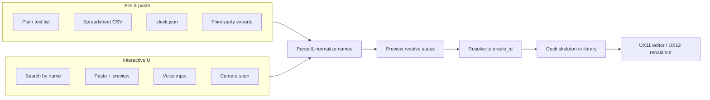

# Deck input — planning (UX13)

**Status:** **UX13-MVP** + **UX13b** + **UX13c** + **resolver v2** shipped (2026-06-28). Next: **IN-DECK-JSON** — [backlog/product-data.md](../../roadmap/backlog/product-data.md).  
**Depends on:** **UX7f** library (shipped), **UX11** editor (shipped).  
**Related:** [deck-output-format.md](deck-output-format.md) · [library-api.md](../web/library-api.md) · [user-experience.md](../dependency-engine/user-experience.md).

---

## Shipped summary (2026-06-28)

| Layer | Deliverable |
| --- | --- |
| **Parser** | `deck_import/parse_text.py` — Commander/Deck sections, quantities, comments |
| **Resolver** | Exact + case-insensitive + fuzzy match; disambiguation via `resolutions` |
| **Builder** | Library `.deck.json` with `imported`/`lands` slots, metrics, `dependency_report` |
| **CLI** | `mtg-deck-tools deck import --file` (`--commander`, `--name`) |
| **API** | `POST /api/v1/decks/import` |
| **Web** | Home — paste, file upload, template download, **Preview** → gated import |

**Gap today:** no `.deck.json` upload; import+fill and spreadsheet paths remain backlog.

---

## Roadmap analysis (post–UX13b)

Recommended priority for remaining deck-input work:

| Priority | ID | Topic | Rationale |
| --- | --- | --- | --- |
| **1** | **IN-DECK-JSON** | `.deck.json` upload | Reload saved decks without retyping |
| **2** | Import + fill | Lock imported cards → generate remainder | Addresses “continue editing” goal (**UX11** locks) |
| **3** | **IN-DECK-SHEET** / **UX13d** | CSV spreadsheet | After text path stable |
| **4** | **IN-DECK-EXT** | Site-specific parsers | Moxfield plaintext may already work via text grammar |
| **5** | **UX13e/f** | Voice / camera | Experimental; after resolver UX solid |

**Not planned:** sideboard/companion, live Scryfall lookup, partial save with placeholders, batch multi-deck import.

---

## Problem

Users need to load an **existing deck** into the builder for dependency review, metrics, and guided rebalance (**UX12**). Card **database** import (`POST /api/v1/import`) is unrelated.

---

## Input channels (concept map)



---

## MVP text import — shipped (UX13-MVP + UX13b)

Promoted IDs: **IN-DECK-TEXT**, **IN-DECK-RESOLVE**, **CLI-IN**, **UX13b**.

### Locked decisions (still apply)

| Topic | Decision |
| --- | --- |
| **Commander** | Required — `Commander` section or CLI/API `commanders` / `--commander` |
| **Unknown names** | Fail import with unresolved line list (no partial save) |
| **Name matching** | Resolver v2 — exact, case-insensitive, fuzzy auto-pick; manual `resolutions` for ambiguous/unknown |
| **Slots** | `lands` for basics; `imported` otherwise |
| **Deck size** | Incomplete lists OK; validation warnings, not hard fail on import |
| **Web entry** | Home — paste, file upload, template download |

### Text grammar (IN-DECK-TEXT)

```text
Commander
Meren of Clan Nel Toth

Deck
1x Grave Pact
1 Sol Ring
14 Swamp
Forest x13
```

See [changelog](../../history/changelog.md) 2026-06-28 for ship record.

### MVP slices

| Slice | Status |
| --- | --- |
| UX13-MVP-a … UX13-MVP-e | Shipped |
| UX13-MVP-f / **UX13b** (web paste + file + template) | Shipped |

---

## Import preview — shipped (UX13c)

**Goal:** Parse and resolve without saving. User reviews line-level status, then commits only when the preview is clean.

### Product decisions (locked 2026-06-28)

| Topic | Decision |
| --- | --- |
| **Save** | Preview **never** writes to library |
| **Pipeline** | Same `parse_text` + `resolve` as `import_deck_from_text`; skip `build` + `save_deck_to_library` |
| **Commit gate** | **Import** enabled only when `unknown_count = 0` and `ambiguous_count = 0` |
| **UI flow** | Home import section: **Preview** → results panel → **Import pasted list** (or auto-preview on file load — implementation choice; minimum is explicit Preview button) |
| **Line table** | Per line: line number, input name, status (`resolved` \| `unknown` \| `ambiguous`), resolved card name when ok |
| **Summary** | Counts: commanders, maindeck lines, resolved, unknown, ambiguous |
| **Errors** | Unknown/ambiguous lines listed with line numbers (same messages as failed import) |
| **API** | `POST /api/v1/decks/import/preview` — body same as import (`text`, optional `commanders`); response preview DTO only |
| **CLI** | `deck import --file PATH --dry-run` prints summary table; exit non-zero if unresolved (optional slice UX13c-d) |
| **Fuzzy / disambiguation** | **Out of scope** for UX13c — preview shows failures; resolver v2 is a later promotion |

### Preview response sketch

```json
{
  "commanders": [{ "input_name": "Meren of Clan Nel Toth", "status": "resolved", "name": "Meren of Clan Nel Toth", "oracle_id": "…" }],
  "maindeck": [
    { "line_number": 6, "input_name": "Sol Ring", "quantity": 1, "status": "resolved", "name": "Sol Ring", "oracle_id": "…" },
    { "line_number": 7, "input_name": "Not A Card", "quantity": 1, "status": "unknown" }
  ],
  "summary": {
    "commander_count": 1,
    "maindeck_line_count": 2,
    "resolved_count": 1,
    "unknown_count": 1,
    "ambiguous_count": 0,
    "ready": false
  }
}
```

### Implementation modules (planned)

| Module | Responsibility |
| --- | --- |
| `service/deck_import.py` | `preview_deck_import(text, …)` → preview DTO |
| `service/dto.py` | `ImportDeckPreviewRequest` (reuse import body), `ImportDeckPreviewResponse`, line items |
| `api/library.py` | `POST /api/v1/decks/import/preview` |
| `packages/web/…/HomePage.svelte` | Preview UI + gated Import |
| `cli/main.py` | `--dry-run` on `deck import` (optional) |

### UX13c slices

| Slice | Deliverable | Status |
| --- | --- | --- |
| **UX13c-a** | Planning + promotion | Shipped |
| **UX13c-b** | Preview service + API + OpenAPI | Shipped |
| **UX13c-c** | Home preview UI | Shipped |
| **UX13c-d** | CLI `--dry-run` | Shipped |

**Parallel OK with:** doc-only, **GATE**. **Depends on:** UX13-MVP resolver (shipped).

---

## Resolver v2 — shipped (IN-DECK-RESOLVE-v2)

**Goal:** Recover from typos, case differences, and duplicate-name collisions during text import preview.

### Product decisions (locked 2026-06-28)

| Topic | Decision |
| --- | --- |
| **Match order** | Exact → case-insensitive → fuzzy (single high-confidence auto-pick) |
| **Ambiguous** | Multiple exact rows or multiple fuzzy scores ≥ 0.85 → `ambiguous` with `candidates` |
| **Unknown** | No strong match; return top fuzzy `candidates` (score ≥ 0.65) as suggestions |
| **Manual pick** | `resolutions[]` on preview/import — `{ section, index, oracle_id }` |
| **Commit gate** | Unchanged — import only when preview `ready` (all lines resolved) |
| **Web** | Candidate chips on ambiguous/unknown lines; re-preview after pick |

### Implementation modules

| Module | Responsibility |
| --- | --- |
| `deck_import/normalize.py` | Name normalization for fuzzy compare |
| `deck_import/resolve.py` | Fuzzy candidate search + `build_resolution_map` |
| `service/dto.py` | `ImportDeckResolution`, preview `candidates` |
| `packages/web/…/HomePage.svelte` | Disambiguation candidate buttons |

---

## Backlog (not active)

### Search by name (UX13a)

Typeahead add-card on deck view / import flow. Resolver v2 shipped — UX13a can promote next.

### Spreadsheet (IN-DECK-SHEET / UX13d)

CSV columns: `name`, `quantity`, `section`. UTF-8 first.

### Native `.deck.json` (IN-DECK-JSON)

Validate `schema_version`; hydrate library; re-resolve stale `oracle_id`.

### Third-party exports (IN-DECK-EXT)

Moxfield/Archidekt plaintext (P1 — may work today); MTGO `.dek`, Arena (P2).

### Import + fill (future)

Lock imported cards → wizard/generate fills remainder (**UX11** locks).

### Voice (UX13e) / Camera (UX13f)

Experimental mobile; backlog until text + resolver UX stable.

---

## Post-import deck shape

| Mode | Behavior |
| --- | --- |
| **List-only import** | `cards[]` with `slot: "imported"` or `"lands"`; metrics + dependency report |
| **Import + fill (future)** | Locked imports → generate / refill remainder |
| **Library** | New `id`; deck view after commit |

---

## Resolved / open questions

| # | Question | Answer |
| --- | --- | --- |
| 1 | Web import entry | **Home** (shipped **UX13b**) |
| 2 | Commander required? | **Yes** |
| 3 | Preview before save? | **Yes** — **UX13c** shipped |
| 4 | Per-site parsers? | **Deferred** — plaintext grammar first |
| 5 | Import + auto-fill? | **Separate flow** — backlog |
| 6 | Fuzzy in preview? | **Yes** — resolver v2 shipped (auto-pick + manual `resolutions`) |

---

## Out of scope (all phases)

- Sideboard / companion / wishboard
- Live Scryfall lookup during import
- Multi-deck batch import
- Full-deck photo OCR

---

## References

- [deck-output-format.md](deck-output-format.md)
- [library-api.md](../web/library-api.md)
- [iterate-api.md](../web/iterate-api.md)
- [active.md](../../roadmap/active.md)
- [backlog/web-ui.md](../../roadmap/backlog/web-ui.md)
