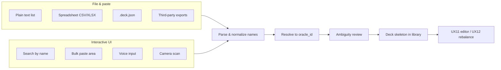

# Deck input — planning sketch (UX13)

**Status:** Planning (2026-06-28). **Backlog** — [product-data.md](../../roadmap/backlog/product-data.md), [web-ui.md](../../roadmap/backlog/web-ui.md), [cli-ui.md](../../roadmap/backlog/cli-ui.md).  
**Phase:** Planning only — no implementation or changelog until promoted.  
**Depends on:** **UX7f** library (shipped), **UX11** editor (shipped), cards.db name resolution.  
**Related:** [deck-output-format.md](deck-output-format.md) · [library-api.md](../web/library-api.md) · [user-experience.md](../dependency-engine/user-experience.md).

---

## Problem

Today the builder assumes a **generated** deck: wizard criteria → slot fill → save to library. Users who already have a physical pile, a spreadsheet, a text export from another site, or a `.deck.json` from a prior session have **no first-class path** to load that list into the editor for dependency review, metrics, or guided rebalance (**UX12**).

Card **database** import (`POST /api/v1/import`) is unrelated — this feature is **deck list** intake.

---

## User goals

| Goal | Example |
| --- | --- |
| **Analyze an existing list** | “I built this on Moxfield — show me dependency gaps.” |
| **Continue editing** | “I have 60 cards picked — fill the rest under my criteria.” |
| **Partial import** | “Here are my commanders and a wishlist — slot the remainder.” |
| **Physical → digital** | “I’m at the table with a pile of cards — get them into the app quickly.” |

---

## Input channels (concept map)



---

## File & structured formats

### Plain text list (IN-DECK-TEXT)

Lowest friction; matches how many sites export decklists.

**Sketch format:**

```text
Commander
Meren of Clan Nel Toth

Deck
1x Grave Pact
1 Sol Ring
Forest x13
```

**Parser notes:**

- One card per line; optional quantity prefix (`1x`, `4`, `x2`).
- Optional section headers (`Commander`, `Deck`, `Sideboard` — sideboard out of scope for Commander v1).
- Comments (`#`) and blank lines ignored.
- **Lands:** accept `14 Swamp` and `Swamp x14`.
- Output: ordered name list + optional commander section before DB resolution.

### Spreadsheet (IN-DECK-SHEET)

For users who maintain decks in Excel / Google Sheets.

| Column (minimal) | Required | Notes |
| --- | --- | --- |
| `name` | yes | Card name as printed |
| `quantity` | no | Default 1; Commander singleton ignores >1 with warning |
| `section` | no | `commander` \| `main` — or separate sheets |
| `slot` | no | Hint for slot assignment post-import (stretch) |

**Formats:** CSV first; XLSX if a lightweight reader is acceptable. First row = headers; UTF-8.

### Native `.deck.json` (IN-DECK-JSON)

Already specified in [deck-output-format.md](deck-output-format.md). Library deferred import — [library-api.md](../web/library-api.md).

**Behavior:** Validate `schema_version`; hydrate library entry; skip re-resolution when `oracle_id` present; re-resolve by name when ids stale after bulk refresh.

### Third-party deck files (IN-DECK-EXT)

Translate **into** the internal parse result (names + sections), not directly into engine objects.

| Source | Format | Priority | Notes |
| --- | --- | --- | --- |
| Moxfield / Archidekt | Plaintext export | P1 | Pairs with **EXP-MOX** export symmetry |
| MTGO | `.dek` XML | P2 | Arena uses different encoding |
| Arena | Copy-paste / export URL | P2 | May need dedicated parser; IDs not oracle |
| TappedOut | BBCode / text | P3 | Declining share; text fallback may suffice |

**Open question:** Maintain per-site parsers vs. document “paste plaintext export” as the supported path for P1.

---

## Interactive UI methods

### Search by name (UX13a)

Typeahead against `cards.db` — same family as commander search and **UX12e** named-card swap.

| Surface | Behavior |
| --- | --- |
| **Empty deck / import flow** | “Add card” → search → append to maindeck list |
| **Deck view** | Quick add row without full generate pipeline |
| **Commander** | Dedicated commander picker when import omits commanders |

**Constraints:** Commander-legal filter optional toggle; duplicate singleton warning; fuzzy match disambiguation sheet (see Resolution).

### Bulk paste (UX13b)

Large textarea + **Parse preview** before commit.

- Accepts same grammar as IN-DECK-TEXT.
- Show resolved / ambiguous / unknown counts before save.
- Mobile: paste from clipboard is often easier than file upload.

### Voice input (UX13c)

**Mobile-first experimental.** User speaks card names; speech-to-text → name resolution pipeline.

| Aspect | Sketch |
| --- | --- |
| **API** | Browser Web Speech API (no server round-trip for audio) |
| **UX** | Push-to-talk per card or short list; confirm each match |
| **Risk** | Homophones (“Jace” vs “JS”) — always show candidate confirmation |
| **Offline** | Speech may work offline on some platforms; resolution still needs local DB |

**Defer** until search-by-name and paste are stable.

### Camera scan (UX13d)

**Mobile-first experimental.** Point camera at physical card → identify → add to list.

| Approach | Tradeoff |
| --- | --- |
| **OCR on card name** | Fragile on stylized frames; may work for recent sets |
| **Third-party card recognition API** | Accuracy vs. privacy, cost, offline policy |
| **On-device ML model** | Bundle size; maintenance per set |

**Product stance (planning):** Treat as **research spike** — do not block file/paste/search paths. Align with local-first / offline goals: prefer on-device or bundled model over live cloud unless user opts in.

---

## Resolution & ambiguity

Shared pipeline for all channels:

```
raw string → normalize (trim, unicode, split DFC "//") → exact name lookup → fuzzy fallback → user disambiguation UI
```

| Outcome | UI |
| --- | --- |
| **Exact match** | Auto-resolve to `oracle_id` |
| **Multiple printings** | Pick printing or “use oracle default” |
| **Unknown name** | Skip, manual edit, or “add as placeholder” (blocks analyze until fixed) |
| **DFC / split card** | Use front-face name; match [oracle-bulk-contract.md](../data/oracle-bulk-contract.md) normalization |

**CLI parity:** Same resolution service for `mtg-deck-tools deck import --file …`.

---

## Post-import deck shape

Imported lists are **not** fully slot-filled unless the source included slot metadata.

| Mode | Behavior |
| --- | --- |
| **List-only import** | `cards[]` with `slot: "imported"` or unslotted; metrics + dependency report still run |
| **Import + fill** | Criteria from wizard + locked imported cards → `generate` / refill remainder (**UX11** locks) |
| **Import as new library deck** | `POST` creates id; opens deck view |

Persisted document remains [deck-output-format.md](deck-output-format.md) `.deck.json`.

---

## Suggested phasing

| Phase | Deliverable | Component |
| --- | --- | --- |
| **UX13a** | Search-by-name add + bulk paste with preview | web-ui |
| **UX13b** | `.deck.json` upload + plain-text file upload | web-ui + product-data |
| **UX13c** | CSV import; Moxfield/Archidekt plaintext auto-detect | product-data |
| **UX13d** | CLI `deck import` | cli-ui |
| **UX13e** | Voice input (mobile) | web-ui |
| **UX13f** | Camera scan spike / POC | web-ui |

**Parallel OK with:** **UX12** (disjoint UI surfaces; shared card search endpoint). **Depends on** stable library + iterate APIs.

---

## Open questions

| # | Question |
| --- | --- |
| 1 | Import flow entry: new route `/import` vs. modal from library vs. wizard branch? |
| 2 | Require commander(s) upfront or allow incomplete list + fix later? |
| 3 | Per-site parsers in scope for v1 or plaintext-only? |
| 4 | Voice/camera: ship behind feature flag or backlog-only until accuracy proven? |
| 5 | Import + auto-fill: one flow or separate “analyze only” vs. “complete my deck”? |

---

## Out of scope (planning)

- Sideboard / companion / wishboard (Commander v1 is 100 + commanders).
- Live Scryfall lookup during import (static `cards.db` only).
- Multi-deck batch import.
- OCR of entire deck photos in one shot (vs. one card at a time).

---

## References

- [deck-output-format.md](deck-output-format.md) — persisted schema
- [library-api.md](../web/library-api.md) — deferred `.deck.json` upload
- [iterate-api.md](../web/iterate-api.md) — post-import editing
- [advanced-swap-ux.md](../web/advanced-swap-ux.md) — named-card search patterns (**UX12e**)
