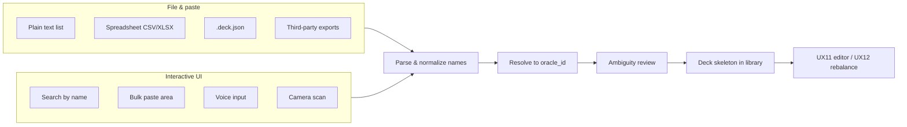

# Deck input — planning (UX13)

**Status:** **UX13-MVP** active — [active.md](../../roadmap/active.md). Text import decisions locked 2026-06-28.  
**Phase:** Planning complete for MVP slice; implementation next.  
**Depends on:** **UX7f** library (shipped), **UX11** editor (shipped).  
**Related:** [deck-output-format.md](deck-output-format.md) · [library-api.md](../web/library-api.md) · [user-experience.md](../dependency-engine/user-experience.md).

---

## Problem

Today the builder assumes a **generated** deck: wizard criteria → slot fill → save to library. Users who already have a physical pile, a spreadsheet, a text export from another site, or a `.deck.json` from a prior session have **no first-class path** to load that list into the editor for dependency review, metrics, or guided rebalance.

Card **database** import (`POST /api/v1/import`) is unrelated — this feature is **deck list** intake.

---

## User goals

| Goal | Example |
| --- | --- |
| **Analyze an existing list** | “I built this on Moxfield — show me dependency gaps.” |
| **Continue editing** | “I have 60 cards picked — fill the rest under my criteria.” |
| **Partial import** | “Here are my commanders and a wishlist — slot the remainder.” |
| **Physical → digital** | “I’m at the table with a pile of cards — get them into the app quickly.” |

---

## Input channels (concept map)



---

## MVP text import — locked decisions (UX13-MVP)

First slice: **plain-text file** → library deck via **CLI**, then API/web. Promoted IDs: **IN-DECK-TEXT**, **IN-DECK-RESOLVE**, **CLI-IN**.

### Product decisions

| Topic | Decision |
| --- | --- |
| **Commander** | **Required.** `Commander` section header + name line, or CLI `--commander "Name"` when the file has no commander block. Partner: second line under `Commander` or repeat `--commander`. |
| **Unknown names** | **Fail** the import with a list of unresolved lines. No partial save in MVP. |
| **Name matching** | **Exact match** on `cards.name` only. No fuzzy match or disambiguation UI in MVP. Multiple DB rows with the same name → fail that line as **ambiguous**. |
| **DFC / split cards** | Match oracle bulk **front-face** name as stored in `cards.db` (user supplies front name only). |
| **Slot assignment** | `slot: "lands"` for basic lands (`is_basic_land = 1`); `slot: "imported"` for all other maindeck cards. |
| **Quantities** | Honor `1x`, `14`, `Swamp x14`, etc. Basic lands may have `quantity > 1`. Non-basic with `quantity > 1` → **warning** on deck document; still import. |
| **Deck size** | **Incomplete lists allowed** (&lt; 99 maindeck). Do **not** call `require_valid_deck()` on import; attach validation **warnings** when size or singleton rules fail. |
| **Dependency / metrics** | **Run** `validate_dependencies()` and `compute_deck_metrics()` on the imported list; persist `dependency_report` and `stats` like a generated deck. |
| **Entry surface** | **CLI first:** `mtg-deck-tools deck import --file PATH [--name LABEL] [--commander NAME]`. API `POST /api/v1/decks/import` and web paste/upload follow the same `service/` facade. |
| **Library** | Always **save** to server library (`save_deck_to_library`); print deck `id` on success. |
| **Criteria** | Minimal `DeckCriteria`: `commander_oracle_ids`, `colors` from commander CI, default `slot_template`, no themes/mechanics unless later import+fill flow. |

### Text grammar (IN-DECK-TEXT)

```text
Commander
Meren of Clan Nel Toth

Deck
1x Grave Pact
1 Sol Ring
14 Swamp
Forest x13
# sideboard notes ignored
```

| Rule | Detail |
| --- | --- |
| Sections | Optional headers: `Commander`, `Deck` (case-insensitive). Lines before first header → `Deck`. |
| Comments | Lines starting with `#` ignored. |
| Blank lines | Ignored. |
| Quantity | Optional prefix `Nx`, `N x`, or suffix `x N` (N integer). Default quantity 1. |
| Sideboard | `Sideboard` header recognized but **ignored** (out of scope Commander v1). |

### Resolution pipeline (IN-DECK-RESOLVE)

```
trim → exact SELECT … WHERE name = ? → 0 rows: unknown
                                    → 1 row: resolve
                                    → 2+ rows: ambiguous
```

Commanders: `commander_eligible = 1` filter in addition to name match. Maindeck: any commander-legal card in `cards`.

Reuse patterns from `builder/commander_resolve.resolve_commander_oracle_ids` and `pool._row_to_candidate` column set when building `DeckCard` entries.

### Implementation modules (planned)

| Module | Responsibility |
| --- | --- |
| `deck_import/parse_text.py` | Text → `ParsedDeckList` (commanders, maindeck lines with qty) |
| `deck_import/resolve.py` | Name → card row; `ResolveError` with unknown/ambiguous lists |
| `deck_import/build.py` | Resolved rows → `DeckBuildResult` → `build_deck_document()` |
| `service/deck_import.py` | Facade: `import_deck_from_text()` → `DeckLibraryDetailResponse` |
| `cli/main.py` | `deck import` typer command |

### MVP slices

| Slice | Deliverable | Status |
| --- | --- | --- |
| **UX13-MVP-a** | Locked decisions + promotion (this doc) | Planning shipped |
| **UX13-MVP-b** | `parse_text` + unit tests | Pending |
| **UX13-MVP-c** | `resolve` + `build` + `service/deck_import` | Pending |
| **UX13-MVP-d** | CLI `deck import --file` | Pending |
| **UX13-MVP-e** | `POST /api/v1/decks/import` + OpenAPI | Pending |
| **UX13-MVP-f** | Web paste / file upload (**UX13b**) | Backlog |

**Parallel OK with:** doc-only, **GATE** (no engine rule changes). **Not parallel** with concurrent edits to `service/library.py` validation without coordination.

### Out of scope (MVP)

- Fuzzy search, printing picker, placeholder cards
- CSV, `.deck.json` upload, Moxfield-specific parsers
- Import + auto-fill remainder (separate future flow using UX11 locks)
- Web UI, voice, camera

---

## File & structured formats (post-MVP)

### Plain text list (IN-DECK-TEXT)

See **MVP text grammar** above. Bulk paste in web uses the same grammar (**UX13b**).

### Spreadsheet (IN-DECK-SHEET)

| Column (minimal) | Required | Notes |
| --- | --- | --- |
| `name` | yes | Card name as printed |
| `quantity` | no | Default 1 |
| `section` | no | `commander` \| `main` |

**Formats:** CSV first; XLSX later. UTF-8.

### Native `.deck.json` (IN-DECK-JSON)

Validate `schema_version`; hydrate library; re-resolve stale `oracle_id` after bulk refresh. See [library-api.md](../web/library-api.md).

### Third-party deck files (IN-DECK-EXT)

| Source | Format | Priority |
| --- | --- | --- |
| Moxfield / Archidekt | Plaintext export | P1 — same grammar as MVP text |
| MTGO | `.dek` XML | P2 |
| Arena | Copy-paste | P2 |

**Decision:** MVP is **plaintext only**; site-specific parsers deferred until after CLI dogfood.

---

## Interactive UI methods (backlog)

### Search by name (UX13a)

Typeahead against `cards.db` — commander search and **UX12e** named-card swap family. Disambiguation sheet when fuzzy ships.

### Bulk paste (UX13b)

Textarea + parse preview; same grammar as MVP. **After** CLI/API facade exists.

### Voice input (UX13e) / Camera scan (UX13f)

Experimental mobile; **backlog only** until text import is stable. No feature flag in MVP.

---

## Post-import deck shape

| Mode | Behavior |
| --- | --- |
| **List-only import (MVP)** | `cards[]` with `slot: "imported"` or `"lands"`; metrics + dependency report populated |
| **Import + fill (future)** | Lock imported cards → generate / refill remainder |
| **Library** | New `id`; opens in deck view when using web |

Persisted document: [deck-output-format.md](deck-output-format.md) `.deck.json`.

---

## Resolved / open questions

| # | Question | MVP answer |
| --- | --- | --- |
| 1 | Import entry (web) | **Deferred** — CLI first; library “Import” button when **UX13b** promotes |
| 2 | Commander required? | **Yes** (section or `--commander`) |
| 3 | Per-site parsers? | **No** — plaintext grammar only |
| 4 | Voice/camera? | **Backlog** — not in MVP |
| 5 | Import + auto-fill? | **Separate flow** — MVP is list-only analyze/edit |

---

## Out of scope (all phases)

- Sideboard / companion / wishboard
- Live Scryfall lookup during import
- Multi-deck batch import
- Full-deck photo OCR

---

## References

- [deck-output-format.md](deck-output-format.md) — persisted schema
- [library-api.md](../web/library-api.md) — library HTTP API
- [iterate-api.md](../web/iterate-api.md) — post-import editing
- [active.md](../../roadmap/active.md) — **UX13-MVP** register
