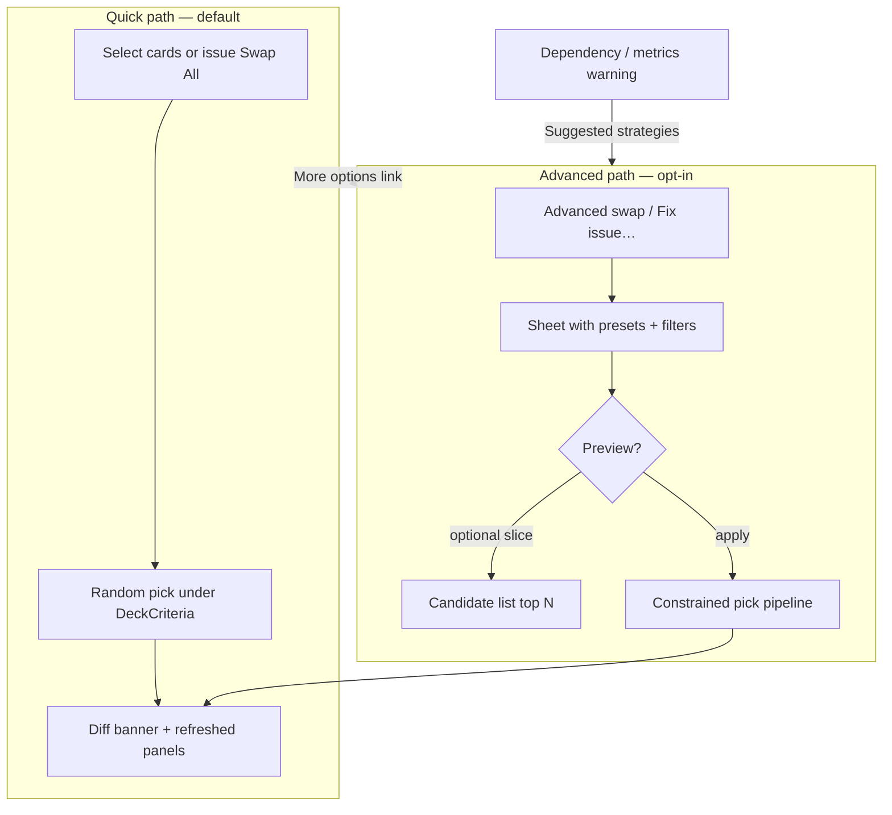

# Advanced swap & guided rebalance — UX planning (UX12)

**Status:** Planning (2026-06-27). **Active** — [active.md](../../roadmap/active.md). Wireframes: P0 drafts in [wireframes/](wireframes/).  
**Phase:** Planning only — no implementation or changelog until slices ship.  
**Depends on:** **UX11** (shipped), **UX7d** dependency dashboard (shipped), **UX10** deck metrics (shipped).  
**Related:** [iterate-api.md](iterate-api.md) · [user-experience.md](../dependency-engine/user-experience.md) § Understanding and swapping dependencies · [backlog/web-ui.md](../../roadmap/backlog/web-ui.md).

---

## Problem

After **UX11**, users can lock cards, regenerate a slot, or swap selected cards — but every replacement is a **random pick** from the existing generate pipeline. The only “guided” affordance today is **Swap All** on a dependency issue, which still performs unconstrained random swaps on the cards named in the issue detail.

Users lack control when rebalancing:

| Gap | Example |
| --- | --- |
| **No replacement intent** | Equipment imbalance → user wants new picks to be Equipment, not arbitrary synergy cards |
| **No resolution choice** | Too much equipment → user may want to **add carriers** or **remove equipment**, not one fixed repair |
| **Metrics disconnected from swap** | Curve advisories (`CURVE_MISSING_EARLY`) have no iterate action |
| **No named-card swap** | User knows they want *Sword of Feast and Famine* in place of a flex slot |
| **No filter constraints** | Cannot say “replace with a blue uncommon under $2” |

The engine already has building blocks (`dependency_repair.py` role-aware pool filters, price/rarity/CI filters in `filler.py`) but **UX11 swap** does not expose them.

---

## Design goals

1. **Preserve the fast path** — one-tap random swap/regen must remain the default for users who want speed.
2. **Opt-in depth** — advanced controls live behind an explicit affordance, not on every row.
3. **Warning-aware entry** — dependency issues offer **suggested strategies**, not a single auto-fix. Curve advisories deferred to a later UX12 slice.
4. **Composable constraints** — color, type, rarity, price, mechanic role, and named card should combine in one swap request.
5. **Transparent outcomes** — show what was constrained, preview candidates when feasible, diff after apply (same as UX11).
6. **Respect locks** — locked cards never vacated; advanced swap inherits UX11 semantics.

---

## Two-tier interaction model



| Tier | Entry points | User cost | Engine |
| --- | --- | --- | --- |
| **Quick** | Row checkbox → **Swap (N)**; slot **Regenerate**; issue **Swap All** | 1–2 taps | Current `swap_deck_cards` / `refill_deck_slot` |
| **Advanced** | **Advanced…** on swap bar (right); **Fix issue…** on dependency row | 3–8 taps | Extended swap/refill with `SwapConstraints` + preview |

**Swap bar layout (UX12):** **Clear** (left) · **Swap (N)** (center) · **Advanced…** (right).

**Deferred entry:** **Adjust curve…** on deck metrics advisories — post-v1 UX12 slice (see [Phased delivery](#phased-delivery)).

**Principle:** Quick actions stay visible; advanced is always reachable but never required.

---

## Advanced swap sheet (primary UI)

**Presentation:** Bottom sheet on mobile (375px baseline), side panel on wider viewports. Same route `/deck/:id` — not a new route (consistent with UX11).

### Sections (top → bottom)

| Section | Purpose |
| --- | --- |
| **Context** | “Replacing N cards” or “Fixing: Equipment balance”; list selected card names (chips) |
| **Strategy presets** | Issue-specific chips (see [Resolution playbooks](#resolution-playbooks)); one preset selected by default when opened from a warning |
| **Replacement filters** | Collapsible **Filters** — type, color, rarity, max price, mechanic role |
| **Named card** | Optional search: “Replace with specific card” — commander-legal lookup |
| **Scope** | **Same slot only** (default); expert toggle **Any eligible slot** (`slot_policy: any`) |
| **Actions** | **Apply swap** (primary), **Preview candidates** (secondary — v1), **Cancel** |

### Filter controls

Reuse deck-view filter vocabulary where possible (WUBRG pips, type chips) plus swap-specific fields:

| Filter | UI control | Maps to engine |
| --- | --- | --- |
| **Card type** | Multi-select chips: Creature, Instant, Sorcery, Artifact, Enchantment, Equipment, Vehicle, Land, … | `type_line` substring / taxonomy |
| **Color** | WUBRG + colorless + void (∅) — same as deck list filters | `color_identity` / mana cost |
| **Rarity** | Common / Uncommon / Rare / Mythic multi-select | `filter_candidates_by_rarity` |
| **Max price** | Currency input; default = deck `criteria.budget` remainder or per-card cap | `filter_candidates_by_price` |
| **Mechanic role** | When opened from dependency issue: Producer / Consumer / Equipment / Equip payoff / Vehicle / … | `card_effects` / profile atoms |
| **Named card** | Autocomplete search → single `oracle_id` | Direct assignment (bypass random pick) |

**Named-card mode:** When user picks a specific card, filters collapse to validation-only (CI, budget, uniqueness). If illegal, inline error with optional **override** (see below).

### Validation override

Iterate operations normally **block** when post-swap deck validation fails (budget, color identity, strict dependencies, slot counts). Users experimenting with swaps need an explicit escape hatch.

| Aspect | Spec |
| --- | --- |
| **Default** | `POST …/swap` / `…/refill-slot` returns **400** with `validation_errors[]` — deck not saved |
| **Override** | User checks **Override validation and apply anyway** → retry with `force_validation_override: true` |
| **UI** | Shown in advanced sheet and named-card flow after failed apply; same pattern for quick swap error banner (stretch) |
| **Apply anyway** | Primary button disabled until override checkbox checked |
| **Still blocked** | Locked card swap, commander in `oracle_ids`, empty selection, engine cannot find replacement (no pool match) |
| **After override** | Deck saves; `dependency_report` / metrics may show warn/fail — user accepts |

Wireframe: [deck-view-advanced-swap-override.html](wireframes/deck-view-advanced-swap-override.html).

### Slot regen (advanced variant)

Slot heading **Regenerate** gains a chevron or **Advanced…** sibling:

| Mode | Behavior |
| --- | --- |
| **Quick regen** (default) | Unchanged — confirm → `POST …/refill-slot` |
| **Advanced regen** | Sheet: “Only pick cards matching…” + same filter set; optional “bias toward resolving: [issue]” |

---

## Resolution playbooks (warning → strategies)

Each `rule_id` (and curve advisory) exposes **multiple strategies** — user picks one; UI pre-fills the advanced sheet.

### Equipment (`EQUIPMENT_BALANCE`)

Read `detail.deficit` from issue payload (`equipment` | `carriers` | equip-payoff imbalance).

| Strategy | User intent | Replace targets | Replacement constraints |
| --- | --- | --- | --- |
| **Add equipment** | More equipment pieces | User-selected or flex/synergy cards | Type: Equipment |
| **Add carriers** | More creatures to equip | Flex/synergy | Type: Creature; exclude Vehicle |
| **Add equip payoffs** | Cards that care about equipment | Flex/synergy | Role: equip_payoff |
| **Trim equipment** | Abandon voltron density | Equipment cards listed in issue | Random flex/synergy (no equipment type filter) |
| **Trim payoffs** | Too many payoff pieces | `detail.equip_payoffs` names | Random non-payoff |
| **Quick shuffle** | Try luck | Issue-listed cards | None (current Swap All) |

### Vehicles (`VEHICLE_BALANCE`)

| Strategy | `detail.deficit` | Replacement focus |
| --- | --- | --- |
| **Add vehicles** | `vehicles` | Type: Vehicle |
| **Add pilots** | `creatures` | Type: Creature |
| **Remove vehicles** | oversupply | Swap out vehicles → non-vehicle |

### Producer / consumer profiles (energy, tokens, sacrifice, blood, …)

| Strategy | When | Replacement focus |
| --- | --- | --- |
| **Add producers** | `ONE_SIDED` / low producer count | `effect_kind` producer for profile |
| **Add consumers** | consumers deficit | `effect_kind` consumer |
| **Trim producers** | `IMBALANCED_RATIO` — too much setup | Swap listed producers → non-producer |
| **Trim consumers** | overpayoff | Swap consumers → flex |
| **Rebalance package** | Future **UX6** `dependency_roles` on cards | Profile package swap (ties to CLI-SWAP) |

### Tutor targets (`TUTOR_TARGET_EXISTS`)

| Strategy | Replacement focus |
| --- | --- |
| **Fix tutor** | Swap tutor card → tutor with valid targets in deck |
| **Add target** | Swap flex slot → card matching tutor predicate (reuse `swap_matching_card`) |

### Curve advisories (`CURVE_MISSING_EARLY`, `CURVE_TOP_HEAVY`) — deferred

| Strategy | Replacement focus |
| --- | --- |
| **Lower curve** | Swap high-CMC nonlands → CMC ≤ 3 |
| **Raise curve** | Swap low-impact 1–2 drops → CMC 4+ |
| **Slot regen early** | Refill `ramp`/`removal` with `max_cmc: 3` |

**Status:** Playbook definitions may be drafted in config during UX12a, but **no UI or iterate entry** until a post-v1 slice (after dependency-issue guided swap ships).

**Playbook source of truth:** YAML or JSON map `rule_id` → `strategies[]` in `config/` (mirrors `curve-advisories.yaml` pattern) so copy and constraints stay data-driven.

---

## Entry-point matrix

| Source | Quick action (keep) | New advanced entry | Default preset |
| --- | --- | --- | --- |
| Card row selection + swap bar | **Swap (N)** | **Advanced…** link on bar | None — user sets filters |
| Dependency issue row | **Swap All** | **Fix issue…** button; **Quick fix** (prototype) | Highest-confidence strategy for `deficit` |
| Deck metrics advisory | — (none today) | **Adjust curve…** — *deferred* | — |
| Slot heading | **Regenerate** | **Regenerate…** (split button) or long-press | Slot-appropriate curve bias |
| Card row context menu (stretch) | — | **Swap for…** → named card search | Named card |

**Navigation:** Opening advanced from an issue passes query state (`issueKey`, `strategyId`, preselected `oracle_ids`) — no new route; sheet state in client.

---

## API sketch (planning)

Extend iterate endpoints; avoid proliferating one-off routes.

### `SwapConstraints` (request body extension)

```json
{
  "oracle_ids": ["…"],
  "seed": 42,
  "constraints": {
    "type_lines_any": ["Equipment"],
    "colors_all": ["W"],
    "rarities": ["uncommon", "rare"],
    "max_price_usd": 5.0,
    "effect_role": { "profile_id": "equipment", "role": "equipment" },
    "replacement_oracle_id": null,
    "slot_policy": "same"
  },
  "strategy_id": "add_equipment",
  "preview_limit": 8,
  "force_validation_override": false
}
```

| Field | Notes |
| --- | --- |
| `oracle_ids` | Cards to vacate (unchanged from UX11) |
| `constraints` | Optional; omit = quick swap |
| `constraints.slot_policy` | `"same"` (default) or `"any"` — expert cross-slot replacement |
| `strategy_id` | Telemetry + playbook lookup; server may validate consistency |
| `replacement_oracle_id` | When set, direct swap if legal |
| `preview_limit` | Preview endpoint only — max candidates per vacated position (default 8) |
| `force_validation_override` | When `true`, persist deck even if validation fails; default `false` |

**400 validation response** (when override not set):

```json
{
  "detail": "Deck validation failed",
  "validation_errors": [
    { "code": "BUDGET_EXCEEDED", "message": "Deck total would be $162.40 (limit $150.00)" },
    { "code": "COLOR_IDENTITY", "message": "Sword of Fire and Ice is not legal in Orzhov" }
  ]
}
```

### `POST /api/v1/decks/{id}/swap/preview` (**v1**)

Returns top *K* candidates per vacated slot **without persisting** — powers **Preview candidates** in the advanced sheet. Same request body as swap (including `constraints`); response:

```json
{
  "candidates_by_position": [
    {
      "from_oracle_id": "…",
      "from_name": "…",
      "slot": "synergy",
      "candidates": [
        { "oracle_id": "…", "name": "…", "mana_cost": "{2}", "price_usd": 1.5, "rarity": "uncommon" }
      ]
    }
  ]
}
```

Ship in **first UX12 implementation tranche** alongside constrained swap (not a follow-up slice).

### `POST /api/v1/decks/{id}/refill-slot` extension

Add optional `constraints` on refill-slot body (same shape).

### Engine

Refactor `swap_deck_cards` to accept optional `SwapConstraints`:

1. Build candidate pool (existing fetch + CI/budget/rarity/availability).
2. Apply constraint filters (reuse `dependency_repair.swap_matching_card` / `swap_effect_kind_card` patterns).
3. Score + weighted pick (existing scorer) or pin `replacement_oracle_id`.
4. Re-run validation + `dependency_report`.

**Locked cards:** Unchanged — cannot appear in `oracle_ids`.

---

## UX options considered

| Option | Pros | Cons | Recommendation |
| --- | --- | --- | --- |
| **A. Inline filters on swap bar** | Always visible | Clutters 375px; scares casual users | Reject as default; link only |
| **B. Bottom sheet (chosen)** | Familiar mobile pattern; room for presets + filters | Extra tap to open | **Primary** |
| **C. Separate `/deck/:id/swap` route** | Deep-linkable | Breaks UX11 “same surface” model | Defer — use sheet + URL hash `?swap=advanced` if needed |
| **D. Auto-execute best strategy (“Quick fix”)** | Fastest fix | Wrong when user wants abandon vs add | **Prototype in v1** on issue rows; dogfood then keep or remove |
| **E. Full candidate grid picker** | Maximum control | Heavy UI; slow on mobile | **Preview slice** only (top 5–8), not full Scryfall browser |
| **F. Re-run wizard** | Changes criteria holistically | Loses locks and manual edits | Out of scope — iterate stays on deck view |

---

## Phased delivery (proposed slices)

| Slice | Deliverable | Depends on |
| --- | --- | --- |
| **UX12a** | Planning lock + playbook YAML + OpenAPI (`SwapConstraints`, `swap/preview`) | — |
| **UX12b** | Engine: `SwapConstraints` on swap + refill; `swap/preview` endpoint; unit tests | UX12a |
| **UX12c** | Advanced swap sheet; filters (type, color, rarity, price); **Preview candidates** UI; expert **cross-slot** toggle | UX12b |
| **UX12d** | Issue **Fix issue…** + strategy presets (equipment, vehicles, producer/consumer); **Quick fix** prototype on issue rows | UX12b + playbook |
| **UX12e** | Named-card replacement (search + pin) | UX12b |
| **UX12f** | Curve advisory **Adjust curve…** + metrics panel links | UX12b; UX10c — **post-v1** |

**First implementation tranche (ship together):** UX12a → UX12b → UX12c + UX12d + UX12e. Preview API and UI are in-scope for that tranche, not deferred.

**Parallel OK with:** doc-only, cli-engine maintenance. **Not parallel with:** large OpenAPI refactors without coordination.

### Quick fix (prototype)

On dependency issue rows, a tertiary **Quick fix** button applies the playbook’s default strategy for `detail.deficit` with a confirm step (and post-swap diff banner for undo context). **Ship as prototype** in UX12d; remove or promote to permanent affordance after dogfood — do not block other UX12 slices on this decision.

---

## Decisions (locked)

| # | Decision |
| --- | --- |
| 1 | **Cross-slot replacement** — expert-only toggle (`slot_policy: any`); default remains same-slot |
| 2 | **Preview API** — `POST …/swap/preview` ships in first UX12 implementation tranche |
| 3 | **Curve advisory actions** — deferred to UX12f (after dependency guided swap) |
| 4 | **repair_dependencies** (D5) — separate future action; do not conflate with user swap |
| 5 | **Batch strategies** across multiple issues — defer |
| 6 | **Validation override** — `force_validation_override` on swap/refill; checkbox gates **Apply anyway** |

## Open decisions

| # | Question | Notes |
| --- | --- | --- |
| 1 | Keep **Quick fix** after prototype? | Decide after UX12d dogfood |
| 2 | CLI parity (`--swap-constraints JSON`)? | Stretch after web proves contract |

---

## Wireframe targets

| File | State |
| --- | --- |
| `deck-view-advanced-swap-sheet.html` | **Draft** — sheet open from swap bar; filters, cross-slot toggle, Preview + Apply |
| `deck-view-issue-fix-strategies.html` | **Draft** — issue expanded with strategy chips, Fix issue…, Quick fix (prototype) |
| `deck-view-advanced-swap-override.html` | **Draft** — validation blocked + override checkbox + Apply anyway |

Indexed in [wireframes/index.md](wireframes/index.md). Approve P0 files before UX12b implementation.

---

## Success criteria

- User can rebalance equipment by choosing **add equipment** vs **trim equipment** without manual card hunting.
- Quick swap unchanged for users who never open advanced.
- Dependency **Swap All** remains; **Fix issue…** adds guided path.
- Named-card swap respects CI, budget, and duplicate rules with clear errors.
- All operations refresh `dependency_report` and deck metrics in place.

---

## References

- UX11 shipped behavior: [iterate-api.md](iterate-api.md), [screens.md](screens.md) § Deck editor
- Engine repair patterns: `src/mtg_deck_tools/builder/dependency_repair.py`
- Issue payload shapes: `src/mtg_deck_tools/rules/equipment_depth.py`, `dependencies.py`
- CLI backlog coupling: [cli-ui.md](../../roadmap/backlog/cli-ui.md) **CLI-SWAP**
