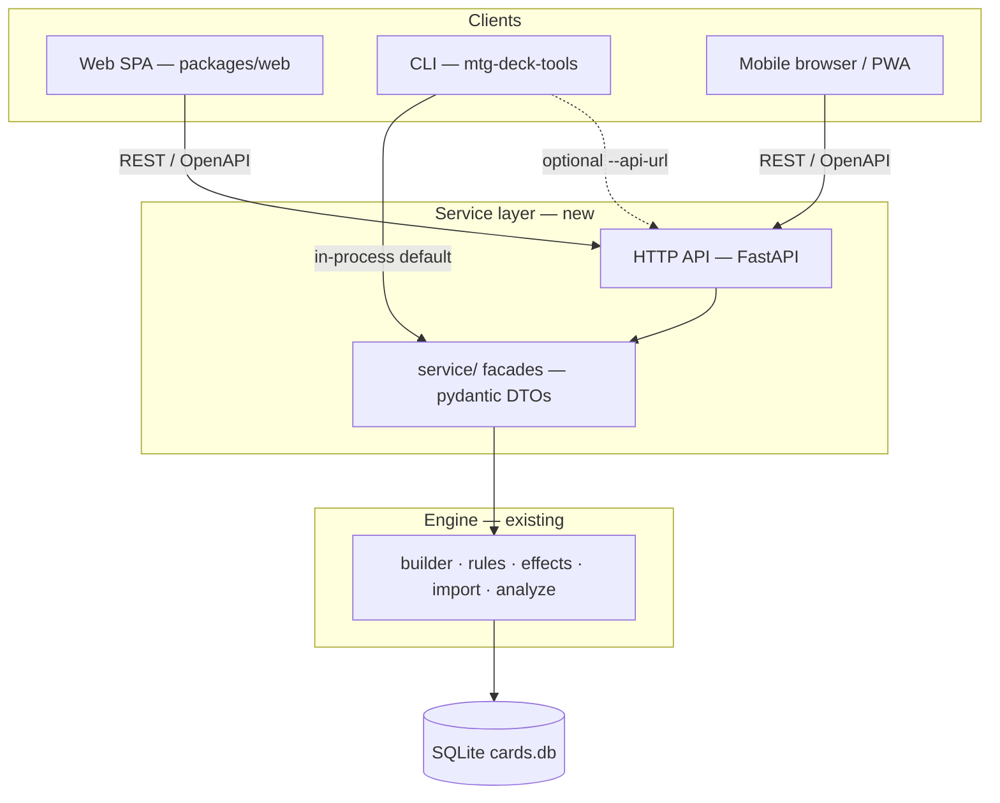
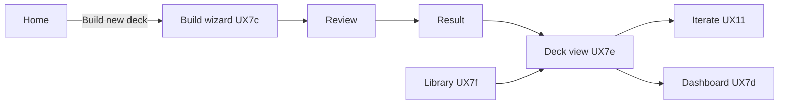

# Web UI architecture (planned)

**Status:** **UX7a–UX7c implemented** — wizard API + Svelte SPA (steps 1–7, review, result) — [specs/web/README.md](README.md).
**Phase:** UX7 active — **UX7e** enhanced deck view next.

## Strategic shift

| Prior assumption | Updated direction |
| --- | --- |
| Local **Windows** utility | **Cross-platform** CLI and GUI: Windows, Linux, macOS |
| Native desktop (WPF / WinUI) as a strong v1 path | **Web UI** as the primary interactive shell |
| Terminal-first for all rich UX | **Web** is the primary interactive shell; **CLI** for automation, dogfood, test harness, and bulk ops (TBD) |
| Desktop-only UX | **Mobile** is a first-class layout target — constrains scope and keeps flows simple |

The CLI is already cross-platform (Python 3.12+). A browser-based UI inherits that reach without maintaining three native clients.

---

## Decision: keep the Python engine (no port)

**Recommendation:** Do **not** port `src/mtg_deck_tools/` to another language for UX7.

| Factor | Assessment |
| --- | --- |
| Maturity | ~80+ modules: import, tagging (regex/YAML), builder, dependency engine, analyze |
| Performance | Deck generation already &lt; 2s; SQLite pool queries are not the bottleneck |
| Cross-platform | Python 3.12 runs on Windows, Linux, macOS today |
| Ecosystem fit | `pydantic`, `pyyaml`, `sqlite3`, golden-file tests — high rewrite cost elsewhere |
| Web hosting | A small Python API process is normal for self-hosted and PaaS deploys |

A TypeScript/Rust port would duplicate rules, drift from dogfood (`analyze run --fail-on-expect`), and delay UX7 by months with no measurable user gain.

**Revisit porting only if:** packaging Python for end users becomes unsolvable, or hosted multi-tenant scale demands a different runtime (not a v1 concern).

---

## Target architecture: shared service layer + HTTP for web

Three layers, one engine:



### Layer responsibilities

| Layer | Location (proposed) | Role |
| --- | --- | --- |
| **Engine** | `src/mtg_deck_tools/{builder,rules,...}` | Pure domain logic; UI-agnostic (unchanged principle) |
| **Service** | `src/mtg_deck_tools/service/` | **Shipped (UX7a)** — facades + pydantic DTOs; CLI uses in-process |
| **HTTP API** | `src/mtg_deck_tools/api/` | **Shipped (UX7a–UX7b)** — FastAPI routes + [openapi.yaml](openapi.yaml); `mtg-deck-tools serve` |
| **Web client** | `packages/web/` | Mobile-first SPA; generated or hand-written API client |
| **CLI** | `src/mtg_deck_tools/cli/` | Thin Typer commands → `service/` (not raw `builder/` calls over time) |

The **common layer** is `service/`, not HTTP itself. HTTP is the wire format the web UI (and optional remote CLI) uses; the CLI keeps a **direct in-process** path for local speed and CI.

---

## CLI and API: how they share the engine

### Default (local, v1)

- CLI commands call `service/` functions in-process — same code paths the API handlers call.
- No mandatory localhost round-trip for `generate`, `import`, or `analyze`.
- Dogfood and pytest continue to exercise engine + service without a server.

### Optional (parity, remote, hosted)

- `mtg-deck-tools serve` starts the API (and optionally serves the built SPA).
- CLI flag e.g. `--api-url http://127.0.0.1:8000` routes selected commands through HTTP — useful for:
  - Verifying API contracts match CLI behavior
  - Pointing at a self-hosted instance while using a thin local CLI
  - Integration tests of the HTTP surface

### Extraction order

1. Identify CLI entrypoints that already wrap engine calls (`run_generate`, `run_wizard`, `run_import`, …).
2. Move orchestration + DTO mapping into `service/` without behavior changes.
3. Point CLI at `service/`; add FastAPI handlers that call the same functions.
4. Add OpenAPI; generate TypeScript types for `packages/web/`.

**Anti-pattern:** Duplicating validation or dependency rules in the frontend. The SPA sends `DeckCriteria` (or deck id) and renders responses from [deck-output-format.md](../../product/deck-output-format.md).

---

## Deployment modes

| Mode | How | Primary user |
| --- | --- | --- |
| **Local dev** | `mtg-deck-tools serve` + Vite dev server proxying `/api` | Developers |
| **Local app** | `serve --with-ui` (API + static `packages/web/dist`) | Desktop users — open `http://127.0.0.1:PORT` |
| **CLI-only** | No server; existing workflow | Scripts, dogfood, automation |
| **Self-hosted** | Single container/process; volume for `data/cards.db` | Friends / small group |
| **Simple PaaS** | Fly.io, Railway, Render — one web service + persistent disk | Low-traffic public demo |

### Local-first constraints (unchanged)

- Static Scryfall snapshot → `cards.db`; no live sync at runtime.
- Core deck build works **offline** after import.
- Card **images** may use Scryfall CDN URLs (network optional enhancement).

### Hosting considerations

| Topic | v1 policy |
| --- | --- |
| **Auth** | **None** — local `127.0.0.1` and self-hosted instances run open; operators may add reverse-proxy auth outside the product if they expose a public URL |
| **Multi-tenant** | **Out of scope** — one deployment = one logical user; single-writer SQLite |
| Data path | Configurable `MTG_DB_PATH` / `--db`; document for container volumes |
| Secrets | No Scryfall API key required (bulk JSON only) |

---

## Web client (packages/web)

### Product modes

The web app is the **primary interactive shell**. The CLI remains for automation, dogfood, test harness, and possible bulk operations (TBD).

| Mode | When | Wizard? | Roadmap |
| --- | --- | --- | --- |
| **Build** | New deck from scratch | Yes — once | **UX7c** |
| **Iterate** | Swap, slot regen, param changes → partial/full rebuild | No | **UX11** + **UX7f** |
| **View** | Inspect active deck (filters, balance, analysis) | No | **UX7e** → **UX7d** / **UX10** |

Routes: [routes.md](routes.md). Screens: [screens.md](screens.md). Navigation: [navigation.md](navigation.md). Wizard API: [wizard-api.md](wizard-api.md). Visual design: [design.md](design.md).



Delivery priority and backlog: [backlog/web-ui.md](../../roadmap/backlog/web-ui.md). UX7c scope: [user-experience.md](../dependency-engine/user-experience.md) § UX7c.

### UX principles (mobile-first)

- Single-column wizard; linear Next/Back (optional back-swipe only).
- Touch targets for swap / lock (UX11).
- Progressive disclosure — dependency dashboard as a drill-down, not a wall of controls.
- Reuse wizard **semantics** from [user-experience.md](../dependency-engine/user-experience.md) (UX2–UX5 shipped in CLI).
- Visual tokens: [design.md](design.md).

### Database gate (UX7c)

When `cards.db` is missing (`GET /api/v1/stats` → 404 or wizard meta reports not ready):

- **Hard block** — no wizard or deck functionality.
- **Home** (`/`) still renders with a **banner**; **Build new deck** disabled.
- Copy directs user to CLI: `mtg-deck-tools import`.
- **UX7g** (backlog): web-side init / Scryfall refresh when online.

### Technical choices (proposed — confirm at UX7 implementation)

| Area | Proposal | Rationale |
| --- | --- | --- |
| Framework | **Svelte 5 + Vite** (SPA) — see [§ Frontend framework](#frontend-framework-svelte-vs-vue) | Locked; mobile-first wizard + charts |
| API client | OpenAPI-generated TypeScript | Contract lock with Python pydantic models |
| Styling | Mobile-first CSS (plain or lightweight utility) | Avoid heavy desktop-only layouts |
| PWA | Stretch after UX7 shell | Installable mobile without app stores |

### Frontend framework: Svelte (locked)

**Decision:** **Svelte 5 + Vite** SPA in `packages/web/`. Not SvelteKit — the Python FastAPI app owns routing for API and static `dist/`; the frontend is a pure client bundle.

Rationale: smallest payload for mobile, simple component files for wizard flows, no SSR needed for local-first hosting.

Comparison retained for context (Vue was the alternative):

| Dimension | **Svelte** (SvelteKit or Vite + Svelte) | **Vue 3** (Vite + Vue) |
| --- | --- | --- |
| **Runtime model** | Compiler — most code becomes vanilla DOM updates; minimal framework in the bundle | Virtual DOM + reactivity runtime shipped to the client |
| **Bundle size** | Typically **smaller** — matters on mobile networks and low-end phones | Slightly larger baseline; still fine for a focused tool app |
| **Learning curve** | HTML-centric components; less API surface for a small codebase | Composition API + single-file components; familiar if you know React |
| **Forms / wizard** | Excellent — bindable inputs, little boilerplate | Excellent — `v-model`, mature form patterns |
| **Charts (UX10)** | Chart.js / layercake / custom SVG — adequate ecosystem | Chart.js / vue-chartjs / ECharts wrappers — **more** chart UI examples |
| **Component libraries** | Smaller catalog (Skeleton, Bits UI, Melt) | **Larger** (Vuetify, PrimeVue, Headless UI ports) — useful if you want prebuilt mobile UI |
| **TypeScript** | Good (Svelte 5 + TS); OpenAPI client is external either way | **Very mature** tooling and community patterns for TS + Vite |
| **Tooling** | Vite-first (SvelteKit); fast HMR | Vite-first; huge docs and Stack Overflow surface |
| **Long-term** | Strong for lean SPAs; Svelte 5 runes are the current idiomatic style | Safe default for teams; Nuxt available if SSR ever matters (unlikely here) |

**Stack detail (implementation):**

| Piece | Choice |
| --- | --- |
| UI framework | Svelte 5 (runes) |
| Build | Vite (`@sveltejs/vite-plugin-svelte`) |
| App shape | SPA — `packages/web/dist` mounted by `serve` |
| API types | OpenAPI-generated TypeScript client (framework-agnostic) |
| Charts (UX10) | Chart.js or layercake — evaluate at UX10b |

**Not deciding factors:** deck generation performance (server-side), SEO (local-first), auth (none in v1).

### Screens (phased)

| Phase | Screen / feature | Depends on |
| --- | --- | --- |
| UX7a | Service extraction + OpenAPI | Engine stable |
| UX7b | `serve` + health / stats | UX7a |
| UX7c | Build wizard (7 steps + review + MD HTML result) | UX7b — [routes.md](routes.md), [screens.md](screens.md) |
| UX7e | Enhanced deck view (filters, summaries, art) | UX7c |
| UX7f | Saved deck library | UX7e |
| UX7d | Dependency dashboard | UX7f, D5 |
| UX10b | CMC / composition charts | UX7e+ |
| UX11 | Deck editor (swap / lock / iterate) | UX7e, `.deck.json` contract |
| UX7g | Web DB init / Scryfall refresh | UX7b — backlog |

---

## Repository layout (proposed)

```
mtg-deck-tools/
  src/mtg_deck_tools/
    service/          # NEW — shared facades + DTOs
    api/              # NEW — FastAPI app + routes
    cli/              # Thin commands → service/
    builder/          # Unchanged engine
    ...
  packages/web/       # SPA frontend
  docs/specs/web/
    README.md
    architecture.md   # this file
    openapi.yaml      # UX7a — regenerate via scripts/export_openapi.py
```

### New dependencies (implementation phase)

- `fastapi`, `uvicorn` — HTTP server (optional extra e.g. `[web]` in `pyproject.toml`)
- Frontend toolchain in `packages/web/package.json` (**pnpm**; see [packages/web/README.md](../../packages/web/README.md))

Keep core `pip install -e .` free of FastAPI so CLI-only installs stay light; `pip install -e ".[web]"` for serve + dev.

---

## Alternatives considered

| Option | Verdict |
| --- | --- |
| **Subprocess CLI from web** (`mtg-deck-tools generate` per click) | Reject — awkward for swap/lock sessions, no typed contract, harder errors |
| **gRPC / IPC only** | Reject for web — browsers need HTTP; adds complexity without benefit |
| **Port engine to TypeScript** | Reject — duplicate rules, breaks dogfood single source of truth |
| **Port engine to Rust** | Defer — no performance problem to solve |
| **Electron / Tauri shell** | Defer — web + local `serve` covers desktop; Tauri only if offline installable `.app` is required later |
| **CLI always via HTTP** | Reject as default — unnecessary latency and server dependency for scripts |

---

## Success criteria for UX7 architecture

- [x] `service/` facades used by at least `generate`, `stats`, and wizard-equivalent criteria build.
- [x] OpenAPI document describes request/response shapes aligned with `.deck.json` and `DeckCriteria`.
- [x] Web SPA runs against local `serve` on Linux, macOS, and Windows (UX7c-a — `packages/web` + wizard API).
- [x] Layout usable on phone-width viewport (375px) without horizontal scroll on wizard steps (UX7c-c).
- [ ] CLI dogfood gate unchanged: `analyze run --fail-on-expect` without starting a server.
- [x] Documented path to self-host with persistent `cards.db` ([deployment.md](deployment.md)).

---

## References

- [routes.md](routes.md) — client route map
- [screens.md](screens.md) — screen behavior per route
- [navigation.md](navigation.md) — wizard and review flows
- [wizard-api.md](wizard-api.md) — planned wizard HTTP endpoints
- [design.md](design.md) — visual design tokens
- [user-experience.md](../dependency-engine/user-experience.md) — UX7c scope, UX roadmap
- [pipeline-and-components.md](../../architecture/pipeline-and-components.md) — Option B + unified service
- [technology-stack.md](../../architecture/technology-stack.md) — stack update
- [deck-output-format.md](../../product/deck-output-format.md) — shared JSON contract
- [active.md](../../roadmap/active.md) — UX7 task register
