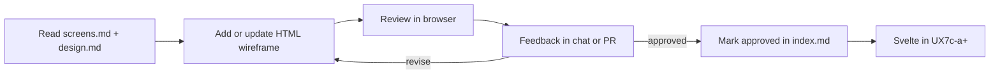

# Web UI — wireframes and layout review

**Status:** UX7c wireframes **approved** (2026-06-07). **UX7e** and **UX7f** wireframes are **reference** mocks — Svelte shipped 2026-06-07 / 2026-06-24; see [packages/web/README.md](../../../packages/web/README.md).

How to mock, review, and iterate on screen layouts **before** Svelte implementation. Behavior and routes remain authoritative in [screens.md](../screens.md), [routes.md](../routes.md), and [navigation.md](../navigation.md).

---

## Purpose

| Layer | Doc / artifact | Answers |
| --- | --- | --- |
| **Behavior** | [screens.md](../screens.md) | Controls, copy intent, API per screen |
| **Navigation** | [navigation.md](../navigation.md) | Next/Back, guards, flow |
| **Visual tokens** | [design.md](../design.md) | Colors, font, 375px baseline |
| **Layout** | `wireframes/*.html` (this folder) | Spacing, hierarchy, touch targets, states |

Wireframes are **throwaway planning assets**. They do not call the API and are not the production UI. Approved layouts inform UX7c Svelte components in `packages/web/`.

---

## Serving wireframes (Docker)

[`../docker-compose.yml`](../docker-compose.yml) runs **nginx** over this folder for LAN review.

**Prerequisites:** Traefik on external Docker network `proxy` ([docker-reverse-proxy](https://github.com/danielhood/docker-reverse-proxy)); DNS or `/etc/hosts` entry for `deck-build-wireframes.lan` → Traefik host.

```bash
cd docs/specs/web
docker compose up -d
```

Open **http://deck-build-wireframes.lan** — landing page [`index.html`](index.html) links to key mocks.

| Mode | URL |
| --- | --- |
| Traefik (default) | `http://deck-build-wireframes.lan` |
| Standalone | Uncomment `ports` in compose → `http://localhost:8080` |

Config: [`nginx-wireframes.conf`](../nginx-wireframes.conf) — static files, `Cache-Control: no-store` for active review.

---

## Fidelity tiers

Use the lowest tier that answers the question; escalate when layout risk is high.

| Tier | Format | When to use |
| --- | --- | --- |
| **1 — Spec** | [screens.md](../screens.md) | Default; sufficient for simple controls |
| **2 — HTML wireframe** | `wireframes/<name>.html` | **Primary mock format** — mobile layout, states, PR review |
| **3 — Cursor Canvas** | `.canvas.tsx` in IDE canvases folder | Exploratory iteration in chat; port winners to tier 2 |
| **4 — Svelte stub** | `packages/web/` | After wireframe approval; UX7c implementation |

**ASCII** in markdown is optional for region notes only (header / form / footer). Do not use ASCII as the main mockup.

---

## HTML wireframe conventions

### File layout

```
docs/specs/web/wireframes/
  README.md                 # this file
  index.md                  # route → file map (create when first mock lands)
  home.html
  build-step-01-themes.html
  build-step-03-synergy.html
  build-review.html
  ...
```

### Naming

- Kebab-case, prefixed by route group: `home.html`, `build-step-NN-<short-name>.html`, `build-review.html`, `build-result.html`.
- One primary state per file; variant states as separate files or a short **States** section in `index.md` (e.g. `home-db-missing.html`).

### Technical rules

| Rule | Value |
| --- | --- |
| Viewport | **375px** wide frame (mobile-first); center in page for desktop preview |
| Font | Verdana, system sans-serif fallback — [design.md](../design.md) |
| Colors | Light theme: white, blue (≤4 shades), black, magenta accent |
| Interactivity | Static or minimal (toggle classes via `<details>` / checkbox hacks OK); **no `fetch`**, no API |
| Data | Placeholder labels (“Theme chip”, “Commander result row”) — no real card DB |
| Dependencies | Self-contained single HTML + inline or `<style>` block; no build step |

### Dev notes vs product UI

Wireframes mix **shipped UI** (inside `.frame`) with **planning annotations**. Use the shared callout pattern so reviewers can scan layouts without mistaking notes for controls.

| Class | Placement | Purpose |
| --- | --- | --- |
| `.dev-note` | Inside `.frame` | API paths, CLI flags, engine TBD, deferred scope — **not** product copy |
| `.wireframe-meta` | Below `.frame` | Route, back links, spec refs, state label — file metadata only |

**Markup (in-frame):**

```html
<aside class="dev-note" role="note" aria-label="Developer note">
  <div class="dev-note-header">
    <span class="dev-note-icon" aria-hidden="true">&lt;/&gt;</span>
    <span class="dev-note-label">Dev note</span>
  </div>
  <div class="dev-note-body"><p>…</p></div>
</aside>
```

Visual tokens: magenta left border + dashed outline + `</>` badge; body text smaller than section copy. **Do not** use `.selection-hint`, `.design-note`, or bare `<code>` in section headers for dev content — move it into `.dev-note`.

Section headers and control subtitles stay **user-facing** only.

### Linking from specs

When a wireframe is **approved**, add a row to `index.md` and an optional **Wireframe:** link under the matching section in [screens.md](../screens.md).

---

## Review loop (agent + product)

Repeat per screen or small group of related screens.



### Step 1 — Select screen

Pick from [screens.md](../screens.md) using route. For UX7c, mock **high-layout-risk** screens first:

1. `/` — home (DB banner, disabled CTA)
2. `/build/1` — theme chips + defaults copy
3. `/build/3` — synergy toggles + focus stepper (− / +)
4. `/build/6` — commander search + color-match toggle
5. `/build/review` — criteria summary + inline warnings
6. `/build/result` — MD HTML preview shell

**UX7e** (deck view — draft wireframes):

1. `/deck/:id` — [deck-view.html](deck-view.html) primary (clean analysis)
2. `/deck/:id` — [deck-view-warnings.html](deck-view-warnings.html) dependency warn state
3. `/` — [home-resume-deck.html](home-resume-deck.html) secondary **View last deck** CTA

See [§ UX7e wireframe scope](#ux7e-wireframe-scope).

### Step 2 — Draft wireframe

- Agent creates `wireframes/<name>.html` on branch.
- Match controls listed in [screens.md](../screens.md); do not invent new behavior without updating the spec first.
- Include **Next** / **Back** chrome per [navigation.md](../navigation.md).

### Step 3 — Review

| Reviewer action | How |
| --- | --- |
| Open mock | Browser (local file or simple static server); Cursor browser MCP for agent-assisted review |
| Check | 375px width, no horizontal scroll, banner/CTA hierarchy, chip wrapping, disabled states |
| Feedback | Chat comments or PR review — reference regions (“move DB banner above title”) |

**Major layout decisions** (not already in [design.md](../design.md)) require explicit product confirmation before marking approved.

### Step 4 — Iterate

- Revise HTML in the same branch until approved.
- Optional: use a **Cursor Canvas** for rapid layout experiments in chat, then copy the chosen structure into the HTML wireframe for repo/PR record.

### Step 5 — Lock

On approval:

1. Add entry to `wireframes/index.md` (route, file, status, date).
2. Link from [screens.md](../screens.md) under that screen’s heading.
3. If tokens changed, update [design.md](../design.md).
4. If behavior changed, update [screens.md](../screens.md) **before** or **with** the wireframe PR.

Status values in `index.md`: `draft` | `in-review` | `approved`.

### Step 6 — Implement (later session)

UX7c Svelte components should match **approved** wireframes. Implementation PRs reference wireframe path in the PR body; drift requires spec + wireframe update or explicit product sign-off.

---

## Cursor Canvas (optional)

Use for **session-only** exploration when HTML iteration feels too slow:

- Live preview beside chat; good for “try two columns of chips” or banner placement.
- **Not** the source of truth — copy the agreed layout into `wireframes/*.html`.
- Canvas files live in the IDE-managed canvases directory, not in this repo.

See Cursor Canvas skill when creating `.canvas.tsx` files.

---

## PR and SDLC

| Change | Phase | Docs to touch |
| --- | --- | --- |
| New wireframe (planning) | **planning** | `wireframes/*`, `wireframes/index.md`, optional [screens.md](../screens.md) link |
| Approved layout only | **planning** | `index.md` status → `approved` |
| Behavior change from review | **planning** | [screens.md](../screens.md), [navigation.md](../navigation.md) if flow changes |
| Token change | **planning** | [design.md](../design.md) |
| Svelte matching wireframe | **implementation** | `packages/web/`, same PR updates spec index if routes change |

**No changelog** for wireframe-only planning PRs. **UX7 MVP shipped** (UX7d closed the MVP) — see [changelog.md](../../history/changelog.md).

PR body must include **Phase: planning** and list docs touched per [DOC-MAP.md](../../DOC-MAP.md).

---

## UX7e wireframe scope

Minimal set to lock layout before Svelte implementation. Behavior: [screens.md](../screens.md) § Enhanced deck view; decisions: [user-experience.md](../../dependency-engine/user-experience.md) § UX7e.

| Priority | File | Route | States to show |
| --- | --- | --- | --- |
| **P0** | `deck-view.html` | `/deck/:id` | Commander hero; collapsed summary; filter chips (none active); card list with thumbs; collapsed MD preview; footer **Build another deck** |
| **P0** | `deck-view-warnings.html` | `/deck/:id` | Same shell; summary **expanded**; **Areas to review** list (2–3 placeholder issues); one filter chip active |
| **P1** | `home-resume-deck.html` | `/` | Same as [home.html](home.html) plus secondary **View last deck** below primary CTA |
| **P2** | `deck-view-filtered-empty.html` | `/deck/:id` | Optional — filters active, zero matches, empty-state copy |

**In frame (product UI):**

| Region | Layout notes |
| --- | --- |
| App header | Brand + **Deck** phase pill (distinct from wizard **Result** pill) |
| Commander block | Hero art (tap affordance), name, type, CI pips |
| Summary | `<details>` default **closed** — slot table + price + avg CMC |
| Analysis | One panel: green **Looks good** *or* warn list — not both |
| Filters | Three horizontal chip rows (Slot · Type · Color); wrap on 375px. Color multi-select requires **all** selected pips on each card (AND within color row). |
| Card list | Thumb 40×56, name, slot badge, mana + price; grouped by slot heading |
| MD preview | `<details>` default **closed** at bottom of scroll |
| Footer | Fixed **Build another deck** (primary); **Delete deck**; bottom row **Back** + **Home** (**UX7f**) |

**Dev notes only (`.dev-note`):** session cache key `mtg-deck-cache-{id}`; server library API shipped (**UX7f**); dependency dashboard shipped (**UX7d**); deck metrics + curve advisories shipped (**UX10**); deck editor shipped (**UX11**).

**Out of scope for UX7e wireframes:** swap/lock selection; library grid; CMC chart (shipped **UX10b**); dependency dashboard drill-down (shipped **UX7d**); dark mode.

**Approval gate:** Mark P0 files `approved` in [index.md](index.md) before UX7e-a Svelte work.

---

## UX7f wireframe scope

**Status:** **Shipped** (2026-06-24) — decisions locked — [user-experience.md](../../dependency-engine/user-experience.md) § UX7f, [screens.md](../screens.md) § Saved deck library.

| Priority | File | Route | Notes |
| --- | --- | --- | --- |
| **P0** | [library.html](library.html) | `/library` | Tappable card grid, search, sort |
| **P0** | [library-empty.html](library-empty.html) | `/library` | Empty state + **Build new deck** CTA |
| **P0** | [deck-view-rename.html](deck-view-rename.html) | `/deck/:id` | Rename modal (pencil on deck label) |
| **P0** | [deck-view-delete.html](deck-view-delete.html) | `/deck/:id` | Delete confirm modal |
| **P1** | [deck-view-from-home.html](deck-view-from-home.html) | `/deck/:id` | Back → home entry context |
| **P1** | [deck-view-from-generate.html](deck-view-from-generate.html) | `/deck/:id` | Back → library after generate |
| **P1** | [home-library-ready.html](home-library-ready.html) | `/` | Enabled **Saved library** + **View last deck** |

**In frame (product UI):**

| Region | Layout notes |
| --- | --- |
| Search | Top field — filters commander name, user label, themes |
| Sort | Control for `saved_at` (default), name, commander |
| Card grid | Commander art, label, CI, themes, price, saved date — **always cards** (not list rows) |
| Library card | Entire card tappable → `/deck/:id` — no footer actions on grid |
| Deck view header | User deck label + pencil → rename modal |
| Deck view footer | **Build another deck** then **Delete deck**; bottom row **Back** (context) + **Home** — wizard-style outline buttons |
| Empty state | Illustration + **Build new deck** CTA |

**Out of scope for UX7f wireframes:** folders; import; download; save-as; regen controls.

**Approval gate:** Mark P0 library wireframes `approved` before UX7f-b Svelte work.

---

## UX7d wireframe scope

**Status:** **Shipped (2026-06-25)** — decisions locked — [user-experience.md](../../dependency-engine/user-experience.md) § UX7d, [screens.md](../screens.md) § Dependency dashboard.

| Priority | File | Route | States to show |
| --- | --- | --- | --- |
| **P0** | `deck-view-dependencies.html` | `/deck/:id` | Dependencies `<details>` **open**; 2–3 profile rows (mixed warn/pass); collapsed issue rows |
| **P0** | `deck-view-dependencies-issue.html` | `/deck/:id` | Same shell; one issue **expanded** — `detail` lists + **Show in deck** link |
| **P1** | `deck-view-dependencies-good.html` | `/deck/:id` | Passed deck — Dependencies **closed**; summary **Looks good** |

**In frame (product UI):**

| Region | Layout notes |
| --- | --- |
| Panel chrome | `<details>` **Dependencies** — replaces standalone **Areas to review** banner |
| Closed summary | One line: green **Looks good** or amber **N areas to review** |
| Profile row | Label (wizard prompt), status pill (pass/warn/fail), horizontal count chips |
| Issue row | Human-readable rule label + chevron; expanded: message, profile label, bullet lists from `detail` |
| Card link | Text button **Show in deck** — wireframe shows affordance only (no scroll in HTML mock) |
| Position | Below Summary `<details>`, above Filter chip rows |
| Footer | Same as UX7f — Build another, Delete, Library, Home |

**Dev notes only (`.dev-note`):** data from `deck.dependency_report`; profile labels align with `WIZARD_FOCUS_PROMPT_LABELS`; no new API; UX11 repair deferred.

**Out of scope for UX7d wireframes:** repair/regen buttons; profile package swap; CMC chart (shipped **UX10b**); swap/lock selection (shipped **UX11**); dark mode.

**Approval gate:** P0 files shipped 2026-06-25 — see [index.md](index.md).

---

## UX11 wireframe scope

**Status:** **Planning approved (2026-06-26)** — decisions locked — [user-experience.md](../../dependency-engine/user-experience.md) § UX11, [screens.md](../screens.md) § Deck editor.

| Priority | File | Route | States to show |
| --- | --- | --- | --- |
| **P0** | `deck-view-edit-mode.html` | `/deck/:id` | **Edit deck** active; lock pins on rows; slot **Regenerate** on heading |
| **P0** | `deck-view-edit-select.html` | `/deck/:id` | Row checkboxes; sticky **Swap (2)** bar above footer |
| **P0** | `deck-view-edit-swap-result.html` | `/deck/:id` | Post-swap inline diff banner; view mode |

**In frame (product UI):**

| Region | Layout notes |
| --- | --- |
| Edit entry | **Edit deck** text button in deck label row (left of rename pencil) |
| Lock pin | 44px tap target on row trailing edge; filled = locked |
| Slot regen | Text **Regenerate** right-aligned on slot heading row |
| Selection | Checkbox 44px at row start; commander block not selectable |
| Swap bar | Sticky above footer — primary **Swap (N)** + secondary **Clear** |
| Diff banner | Amber info strip below commander — `Old name → New name` per swap |

**Dev notes only (`.dev-note`):** `PATCH` lock; `POST …/refill-slot`; `POST …/swap` — [iterate-api.md](../iterate-api.md). No repair pass.

**Out of scope for UX11 wireframes:** full-deck regen; commander swap; seed picker; repair; dark mode.

**Approval gate:** Mark P0 files `approved` in [index.md](index.md) before UX11a Svelte work.

---

## UX12 wireframe scope

**Status:** **P0 drafts (2026-06-27)** — [advanced-swap-ux.md](../advanced-swap-ux.md), [active.md](../../roadmap/active.md).

| Priority | File | Route | States to show |
| --- | --- | --- | --- |
| **P0** | `deck-view-advanced-swap-sheet.html` | `/deck/:id` | Bottom sheet — strategy chips, filters, cross-slot toggle, preview list, Apply |
| **P0** | `deck-view-issue-fix-strategies.html` | `/deck/:id` | Issue expanded — strategy chips, **Fix issue…**, **Quick fix** (prototype), **Swap All** |
| **P0** | `deck-view-named-swap.html` | `/deck/:id` | Named-card search + selected result; validation ok + error states |

**In frame (product UI):**

| Region | Layout notes |
| --- | --- |
| Sheet chrome | Bottom sheet scrim over dimmed deck; handle bar; **×** close 44px |
| Context | Replacing N cards or issue label; source card chips |
| Strategy | Horizontal chip row — one active; pre-filled from issue `deficit` |
| Filters | Type, color, rarity chips; max price line; collapses when named card pinned |
| Cross-slot | Expert toggle row — default off (`slot_policy: same`) |
| Preview | Top 3–8 candidates per position after **Refresh preview** |
| Issue actions | **Fix issue…** (primary) opens sheet; **Quick fix** purple prototype styling; **Swap All** link retained |
| Named search | Wizard-style search input; result list; inline legal/budget validation |

**Dev notes only (`.dev-note`):** `POST …/swap/preview`; `POST …/swap` with `constraints` + `replacement_oracle_id`; playbook YAML TBD in UX12a.

**Out of scope for UX12 wireframes:** curve advisory **Adjust curve…** (UX12f); profile package swap; repair pass; dark mode.

**Approval gate:** Mark P0 files `approved` in [index.md](index.md) before UX12b Svelte/engine work.

---

## Out of scope for wireframes

- Real API integration or `DeckCriteria` persistence
- Scryfall card art (UX7c result is MD HTML; art deferred to **UX7e** — **in scope** for UX7e wireframes)
- Dark mode variants (light only until GUI stabilizes)
- Desktop-only multi-column layouts (mobile baseline first; desktop may add max-width wrapper at implementation)

---

## References

- [screens.md](../screens.md) — screen behavior
- [routes.md](../routes.md) — client paths
- [navigation.md](../navigation.md) — wizard flow
- [design.md](../design.md) — visual tokens
- [user-experience.md](../../dependency-engine/user-experience.md) § UX7c — scope and slices
