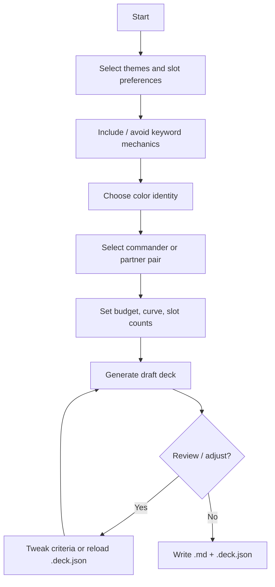

# Goals and Scope

## Problem

Building a Commander deck involves many interdependent choices: commander identity, color identity, mechanical themes, mana curve, land count, budget, and card synergy. Existing tools (EDHREC, Archidekt, Moxfield) help browse and refine decks but rarely **guide** a user from vague intent ("I want a Golgari aristocrats deck under $150") to a **complete, legal, playable** 100-card list.

## Goal

A **local Windows utility** that:

1. Walks the user through selection criteria (mechanics, types, themes, colors, CMC ranges, commander choice, budget, etc.)
2. Uses Scryfall oracle card data as the card library
3. Applies Commander format rules from the Comprehensive Rules
4. Outputs a 100-card deck list (commander + 99 unique cards) that is structurally playable (including a sensible mana base)

## Commander format constraints (hard rules)

From CR 903 ([`resources/mtg/MagicCompRules 20260417.txt`](../resources/mtg/MagicCompRules%2020260417.txt)):

| Rule | Requirement |
| --- | --- |
| 903.5a | Exactly **100 cards** including commander |
| 903.5b | **Singleton** — no duplicate English names (except basic lands) |
| 903.5c | Every card's **color identity** ⊆ commander's color identity |
| 903.5d | Nonbasic lands must only produce colors in commander's identity |
| 903.3 | Commander is legendary creature, Vehicle, Spacecraft (with P/T), or "can be your commander" |
| 702.124 | **Partner** variants allow two commanders (combined color identity) |

## Out of scope for v1 (unless promoted)

- Sideboards (not used in Commander)
- Brawl / Commander Draft variants
- Collection ownership tracking
- Real-time Scryfall API sync (bulk JSON is sufficient for offline)
- Third-party site export (Moxfield/Archidekt) — v2; v1 uses Markdown + `.deck.json`

## Success criteria for v1

- [ ] User completes a multi-step wizard and receives a legal Commander deck
- [ ] Wizard order: theme → colors → commander (including partner pairs)
- [ ] Deck respects color identity, singleton, and 100-card count
- [ ] Land count is computed from deck characteristics (not a fixed 33%)
- [ ] Cards match user-selected theme tags, slot targets, and include/avoid mechanics
- [ ] Budget cap honored when prices known; null prices flagged (allow with warning)
- [ ] Commander synergy influences card ranking within slots
- [ ] Dual export: Markdown summary + `.deck.json` for reload/modification
- [ ] Runs fully offline after initial data import

## User workflow

## Guided slot template (preferred approach)

Instead of optimizing all 99 cards at once, v1 fills **named slots** with target counts. Example starting template (tunable):

| Slot | Typical count | Notes |
| --- | ---: | --- |
| Lands | 33–38 | Dynamic — see mana base section |
| Ramp | 8–12 | Mana rocks, dorks, land ramp |
| Card draw | 8–10 | |
| Removal | 6–10 | Targeted + board wipes |
| Protection / recursion | 4–6 | Optional slot group |
| Synergy pieces | 25–35 | Match mechanic tags + commander |
| Win conditions | 3–5 | |
| Flex / flavor | 5–10 | Theme cards |

Total non-land slots + lands = 99 (commander separate).

The wizard lets users shift slot counts within bounds; the engine validates totals and adjusts land count last.
