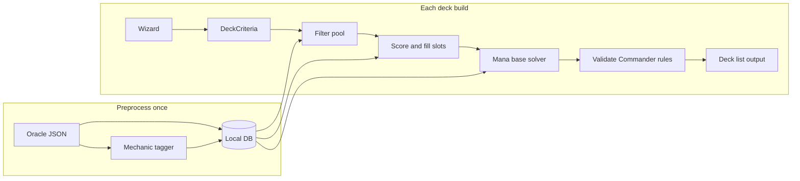

# Problem Decomposition

The deck builder breaks into six sub-problems. Each can be built and tested independently.

## 1. Interactive wizard (criteria collection)

**Step order (decided):**

1. **Themes & slots** — archetype tags (aristocrats, tokens, …) and slot template counts
2. **Include / avoid mechanics** — keyword-level features the user wants or rejects
3. **Colors** — one or more mana colors (narrows commander pool)
4. **Commander** — suggest matching legendaries; support partner pairs in v1
5. **Budget & curve** — total USD cap, CMC preferences, final slot tweaks

Collect structured preferences:

- Theme tags (multi-select from slot/archetype taxonomy)
- **Include mechanics** — e.g. trample, scry, first strike, energy counters, vehicles
- **Avoid mechanics** — hard exclude or heavy score penalty
- Color identity (explicit before commander pick)
- Single commander vs. validated partner pair
- Card type preferences (creatures, enchantments, artifacts, instants/sorceries)
- CMC range per card and/or average deck curve
- Total deck budget (USD from `prices.usd`)
- Slot template overrides (ramp count, removal count, etc.)

**Output:** A `DeckCriteria` object consumed by the generator (serialized in `.deck.json`).

### Two mechanic layers

| Layer | Purpose | Detection | Wizard |
| --- | --- | --- | --- |
| **Theme / slot tags** | Deck archetype and slot filling | Curated taxonomy + oracle regex | Step 1 |
| **Keyword mechanics** | Fine-grained include/avoid | CR 702 keywords, `keywords` field, type patterns, oracle patterns | Step 2 |

**Keyword mechanic examples:**

| Mechanic | Typical detection |
| --- | --- |
| Trample, First strike, Deathtouch | `keywords` array |
| Scry | `keywords` or oracle "scry N" |
| Energy counters | oracle `{E}` or "energy counter" |
| Vehicles | `type_line` contains `Vehicle` |
| Flying, Menace, Lifelink | `keywords` array |

**Include:** boost score for cards matching any selected include mechanic.  
**Avoid:** remove from pool (or strongly penalize if pool too thin).

Store both layers in `card_mechanic_tags` with a `layer` column (`theme` vs `keyword`) or separate tables.

## 2. Card pool filtering (hard constraints)

SQL/query layer over preprocessed cards:

```sql
-- illustrative
SELECT * FROM cards
WHERE commander_legal = 1
  AND color_identity <= :commander_identity  -- subset check
  AND cmc BETWEEN :min_cmc AND :max_cmc
  AND total_price <= :budget_remaining
  AND oracle_id NOT IN (:already_selected)
  AND oracle_id NOT IN (SELECT oracle_id FROM card_mechanic_tags WHERE tag IN (:avoid_mechanics))
```

Color identity subset check requires encoding colors as bitflags or sorted set comparison.

## 3. Mechanic taxonomy and tagging (curated tags)

**Approach:** Maintain a YAML/JSON taxonomy of mechanic tags, each with one or more matchers:

| Matcher type | Example |
| --- | --- |
| `keyword` | `keywords` contains "Landfall" |
| `type_pattern` | `type_line` matches `.*Artifact.*` |
| `oracle_regex` | `oracle_text` matches `(?i)sacrifice a creature` |
| `tag_combo` | has `aristocrats` AND `token` |

Example taxonomy entries:

- **ramp** — mana rocks, +X mana dorks, land ramp spells
- **draw** — "draw a card", impulse draw, repeatable draw
- **removal** — destroy/exile target, -X/-X counters
- **board_wipe** — "destroy all creatures"
- **aristocrats** — sacrifice outlets + death triggers
- **tokens** — token creation
- **landfall** — landfall keyword or landfall-like triggers
- **recursion** — graveyard return effects
- **protection** — hexproof/shroud/indestructible grants to commander

**Pipeline:**

1. Human-curated tag definitions (version controlled)
2. Batch tagger runs over all playable cards at import time
3. Store in `card_mechanic_tags(card_id, tag, confidence)`
4. Wizard filters: `WHERE tag IN (:selected_tags)`

**Limitation:** Oracle text is ambiguous. Tags will be incomplete; v1 should expose "un tagged" fallback and allow type/CMC-only filling for slots.

## 4. Guided slot filling (deck generation)

For each slot in order (synergy pieces first, lands last):

1. Build candidate pool (filters + tags for slot)
2. Score candidates (see §5)
3. Pick from top-N by score using **weighted random** choice (seeded via `--seed`)
4. Track budget spent and color pip demand

**Slot fill order matters:** Fill synergy and spell slots before lands so mana requirements reflect the actual non-land cards.

## 5. Scoring and commander synergy

Within a slot, rank candidates by weighted score:

| Signal | Source | Weight (tunable) |
| --- | --- | --- |
| Commander synergy | Tag overlap, oracle_text keyword match to commander | High |
| EDHREC rank | `edhrec_rank` (lower = more popular) | Medium |
| Curve fit | Distance from target CMC for slot | Medium |
| Post-build curve metrics | CMC histogram / creature distribution in output (UX8) | N/A today — planned advisory report, not pick-time gate |
| Budget efficiency | Price vs. remaining budget | Medium |
| Redundancy penalty | Similar cards already in deck | Low |

**Commander synergy heuristics (v1, no ML):**

- Parse commander `oracle_text` and `keywords` for themes (tokens, +1/+1 counters, spellslinger)
- Boost cards sharing tags with commander
- Boost cards that reference command zone, commander, or "legendary"
- Penalize antsynergy (e.g., "can't cast creature spells" commander)

## 6. Mana base calculation (dynamic land count)

Fixed 33% land count is a starting heuristic, not a rule. Proposed model:

### Inputs

- Color pip distribution across non-land spells (from parsed `mana_cost`)
- Ramp count already in deck (rocks/dorks reduce land need)
- Average CMC of non-land cards
- Number of colors in identity

### Heuristic formula (starting point)

```
base_lands = 37
land_adjustment = -0.5 * ramp_count
land_adjustment += 0.5 * (avg_cmc - 3.0)
land_adjustment += 2 * (num_colors - 2)  # multicolor tax
final_lands = clamp(base_lands + land_adjustment, 30, 40)
```

Then split lands by pip requirements (e.g., 40% of colored pips → that color's basics + duals from pool).

### Mana-producing nonlands

Include ramp in mana availability:

- Mana rocks → count as ~0.5 land equivalent
- Land ramp (Cultivate) → reduces need for raw land slots
- `produced_mana` on nonland permanents → adjust color sources

**Validation pass:** Ensure enough sources for each color by turn 4–5 (simplified checklist, not full simulation).



## Hardest risks

| Risk | Mitigation |
| --- | --- |
| Oracle text parsing misses mechanics | Curated tags + manual taxonomy growth; show confidence |
| "Playable" ≠ "good" | EDHREC rank + synergy scoring; user review step |
| Partner commander color math | Precompute combined identity |
| DFC / split / adventure layouts | Normalize via `card_faces` in preprocessor |
| Price data stale / null | Treat null as unknown; exclude from budget sort or use median |
