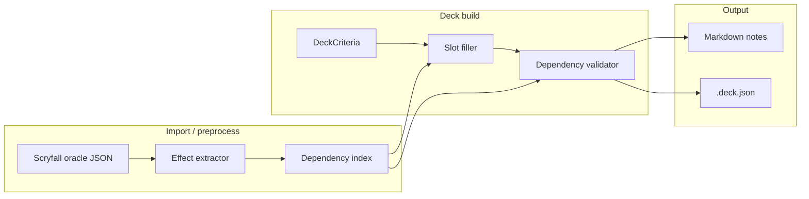

# Card dependency engine (deck synergy rules)

Planning for a **subset rules layer** that ensures cards in a generated deck **support each other’s oracle-text actions** — without implementing full Comprehensive Rules (CR) or in-game simulation.

This is distinct from:

| Layer | Question | Status in repo |
| --- | --- | --- |
| **Construction legality** | Is the 100-card list legal in Commander? (CI, singleton, 903.5d, …) | Shipped — `rules/validate.py`, pool filters |
| **Archetype / slot fit** | Is this card on-theme for ramp / draw / tokens? | Shipped — `mechanic-taxonomy.yaml`, slot filler, scorer |
| **Card dependencies** (this doc) | If I play A, does the deck contain B (or enough Bs) that A’s text actually works? | **Shipped (D0–D5)** — `effects/`, `rules/dependencies.py`, `--strict-dependencies`, `--repair-dependencies` |

---

## Goal

After (or during) deck generation, detect and optionally fix **structural synergy gaps**:

- Tutors and search effects have **valid targets** in the 99.
- “Each … you control” / “other …” effects have **enough payoffs** of the referenced type.
- **Resource loops** (e.g. energy produced vs consumed) are not one-sided.

**Non-goals:** priority, stack, “can I cast this on turn 3?”, combat, layers, copy effects, sideboard, wishboards outside the deck (unless explicitly modeled).

---

## Example dependency classes

### 1. Tutor / search targets (`SEARCH_FOR`)

**Pattern:** Card moves a card from library to a zone with constraints.

Examples:

- “Search your library for a **land** card …”
- “Search your library for a **creature** card with mana value 3 or less …”
- “Search your library for an **Aura** card …”

**Dependency:** Deck must contain ≥1 card matching the search predicate (name, type, subtype, CMC, tag, etc.).

**Severity:** High — tutor with zero targets is dead.

---

### 2. Type / subtype amplifiers (`REQUIRES_TYPE`, `BUFFS_TYPE`)

**Pattern:** Card cares about permanents or spells of a type/subtype.

Examples:

- “Other **Elves** you control get +1/+1” → need other Elf cards.
- “Whenever you cast an **Artifact** spell …” → need artifact spells/cards.
- “**Vehicle** creatures you control …” → need Vehicles (and often crew enablers).

**Dependency:** Deck should contain a **minimum count** of matching cards (threshold TBD by effect: 3–8+).

**Severity:** Medium — deck is weak without payoffs; not always illegal.

---

### 3. Mechanic resource balance (`PRODUCES_RESOURCE`, `CONSUMES_RESOURCE`)

**Pattern:** Card introduces or spends a named resource not fully captured by generic tags.

Examples:

- **Energy:** `{E}` in text, “get an energy counter” vs “pay {E}”.
- **Experience, rad counters, oil, charge counters** (format-specific subsets).
- **Sacrifice outlets** vs **sacrifice fodder** (overlap with `aristocrats` theme but countable).

**Dependency:** `producers` and `consumers` counts should both be ≥1 (optionally ratio bounds, e.g. consumers ≥ 0.5 × producers).

**Severity:** Medium–high for dedicated builds; low if mechanic is incidental on one card.

---

### 4. Named card / combo piece (`REQUIRES_CARD`, `PAIRS_WITH`)

**Pattern:** Oracle names another card or a narrow category.

Examples:

- “Search your library for a card named **X**” (rare in EDH).
- “If you control **Y** …”
- **Partner with**, **Friends forever** (partially handled at commander layer).

**Dependency:** Exact or fuzzy name match in deck.

**Severity:** High when explicit.

---

### 5. Graveyard / zone conditions (`REQUIRES_ZONE_CONTENT`)

**Pattern:** Recursion or threshold on zone contents.

Examples:

- “Return target **creature** card from your graveyard …” → need creatures that die / mill.
- “Delve”, “Escape” → need cards to exile from graveyard (soft dependency).

**Dependency:** Deck composition + curve (harder; often warning-only in v1).

**Severity:** Low in v1 — defer to heuristics or tags.

---

## High-level architecture



**Two consumption modes:**

1. **At pick time (scoring / filter)** — prefer candidates that satisfy or improve existing dependencies.
2. **Post-build (validator)** — report gaps; optional repair pass (swap cards).

Aligns with existing pattern: legality at pool fill + validation section in output.

---

## Phase A — Effect extraction (preprocess)

### Input fields (already in SQLite / oracle JSON)

| Field | Use |
| --- | --- |
| `oracle_text` | Primary source for patterns |
| `type_line` | Type/subtype for REQUIRE_TYPE |
| `keywords` | Keyword abilities (Landfall, Crew, …) |
| `mana_cost` | `{E}`, hybrid, etc. |
| `name` | Named-card search |
| `layout` / `card_faces` | DFC/adventure — join faces for full text |

### Extractor design (rule-based v1, not ML)

Versioned **`config/effect-patterns.yaml`** (or extend taxonomy) defining:

| Pattern kind | Output atom |
| --- | --- |
| `oracle_regex` | `EffectAtom(kind, params)` |
| `keyword` | atom from CR 702 keyword |
| `type_line` | creature / artifact / land / … |

**Effect atom examples (internal schema):**

```yaml
# Illustrative — not final schema
- kind: search_library
  constraints:
    types: [land]
    zones: [library]
    destination: hand

- kind: energy_produce
  amount: variable  # or integer when parseable

- kind: energy_consume
  min_cost: 1

- kind: buff
  target: other
  filter:
    types: [creature]
    subtypes: [Elf]
```

**Pipeline step:** `import` → normalize card → **extract effects** → store atoms per `oracle_id` (and per face if needed).

**Quality control:**

- Golden tests: sample oracle texts → expected atoms (like `tests/test_taxonomy.py`).
- Manual review queue for low-confidence extractions (log `extraction_version` in metadata).

### Hard cases (document, defer)

| Case | v1 stance |
| --- | --- |
| Modal / “choose one” | Extract each mode line separately |
| “Choose a creature type” | Warning only — no static proof |
| “Any card” tutors | Skip target check or require ≥1 nonland spell |
| Tokens created with types | Soft count via token makers tagged `tokens` + subtype regex |
| Commander outside 99 | Tutor for “legendary creature” can use commander — special case |

---

## Phase B — Storage

Current **`cards` + `card_mechanic_tags`** is enough for tags, not for structured cross-card queries.

### Recommended: SQLite extension (keep single `cards.db`)

Add tables (names illustrative):

```sql
-- One row per extracted atomic effect on a card
CREATE TABLE card_effects (
  oracle_id TEXT NOT NULL,
  face_index INTEGER NOT NULL DEFAULT 0,
  effect_kind TEXT NOT NULL,          -- search_library, energy_consume, ...
  payload TEXT NOT NULL,              -- JSON: constraints, counts, filters
  confidence REAL NOT NULL DEFAULT 1.0,
  source TEXT NOT NULL,               -- pattern id from effect-patterns.yaml
  PRIMARY KEY (oracle_id, face_index, effect_kind, source)
);

-- Optional: denormalized counters for fast deck checks
CREATE TABLE card_resource_flags (
  oracle_id TEXT PRIMARY KEY,
  produces_energy INTEGER NOT NULL DEFAULT 0,
  consumes_energy INTEGER NOT NULL DEFAULT 0,
  searches_library INTEGER NOT NULL DEFAULT 0,
  -- ...
);

-- Deck-level validation is runtime; no extra persistence required
```

**Indexes:** `effect_kind`, JSON extracts if needed (`json_extract(payload, '$.types')`).

### Alternative: sidecar graph file

- **JSONL / SQLite `card_edges`** `(from_oracle_id, edge_type, to_predicate)` for tutor→type edges.
- Better for “combo graph” analytics later; more work to maintain.
- **Recommendation:** start with `card_effects` + runtime deck aggregation; add explicit edges only if tutor matching needs it.

### Parquet / columnar

Only if effect extraction becomes huge or you need offline analytics — **not required for v1**.

---

## Phase C — Deck-level dependency rules

### Rule engine shape

Small **predicate + counter** engine (not CR):

```text
For each card C in deck:
  For each effect E on C:
    Evaluate rule R(E, deck_stats) → pass | warn | fail
```

**`deck_stats`** computed once per build:

- Counts by type/subtype (from `type_line`)
- Set of names
- Tag sets (energy producer/consumer from `card_resource_flags` or tags)
- CMC histogram for “search CMC ≤ 3”

### Example rules (v1)

| Rule ID | Trigger | Check | Default |
| --- | --- | --- | --- |
| `TUTOR_TARGET_EXISTS` | `search_library` | ∃ card in maindeck matching constraint | **warn** if 0 |
| `TYPE_SYNERGY_MIN` | `buff` / `whenever_cast` with type filter | count(type) ≥ N | **warn** if below N |
| `ENERGY_BALANCE` | deck has energy producer | consumers ≥ 1 | **warn** if producers > 0 and consumers == 0 |
| `SUBTYPE_SYNERGY` | “other Goblins” | Goblin count ≥ 5 | configurable N |

**Commander:** Include commander in stats for “legendary creature” tutors; exclude from maindeck counts where appropriate.

### Integration points

| Hook | Behavior |
| --- | --- |
| **`scorer.py`** | Penalty if pick worsens open dependency; bonus if it closes a gap |
| **`filler.py`** | After slot fill, run validator; optional second pass |
| **`budget_backfill.py`** | Don’t swap away the only tutor target |
| **`output.py`** | New Notes group: **Deck dependencies**; `.deck.json` `dependency_report` |
| **Wizard** | Optional step: “Strict synergy checks” toggle |

---

## Phase D — Repair (optional, post-v1)

Mirrors “post-validation repair” in [09-next-steps.md](09-next-steps.md):

1. Run dependency validator.
2. For each **fail**, search pool for a card that satisfies the missing predicate without breaking legality/budget.
3. Swap within same slot or `flex` first.

Defer until warn-only mode is trustworthy.

---

## D0.5 — Inventory audit (feasibility for restrictions)

Before tightening **wizard restrictions** or default thresholds, run a read-only scan over commander-legal cards in `cards.db` (same patterns as D1).

| Output | Purpose |
| --- | --- |
| Pattern hit counts + examples | Prioritize which atoms to implement |
| `profile_counts_by_ci` (companion table or JSON) | Layer-1 wizard: disable focus presets with no pool support |
| `predicate_target_counts` | Tutor feasibility per search predicate × color identity |
| False-positive review queue | Do not hard-disable UI until confidence is high |

Feeds progressive constraints in [11-dependency-engine-user-experience.md](11-dependency-engine-user-experience.md) (UX6). The audit can ship as `dependency-audit` CLI or import sidecar without enabling generate-time strict mode.

**Static DB:** Audit results are valid for the **bundled oracle snapshot** only. Re-run audit when maintainers refresh bulk import ([02-data-sources.md](02-data-sources.md)); users are not expected to update for new sets.

---

## Implementation phases

| Phase | Deliverable | Acceptance |
| --- | --- | --- |
| **D0 — Spec** | This doc + `effect-patterns.yaml` skeleton + atom schema | Reviewed taxonomy of 10–15 high-value patterns |
| **D0.5 — Audit** | Inventory reports + feasibility indexes | Profile list and thresholds updated with evidence — **shipped** (`dependency-audit`) |
| **D1 — Extract** | Import writes `card_effects` for tutors, `{E}`, simple type triggers | Golden tests; re-import updates atoms — **shipped** (schema v3) |
| **D2 — Validate** | Post-build report in MD/JSON (warn only) | Known bad list (e.g. elf lord + 2 elves) flags warning — **shipped** (`rules/dependencies.py`) |
| **D3 — Score** | Scorer uses deck_stats during fill | Energy deck gets ≥1 `{E}` payoff without manual include — **shipped** (`builder/dependency_scoring.py`, `scorer.py`, `filler.py`) |
| **D4 — Filter** | Optional strict mode excludes cards that create unfulfillable tutors | Tutor for Aura deck with 0 auras excluded at pick time — **shipped** (`--strict-dependencies`, `filter_strict_dependency_candidates`) |
| **D5 — Repair** | Swap pass for top failure classes | One-click regen reduces warnings — **shipped** (`--repair-dependencies`, `dependency_repair.py`) |

**Suggested order:** D0 → D0.5 → D1 → D2 → D3 → D4 → D5.

**Pre-implementation gate:** [12-dependency-engine-pre-implementation-checklist.md](12-dependency-engine-pre-implementation-checklist.md) — complete before merging D1.

**D0 shipped in repo:** `config/effect-patterns.yaml`, `src/mtg_deck_tools/effects/`, `models/effects.py`, golden tests — see [14-effect-extraction-face-policy.md](14-effect-extraction-face-policy.md), [13-dependency-engine-decisions.md](13-dependency-engine-decisions.md).

---

## Relationship to existing systems

| Existing | Dependency engine |
| --- | --- |
| `mechanic-taxonomy.yaml` | Tags (“energy”, “tokens”) — keep; atoms are **finer** (produce vs consume) |
| `slot_quality.py` | Oracle guards per slot — complementary; guards are slot fit, not cross-card |
| `scorer.py` theme overlap | Still needed; dependency score is additive |
| Commander validation | Unchanged — CI/903 only |

**Do not** fold dependency rules into CR validation; separate module e.g. `rules/dependencies.py` + `effects/extract.py`.

---

## Data volume & performance

| Metric | Estimate |
| --- | --- |
| Playable commander-legal cards | ~25k–30k |
| Atoms per card (avg) | 1–4 |
| `card_effects` rows | ~50k–120k |
| Import time added | +5–20s (regex pass) |
| Per-deck validation | <50ms (aggregate stats + scan 99 effects) |

---

## Risks and mitigations

| Risk | Mitigation |
| --- | --- |
| Oracle ambiguity | Confidence scores; warn don’t fail; versioned patterns |
| False positives annoy users | Default **warn**; strict mode opt-in |
| Pattern maintenance on new sets | CI golden tests; community YAML PRs |
| DFC / split faces | Extract per face; merge for deck card |
| “Goodstuff” decks fail arbitrary thresholds | Thresholds scale with deck themes / commander tags |

---

## User experience and control

User-facing mechanics (energy focus, aura density, dominance caps, strict vs warn-only, future swap workflows) are specified in **[11-dependency-engine-user-experience.md](11-dependency-engine-user-experience.md)**. That doc defines:

- `config/dependency-profiles.yaml` — default min/max and share targets per mechanic profile
- `DeckCriteria` extensions (`strict_dependencies`, `repair_dependencies`, `mechanic_focus` — wizard step 3 / CLI)
- `dependency_report` shape for Markdown Notes and future UI

Engine implementation should read profile thresholds from YAML rather than hard-coding counts, so CLI and future web UI share one source of truth.

---

## Post–D5 expansion (active)

D0–D5 and initial mechanic packages are **shipped** (energy, sacrifice, auras, artifacts, subtype lords, tokens, vehicles, dogfood matrix). Further effect kinds, rules, and packages are tracked in **[15-dependency-expansion-roadmap.md](15-dependency-expansion-roadmap.md)**:

- Shipped inventory (`effect_kind`, `rule_id`, packages)
- High-value additions (enchantment matters, tutor payloads, graveyard heuristics, counter resources)
- **Next (planned):** Priority 7 graveyard filler atoms — surveil, discover, broader GY enablers for `SELF_MILL_BALANCE` ([15](15-dependency-expansion-roadmap.md) § Priority 7)
- Explicit non-goals
- Per-feature implementation checklist
- Suggested build order

---

## Open questions

1. **Thresholds:** Global constants vs per-archetype in `slot-templates.yaml`? (See also per-profile defaults in `dependency-profiles.yaml` — [11](11-dependency-engine-user-experience.md).)
2. **Tutor depth:** Match only type/subtype, or parse “nonbasic land”, “basic Plains”, mana value?
3. **Commander zone:** Count commander as tutor target for all “creature” searches?
4. **User overrides:** `criteria.strict_dependencies` vs warn-only?
5. **Storage:** Is JSON `payload` per effect enough, or normalize predicates into `effect_predicates` table?

---

## Success criteria (product)

- Generating a deck with a **land tutor** never reports “no land in deck” (obvious case).
- Deck with **3 energy producers** and **0 consumers** shows a clear **Energy** note with card names.
- **Elf lord** without elves: warning lists lord + suggested minimum count.
- No regression in import time >30s on typical hardware.
- Dependency validation **does not** require network or full CR.

---

## References

- [03-problem-decomposition.md](03-problem-decomposition.md) — tagging vs filtering
- [05-technology-options.md](05-technology-options.md) — why not full rules engine
- [08-card-availability.md](08-card-availability.md) — similar preprocess + score pattern
- [09-next-steps.md](09-next-steps.md) — active backlog (dependency UX, export, UI)
