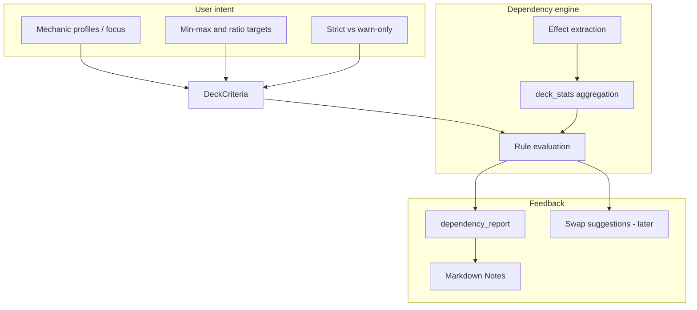

# Dependency engine — user experience and control model

Planning for **how users discover, constrain, and refine** card-dependency behavior alongside the technical engine in [10-card-dependency-engine.md](10-card-dependency-engine.md).

This document is intentionally **UI-agnostic at the core** (criteria + reports in `.deck.json`) but evaluates **terminal CLI vs richer UI** per interaction type, and defines schema hooks the engine must support so any future shell can reuse the same logic.

---

## Relationship to the dependency engine

| Concern | Owner doc | Notes |
| --- | --- | --- |
| What atoms exist, how they are extracted, validation rules | [10-card-dependency-engine.md](10-card-dependency-engine.md) | D0–D5 implementation phases |
| What users can **ask for**, **see**, and **change** | **This doc** | Drives `DeckCriteria` extensions and `dependency_report` shape |
| Deck file contract | [07-deck-output-format.md](07-deck-output-format.md) | `criteria`, Notes groups, future swap metadata |

**Design principle:** The engine evaluates **facts** (producers, consumers, tutor predicates). The UX layer expresses **intent** (which mechanics matter, how “focused” the deck should be). Keep intent in `DeckCriteria` / YAML profiles; keep evaluation in `rules/dependencies.py` + `card_effects`.



---

## What users are trying to control

Users rarely think in “effect atoms.” They think in **mechanics**, **roles**, and **how much** of the deck should revolve around them.

| User mental model | Engine mapping | Example |
| --- | --- | --- |
| “I want an energy deck” | `PRODUCES_RESOURCE` + `CONSUMES_RESOURCE` for `energy` | Aether Hub + payoffs |
| “Don’t make energy the whole deck” | **Focus cap** on energy-tagged cards (e.g. ≤12% of nonlands) | 4–5 energy cards, not 15 |
| “I need auras for this commander” | `SEARCH_FOR` + `REQUIRES_TYPE` for Aura | Tutors + enchantment density |
| “Enough elves for my lord” | `TYPE_SYNERGY_MIN` for subtype Elf | ≥5 other elves |
| “Strict — no dead tutors” | `strict_dependencies` + pick-time filter | Exclude tutors with 0 targets |

Three control dimensions:

1. **Enablement** — which dependency *classes* and *mechanics* are in scope for this build.
2. **Balance** — min/max counts and ratios for producers, consumers, and type payoffs.
3. **Enforcement** — warn in Notes vs block picks / fail validation.

---

## Mechanic and dependency catalog (user-facing)

Below is a **curated catalog** for UX copy and profile presets. The engine may implement subsets per phase (see doc 10); the UI should still list deferred items as “coming soon” only if exposed.

### Resource counters (produce / consume)

| Mechanic | Producer signal | Consumer signal | Typical user goal |
| --- | --- | --- | --- |
| **Energy** | `{E}`, “energy counter(s)” | “pay {E}”, “you may pay {E}” | Both sides present; 3–6 total cards often feels “supported” without dominating |
| **Experience** | “experience counter(s)” | “pay … experience” | Commander-centric; often 1–3 payoffs |
| **Rad counters** | “rad counter(s)” | “pay … rad” | Similar to energy; smaller card pool |
| **Oil / charge / brick** | set-specific oracle | spend counters | Lower priority unless theme selected |
| **Blood** (counters on players) | “blood counter” on opponent | cards that care about blood | Niche; warn-only unless user enables `blood` profile |
| **+1/+1 counters** | “put a +1/+1 counter” | “remove … counter”, “with a +1/+1 counter” | Often overlaps `counters` theme; use **type synergy** not just resource balance |

**User-facing knob:** “Energy focus” — *light* (incidental), *supported* (3–6 cards), *focused* (7–12), *engine* (13+). Maps to min/max nonland slots with energy atoms or `energy` tag.

### Tutors and search (target must exist)

| Pattern | User cares because | Default strictness |
| --- | --- | --- |
| Search for **land** | Obvious failure if 0 lands | Warn (should never happen) |
| Search for **Aura** | Enchantress / Voltron | Warn; strict optional |
| Search for **creature** with CMC cap | Toolbox / reanimator | Warn |
| Search for **artifact** / **enchantment** | Narrow tutors | Warn |
| **Any card** | Hard to validate | Skip or soft warn |

**User-facing knob:** “Honor tutor targets” (on/off) + per-type minimum targets in deck (usually ≥1).

### Type / subtype payoffs (“each other X”)

| Pattern | Example | Suggested min (nonland) when theme selected |
| --- | --- | --- |
| Subtype lord | “Other Elves get +1/+1” | 5–8 other Elves |
| Type matters | “Whenever you cast an Artifact spell” | 8–12 artifacts |
| **Vehicle** + crew | Vehicles without creatures | Vehicles ≥3, creatures ≥25 |
| **Aura** density | “Whenever you cast an Aura” | Auras ≥6–8 |

**User-facing knob:** “Synergy density” — *low* / *medium* / *high* maps to threshold multipliers (see Balance model).

### Sacrifice / aristocrats (paired roles)

Overlaps `aristocrats` theme but dependency engine can count:

| Role | Examples |
| --- | --- |
| **Fodder** | creatures that die easily, tokens |
| **Outlet** | “sacrifice a creature” |
| **Payoff** | “whenever a creature you control dies” |

**User-facing knob:** “Sacrifice package” — ensure ≥1 outlet and ≥1 payoff when fodder theme is on.

### Auras and equipment (Voltron / enchantress)

| Concern | Dependency |
| --- | --- |
| Aura tutors | `SEARCH_FOR` → Aura in library |
| Aura payoffs | `REQUIRES_TYPE` / cast triggers |
| **Aura removal risk** | Not a static dependency; UX note only |

**User-facing knob:** “Aura support” — min aura count + tutor target check.

### Graveyard / zone (soft, v1)

Delve, escape, reanimation — often **warning-only** with heuristics (creature count, mill). Defer strict balance to later phases.

---

## Balance model: counts, ratios, and “deck dominance”

### Problem

Including `energy` in **include mechanics** today boosts any card tagged `energy` but does **not**:

- Distinguish producers vs consumers.
- Cap how many energy cards appear.
- Tell the user when the deck is **too thin** (1 producer, 0 payoffs) or **too thick** (9 producers, 1 payoff — mechanic dominates).

### Proposed metrics (computed in `deck_stats`)

For each **mechanic profile** `M` (e.g. `energy`, `auras`, `elves`):

| Metric | Definition |
| --- | --- |
| `producers(M)` | Cards with `PRODUCES_RESOURCE` or profile-specific atom |
| `consumers(M)` | Cards with `CONSUMES_RESOURCE` |
| `payoffs(M)` | Type/subtype amplifiers, “whenever you …” for M |
| `tutors(M)` | `SEARCH_FOR` predicates referencing M |
| `total(M)` | Union of above (dedupe by `oracle_id`) |
| `share(M)` | `total(M) / nonland_count` (excludes commander from 99 if desired) |

### Default targets (configurable)

Store defaults in **`config/dependency-profiles.yaml`** (new), not hard-coded in Python:

```yaml
# Illustrative — balances are starting points for feedback text
profiles:
  energy:
  label: Energy counters
  roles: [producer, consumer]
  defaults:
    producer_min: 2
    producer_max: 6
    consumer_min: 2
    consumer_max: 8
    share_max: 0.12        # 12% of nonlands ≈ 7–8 cards at 60 nonlands
    consumer_per_producer_min: 0.5
  aura_support:
  label: Auras
  roles: [aura_spell, aura_tutor_target]
  defaults:
    aura_spell_min: 6
    aura_spell_max: 15
    share_max: 0.18
```

**Focus presets** (user selects one per profile or globally):

| Preset | `share_max` (approx) | Producer/consumer band | User message tone |
| --- | --- | --- | --- |
| **Incidental** | 5% | 1–2 each | “A splash of energy — don’t expect a full engine” |
| **Supported** | 10% | 2–5 producers, 2–6 consumers | “Energy should work when you draw it” |
| **Focused** | 15% | 3–6 / 3–8 | “Energy is a main plan” |
| **Engine** | 20%+ | User accepts dominance | “This deck is built around energy” |

### Ratio rules

| Rule | Condition | Severity |
| --- | --- | --- |
| `ONE_SIDED_RESOURCE` | producers ≥ 1 and consumers == 0 | Warn (Fail if strict) |
| `CONSUMER_WITHOUT_PRODUCER` | consumers ≥ 2 and producers == 0 | Warn |
| `IMBALANCED_RATIO` | consumers < 0.5 × producers (when producers ≥ 3) | Warn — “too much setup, not enough payoffs” |
| `OVER_CAP` | total(M) > profile.share_max × nonlands | Warn — “deck may feel one-note” |
| `UNDER_FLOOR` | user set `mechanic_focus[M]=supported` but total(M) < floor | Warn — “you asked for energy support but only 1 card” |

Thresholds should **scale with themes**: if `tokens` + `energy` both selected, apply the **stricter** share cap or sum caps with a global `max_themed_share`.

---

## User feedback: too little, too much, conflicting intent

### Feedback channels (all phases)

| Channel | When | Content |
| --- | --- | --- |
| **Post-build `dependency_report`** | Always (D2+) | Structured pass/warn/fail per rule |
| **Markdown Notes → “Deck dependencies”** | Always | Human summary + card names |
| **Wizard / CLI inline** | During criteria entry | Prevent impossible combos before generate |
| **Pick-time hints** | D3+ (optional verbose) | “Adding this leaves 0 aura targets for …” |

### Example messages (tone: actionable, not judgmental)

| Situation | Message |
| --- | --- |
| Too little energy | “You selected **Supported energy** but the list has 1 producer and 0 payoffs. Add 2–4 `{E}` payoffs or lower focus to Incidental.” |
| Too much energy | “12 cards reference energy (~20% of nonlands). Consider raising focus to **Engine** or removing 4–5 setup cards.” |
| Tutor gap | “**Enlightened Tutor** searches for enchantments; only 2 auras in the deck. Add auras or remove the tutor.” |
| Conflicting criteria | “**Avoid artifacts** conflicts with **Artifact synergy** thresholds. Artifact payoffs will be excluded from the pool.” |
| Strict mode block | “Generation skipped **Vampiric Tutor** — no creature with MV ≤3 in the remaining pool.” |

### “Spec health” preflight (before generate)

Run a lightweight **criteria linter** (no full deck):

| Check | Example |
| --- | --- |
| Conflicting include/avoid | include `energy` + avoid same tag |
| Unreachable profile | `aura_support: focused` with colors that ban enchantments |
| Over-constrained budget | strict budget + high rare minimum + 3 focused profiles |
| Too many focused profiles | >2 profiles at `focused` or `engine` → warn “deck may not have room for all plans” |

Return `criteria_warnings: []` in wizard output and optionally block until acknowledged.

---

## User control surface (criteria schema)

Extend `DeckCriteria` (and `.deck.json` `criteria`) in phases. Names are illustrative.

```python
# Illustrative Pydantic fields — align with implementation PRs
class MechanicFocus(BaseModel):
    profile_id: str           # energy, aura_support, elves, ...
    level: Literal["off", "incidental", "supported", "focused", "engine"]
    producer_min: int | None = None   # override preset
    consumer_min: int | None = None
    share_max: float | None = None

class DependencyPreferences(BaseModel):
    enabled: bool = True
    strict: bool = False              # maps to strict_dependencies
    honor_tutor_targets: bool = True
    mechanic_focus: list[MechanicFocus] = []
    disabled_rule_ids: list[str] = [] # power users
```

| Field | CLI v1 | Rich UI later |
| --- | --- | --- |
| `strict` | `--strict-dependencies` flag | Toggle |
| `mechanic_focus[]` | Subcommand or wizard step 2b | Sliders / presets per mechanic |
| Per-profile overrides | JSON edit in `.deck.json` | Advanced panel |
| `disabled_rule_ids` | Hidden / env var | Expert mode |

**Important:** Wizard step 2 today is flat **include/avoid mechanics** ([`mechanic-taxonomy.yaml`](../config/mechanic-taxonomy.yaml)). Do **not** replace it; **add** an optional “Synergy focus” step or flags so casual users stay on simple checkboxes.

---

## Understanding and swapping dependencies (future)

Not required for first engine release, but the **data model should not block** interactive editing.

### Transparency (what did the builder assume?)

Each card in `.deck.json` may gain optional:

```json
{
  "name": "Aether Hub",
  "dependency_roles": ["energy_producer"],
  "satisfies": ["rule:ENERGY_BALANCE.producer"],
  "introduces_gaps": []
}
```

Deck-level `dependency_report`:

```json
{
  "profiles": [
    {
      "id": "energy",
      "producers": 4,
      "consumers": 2,
      "share": 0.10,
      "status": "warn",
      "messages": ["consumers < recommended minimum (4)"]
    }
  ],
  "rules": [
    {
      "id": "TUTOR_TARGET_EXISTS",
      "card": "Enlightened Tutor",
      "status": "warn",
      "detail": "No Aura card in deck matches search"
    }
  ]
}
```

### Swap workflow (user replaces a dependency “package”)

| Step | Action |
| --- | --- |
| 1 | User opens dependency summary → selects “Energy package (6 cards)” |
| 2 | UI offers **alternatives** with same role histogram (4 prod / 2 cons) |
| 3 | `generate --from deck.json --swap-profile energy --seed N` or UI button |
| 4 | Re-run validator; show diff |

Engine requirements for swaps:

- Tag cards with **profile membership** at build time.
- Repair pass (D5) searches pool preserving `deck_stats` deltas per role.
- Swaps should prefer same **slot** (`synergy`, `flex`) before cross-slot.

---

## Is the terminal CLI appropriate?

### Summary

| Interaction | CLI fit | Recommendation |
| --- | --- | --- |
| On/off strict dependencies | **Good** | Flag on `generate` |
| Include/avoid mechanics (existing) | **Good** | Keep as-is |
| Post-build dependency report | **Good** | Markdown Notes + JSON |
| Focus presets (incidental → engine) | **Adequate** | Wizard step with numbered menu |
| Per-mechanic min/max overrides | **Poor** | JSON edit or defer to UI |
| Visual tutor target preview | **Poor** | Needs card images / list UI |
| Multi-profile balance dashboard | **Poor** | Web or desktop |
| Swap dependency package | **Poor** | Interactive selection |

**Conclusion:** CLI remains the **right first shell** for D0–D3 (reporting, strict flag, simple presets). Plan a **local web or desktop UI** when swap workflows, dashboards, and side-by-side card previews become requirements — reuse Option B/C from [04-architecture-options.md](04-architecture-options.md) without forking the engine.

### Phased UX roadmap

| Phase | UX deliverable | Engine dependency |
| --- | --- | --- |
| **UX0** | Document + `dependency-profiles.yaml` skeleton | None |
| **UX1** | Notes + `dependency_report`; `--strict-dependencies` | D2 |
| **UX2** | Wizard: “Synergy strictness” + 1–2 focus presets (energy, auras) | D2–D3 |
| **UX3** | `criteria` linter warnings in wizard | D2 + profiles |
| **UX4** | `.deck.json` per-card `dependency_roles` | D2 |
| **UX5** | Local web: dependency dashboard + swap | D5 + API wrapper |

---

## Impact on dependency engine design

Decisions here should **constrain** doc 10 implementation early:

| UX requirement | Engine consequence |
| --- | --- |
| Focus presets | Profiles in YAML; evaluator reads `criteria.mechanic_focus` |
| “Too much / too little” | `deck_stats` must expose per-profile counts and `share` |
| User disables a rule | Rule IDs stable and documented; evaluator skips disabled IDs |
| Future swaps | Persist `profile_id` on cards in build result; repair keyed by profile |
| Conflicting intent | Criteria linter runs **before** fill; pool already respects avoid list |
| Commander as target | Document in report when tutor satisfied **only** by commander |
| Feedback clarity | Every warn includes `profile_id`, `rule_id`, affected `oracle_id`s |

### Open questions (UX + engine joint)

1. **Global vs per-profile strictness** — one `strict` flag or per `MechanicFocus`?
2. **Auto-focus from commander** — pre-fill `elves` when commander is Elf tribal?
3. **Include mechanic vs focus** — does checking `energy` in include imply `supported` focus, or remain independent?
4. **Deck dominance across profiles** — single `max_themed_nonland_share` (e.g. 35%) for all focused mechanics combined?
5. **CLI wizard length** — new step 2b vs optional `mtg-deck-tools wizard --advanced`?

---

## Success criteria (UX)

- User enabling **Supported energy** receives a post-build note when producers/consumers fall outside the band, with **counts and card names**.
- User enabling **Engine** energy does **not** get “too much energy” warnings unless they also set a lower `share_max`.
- Preflight warns when **include/avoid** and **mechanic_focus** conflict before a 30s generate.
- `.deck.json` round-trips `dependency_preferences` so `generate --from` preserves user intent.
- Planning docs 10 and 11 stay cross-linked; implementation PRs cite which UX phase they satisfy.

---

## References

- [10-card-dependency-engine.md](10-card-dependency-engine.md) — atoms, rules, D0–D5
- [07-deck-output-format.md](07-deck-output-format.md) — `.deck.json` schema
- [04-architecture-options.md](04-architecture-options.md) — CLI vs web vs desktop
- [06-open-questions.md](06-open-questions.md) — deferred power level; UI timing
- [09-next-steps.md](09-next-steps.md) — backlog ordering
- [`config/mechanic-taxonomy.yaml`](../config/mechanic-taxonomy.yaml) — current include/avoid tags
