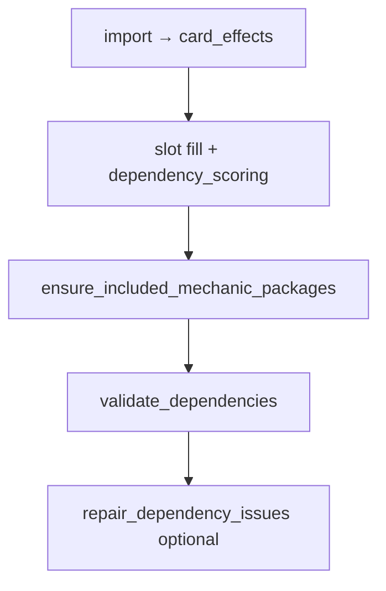

# Dependency engine — expansion roadmap (post D0–D5)

Status as of 2026-06-02. **D0–D5 is shipped** (validate, score, strict filter, repair, mechanic packages). This doc captures **what runs today**, **candidate effect atoms and rules**, and a **suggested build order** for the next dependency work.

**Agent merge gate:** Any PR that ships or changes dependency behavior must update this doc (shipped grid, inventory, sequence), [09-next-steps.md](09-next-steps.md), and user-facing [README.md](../README.md) in the **same PR**. Enforcement: [DOC-MAP.md](DOC-MAP.md), `.cursor/rules/`, skills `/sync-documentation` and `/ship-dependency-feature` — not CI.

Related: [10-card-dependency-engine.md](10-card-dependency-engine.md) (architecture), [11-dependency-engine-user-experience.md](11-dependency-engine-user-experience.md) (UX knobs), [DOC-MAP.md](DOC-MAP.md) (doc maintenance map), [`config/effect-patterns.yaml`](../config/effect-patterns.yaml), [`config/dependency-profiles.yaml`](../config/dependency-profiles.yaml), [`resources/dependency/hard-cases.yaml`](../resources/dependency/hard-cases.yaml).

---

## How dependencies participate in deck build

1. **Import** — `effect-patterns.yaml` → `card_effects` (required; rules no-op if table empty).
2. **Pick time (D3/D4)** — `dependency_scoring.py` biases or excludes candidates using partial-deck stats.
3. **Post-fill packages** — `mechanic_packages.py` swaps cards to meet profile floors when user intent or card-driven rules apply.
4. **Post-build (D2/D5)** — `validate_dependencies` emits warnings; `--repair-dependencies` attempts targeted swaps.

**Theme tags** (`card_mechanic_tags`) drive slot scoring and taxonomy; **dependency rules** primarily use **oracle-derived atoms**, not tags alone.

---

## Shipped inventory (2026-06-02)

### Effect kinds in `card_effects`

| `effect_kind` | Role |
| --- | --- |
| `search_library` | Tutor / search predicates (land, creature, artifact, enchantment, aura, CMC min/max, colored creature, land subtype, creature or planeswalker, any card) |
| `energy_produce` / `energy_consume` | Energy counter balance |
| `experience_produce` / `experience_consume` | Experience counter balance |
| `blood_produce` / `blood_consume` | Blood counter balance (player counters) |
| `plus_one_produce` / `plus_one_consume` | +1/+1 counter producers vs payoffs |
| `sacrifice_outlet` / `sacrifice_payoff` / `sacrifice_fodder` | Aristocrats package roles |
| `buff_subtype` | “Other Elves …” (and similar) subtype lords |
| `whenever_cast_type` | “Whenever you cast an Artifact spell …” |
| `whenever_cast_aura` | “Whenever you cast an Aura spell …” (voltron / aura support trigger) |
| `whenever_cast_enchantment` | “Whenever you cast an enchantment spell …” (enchantress / non-voltron) |
| `type_line_aura` | Aura on type line (extraction aid) |
| `token_produce` / `token_payoff` | Token producers vs “whenever you create a token” payoffs |
| `type_line_vehicle` | Vehicle on type line (crew density checks) |

### Validation rules (`rule_id`)

| Rule | Trigger | Scoped by |
| --- | --- | --- |
| `TUTOR_TARGET_EXISTS` | Tutor with zero matching targets in deck + commander pool | Always (card-driven) |
| `ENERGY_BALANCE` | Producers without consumers or reverse | `include_mechanics: [energy]` or ≥2 imbalanced cards |
| `EXPERIENCE_BALANCE` | Experience producers without consumers or reverse | `include_mechanics: [experience]` or ≥2 imbalanced cards |
| `BLOOD_BALANCE` | Blood producers without consumers or reverse | `include_mechanics: [blood]` or ≥2 imbalanced cards |
| `PLUS_ONE_BALANCE` | +1/+1 producers without consumers or reverse | `include_mechanics: [counters]` or ≥2 imbalanced cards |
| `SACRIFICE_BALANCE` | Outlets without payoffs or reverse | `themes: [aristocrats]` or ≥2 imbalanced cards |
| `TOKEN_BALANCE` | Producers without payoffs or reverse | `themes: [tokens]` or ≥2 imbalanced cards |
| `VEHICLE_BALANCE` | Vehicle count or crew creatures below floor | `include_mechanics: [vehicles]`, Vehicle lord in deck, or ≥2 vehicles |
| `TYPE_SYNERGY_MIN` | Subtype lord or type-matters payoff below suggested minimum | Card-driven (lord / cast trigger in deck) |
| `AURA_SUPPORT_MIN` | Aura count below floor | `themes: [voltron]`, aura tutors, or `whenever_cast_aura` payoffs |
| `ENCHANTMENT_SUPPORT_MIN` | Enchantment count below floor | `themes: [enchantress]`, enchantment tutors, or `whenever_cast_enchantment` payoffs |

### Mechanic packages (post-fill swaps)

| Package | Activation | Floors (defaults) |
| --- | --- | --- |
| Energy | `include_mechanics: [energy]` | ≥2 producers, ≥2 consumers |
| Experience | `include_mechanics: [experience]` | ≥1 producer, ≥2 consumers |
| Blood | `include_mechanics: [blood]` | ≥2 producers, ≥2 consumers |
| +1/+1 counters | `include_mechanics: [counters]` | ≥3 producers, ≥2 consumers |
| Sacrifice / aristocrats | `themes: [aristocrats]` | ≥2 outlets, ≥3 payoffs, ≥8 fodder |
| Auras | Voltron theme or card-driven aura check | ≥6 Aura spells |
| Enchantments | `themes: [enchantress]` or enchantment cast payoff / tutor in deck | ≥8 enchantments |
| Artifacts | `include_mechanics: [equip, vehicles]` or artifact cast payoff in deck | ≥8 artifacts |
| Subtype lords | Any `buff_subtype` lord detected | Per-subtype minimums in profile (Elf default 5) |
| Tokens | `themes: [tokens]` | ≥5 producers, ≥3 payoffs |
| Vehicles | `include_mechanics: [vehicles]` or Vehicle lord in deck | ≥3 Vehicles, ≥25 crew creatures |

### Dogfood coverage

[`config/dogfood-matrix.yaml`](../config/dogfood-matrix.yaml) — **25 scenarios** (tokens, voltron, energy, experience, blood, +1/+1 counters, elves, artifacts, aristocrats, landfall, goblins, vampires, enchantress, budget, strict/repair). Run: `mtg-deck-tools analyze run --fail-on-expect` after import.

---

## High-value additions (recommended next)

Each row follows the same delivery pattern: **patterns → import → rule → optional package → profile activation → dogfood scenario**.

### Priority 1 — Extend existing atoms (lowest risk)

| Work item | New / extended atoms | Rule / package | Activation | Notes |
| --- | --- | --- | --- | --- |
| ~~**Generic subtype lords**~~ | Extend `buff_subtype` capture (Goblin, Vampire, Dragon, Pirate, …) | Per-subtype floors in `subtype_lords` profile; lord package runs for any lord | Card-driven + optional tribal themes | **Shipped 2026-06** — per-subtype minimums (Elf, Goblin, Vampire, Pirate, Zombie, Dragon); Krenko/Edgar dogfood |
| ~~**Tokens package**~~ | `token_produce`, `token_payoff` | `TOKEN_BALANCE` | `themes: [tokens]` | **Shipped 2026-06** |
| ~~**Vehicles profile**~~ | `type_line_vehicle` + crew creature count | `VEHICLE_BALANCE` | `include_mechanics: [vehicles]` | **Shipped 2026-06** — `vehicle_min: 3`, `creature_min: 25` |
| ~~**Enchantment matters**~~ | `whenever_cast_enchantment` (non-Aura) | `ENCHANTMENT_SUPPORT_MIN` | `themes: [enchantress]` + card-driven | **Shipped 2026-06** — `enchantment_min: 8`; Sythis dogfood; separate from `AURA_SUPPORT_MIN` |

### ~~Priority 2 — Tutor payload upgrades~~

**Shipped 2026-06** — [`rules/tutor_payload.py`](../src/mtg_deck_tools/rules/tutor_payload.py): OR type matching (`type_match: any`), `min_cmc` / `max_cmc`, `colors`, land subtypes (Forest, …), creature-or-planeswalker patterns; validator loads card `colors` from DB. Patterns: `search_library_creature_cmc_min`, `search_library_colored_creature`, `search_library_land_subtype`, `search_library_creature_or_planeswalker`.

| Gap | Status |
| --- | --- |
| CMC bands (min / max) | Shipped |
| Color in search | Shipped |
| Named subtype land | Shipped |
| Multi-type tutors | Shipped |
| Named card search | Deferred (`REQUIRES_CARD` — rare) |
| `any_card` tutors | Unchanged (low confidence soft warn) 

### ~~Priority 3 — Resource counters (energy-shaped profiles)~~

**Shipped 2026-06** — [`rules/resource_counters.py`](../src/mtg_deck_tools/rules/resource_counters.py): experience, blood, and +1/+1 counter produce/consume atoms; `EXPERIENCE_BALANCE`, `BLOOD_BALANCE`, `PLUS_ONE_BALANCE`; `ensure_resource_counter_packages`; wizard `include_mechanics: [experience]`, `[blood]`, `[counters]`. Rad/oil/charge remain deferred (lower pool / theme-only).

| Resource | Status |
| --- | --- |
| **+1/+1 / proliferate** | Shipped — `plus_one_*` kinds, `PLUS_ONE_BALANCE` |
| **Experience** | Shipped — `experience_*`, `EXPERIENCE_BALANCE` |
| **Blood** | Shipped — `blood_*`, `BLOOD_BALANCE` |
| **Rad, oil, charge** | Deferred — format-specific; add when theme selected |

### Priority 4 — Sacrifice / tokens refinements

| Work item | Purpose |
| --- | --- |
| Token producers vs aristocrats fodder | `sacrifice_fodder` uses “create … token”; token *payoffs* are a separate axis |
| Opponent-sacrifice effects | Grave Pact-style — optional tag or pattern, not outlet |
| Persist / undying / escape | Death triggers without full aristocrats package |

### Priority 5 — Graveyard / landfall (warn-only first)

Planning doc [10](10-card-dependency-engine.md) §5: **soft dependencies** — deck composition + curve, not pure regex.

| Archetype | Heuristic | Strict package? |
| --- | --- | --- |
| **Reanimation** | “Return … from graveyard” + creature density / CMC | Warn first |
| **Delve / escape / flashback** | Nonland count in graveyard over time | Warn first |
| **Self-mill** | Mill enablers vs graveyard payoffs | Warn first |
| **Landfall** | Land ramp count vs landfall payoffs | Warn when `themes: [landfall]`; matrix today only checks “no unrelated noise” |

### Priority 6 — Equipment depth

Beyond artifact count: equip cost, “whenever equipped”, bodies to carry equipment — overlaps vehicles/ voltron; profile under `equip` / `voltron`.

---

## Explicit non-goals (stay out of `card_effects` for now)

| Concern | Why deferred | Where handled today |
| --- | --- | --- |
| Removal / wipe density | Slot template, not oracle atoms | `slot-templates.yaml`, themes |
| Curve / land count | Mana base planner | `mana_base.py`, validation |
| Named combo pairs | Needs external combo data | — |
| Power level / salt | No simple dial | [06-open-questions.md](06-open-questions.md) |
| Aura removal risk | Not statically provable | UX note in [11](11-dependency-engine-user-experience.md) |
| Commander partners / companion | Construction layer | `validate.py`, commander pick |
| In-game timing / stack | Non-goal per [10](10-card-dependency-engine.md) | — |

---

## Implementation checklist (per feature)

Canonical doc-update map: **[DOC-MAP.md](DOC-MAP.md)**. Agents: invoke **`/ship-dependency-feature`** for this checklist plus ship-status edits.

Use this for each expansion PR:

1. **Patterns** — Add ids to `config/effect-patterns.yaml`; golden cases in `tests/fixtures/effect_golden.yaml`.
2. **Import** — Re-run `mtg-deck-tools import`; note new `effect_count` in PR.
3. **Audit** — Optional `dependency-audit` refresh for pool-size evidence.
4. **Profile** — `config/dependency-profiles.yaml`: `activation`, `defaults`, `roles`.
5. **Scope** — `rules/dependency_scope.py` if deck-level gating needed.
6. **Validate** — New or extended `rule_id` in `rules/dependencies.py`.
7. **Build** — Floors in `rules/dependency_profiles.py`; scoring in `dependency_scoring.py`; package in `mechanic_packages.py`; repair in `dependency_repair.py`.
8. **Rubric** — `analysis/rubric.py` inappropriate vs appropriate for dogfood metrics.
9. **Dogfood** — Scenario in `config/dogfood-matrix.yaml` with `expect.dependency`.
10. **Tests** — Unit tests + `analyze run --fail-on-expect`.

---

## Suggested sequence (engineering)

Aligned with [09-next-steps.md](09-next-steps.md) and dogfood matrix coverage:

| Order | Deliverable | Rationale |
| --- | --- | --- |
| 1 | **Graveyard / landfall heuristics** | Warn-only rules before packages |
| 2 | **Rad / oil / charge counters** | Format-specific resource counters; theme-selected |

**Shipped (2026-06):** **Resource counters** (experience, blood, +1/+1); tutor payload upgrades (`TUTOR_TARGET_EXISTS` matching: CMC bands, colors, land subtypes, multi-type OR); enchantment matters profile (`ENCHANTMENT_SUPPORT_MIN`, `whenever_cast_enchantment`, `themes: [enchantress]`); subtype lord generalization (`TYPE_SYNERGY_MIN`, `ensure_subtype_lord_packages`, `subtype_lords` profile); Tokens package (`TOKEN_BALANCE`); Vehicles profile (`VEHICLE_BALANCE`, crew density).

**Parallel track:** **UX2** wizard controls for `strict_dependencies`, `repair_dependencies`, and `mechanic_focus` ([11](11-dependency-engine-user-experience.md)) — does not block pattern work but improves user-facing control.

---

## References

- Deferred card stances: [`resources/dependency/hard-cases.yaml`](../resources/dependency/hard-cases.yaml) (`v1_stance`: `defer_tokens`, `defer_vehicles`, `defer_graveyard`, `defer_counters`, …)
- Profile thresholds: [`config/dependency-profiles.yaml`](../config/dependency-profiles.yaml)
- Automated regression: [14-deck-analysis.md](14-deck-analysis.md)
- Locked v1 scope: [13-dependency-engine-decisions.md](13-dependency-engine-decisions.md)
