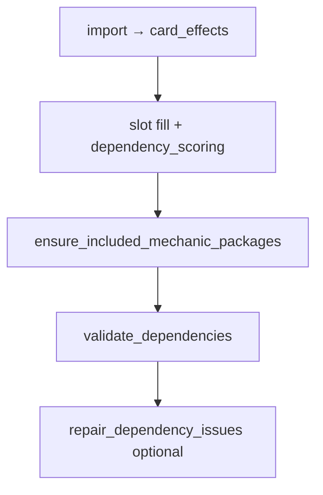

# Dependency engine — expansion roadmap (post D0–D5)

Status as of 2026-06-02. **D0–D5 is shipped** (validate, score, strict filter, repair, mechanic packages). This doc captures **what runs today**, **candidate effect atoms and rules**, and a **suggested build order** for the next dependency work.

**Agent merge gate:** Any PR that ships or changes dependency behavior must update this doc (shipped grid, inventory, sequence), [09-next-steps.md](09-next-steps.md), and user-facing [README.md](../README.md) in the **same PR**. Enforcement: [DOC-MAP.md](DOC-MAP.md), `.cursor/rules/`, skills `/sync-documentation` and `/ship-dependency-feature` — not CI.

Related: [10-card-dependency-engine.md](10-card-dependency-engine.md) (architecture), [11-dependency-engine-user-experience.md](11-dependency-engine-user-experience.md) (UX knobs), [DOC-MAP.md](DOC-MAP.md) (doc maintenance map), [`config/effect-patterns.yaml`](../config/effect-patterns.yaml), [`config/dependency-profiles.yaml`](../config/dependency-profiles.yaml), [`resources/dependency/hard-cases.yaml`](../resources/dependency/hard-cases.yaml).

---

## How dependencies participate in deck build

1. **Import** — `effect-patterns.yaml` → `card_effects` (required; rules no-op if table empty).
2. **Pick time (D3/D4)** — `dependency_scoring.py` biases or excludes candidates using partial-deck stats.
3. **Post-fill packages** — `mechanic_packages.py` swaps cards to meet profile floors when user intent or card-driven rules apply.
4. **Post-build (D2/D5)** — `validate_dependencies` emits warnings; `--repair-dependencies` attempts targeted swaps.

**Theme tags** (`card_mechanic_tags`) drive slot scoring and taxonomy; **dependency rules** primarily use **oracle-derived atoms**, not tags alone.

---

## Shipped inventory (2026-06-02)

### Effect kinds in `card_effects`

| `effect_kind` | Role |
| --- | --- |
| `search_library` | Tutor / search predicates (land, creature, artifact, enchantment, aura, CMC min/max, colored creature, land subtype, creature or planeswalker, any card) |
| `energy_produce` / `energy_consume` | Energy counter balance |
| `experience_produce` / `experience_consume` | Experience counter balance |
| `blood_produce` / `blood_consume` | Blood counter balance (player counters) |
| `rad_produce` / `rad_consume` | Rad counter balance (player radiation) |
| `oil_produce` / `oil_consume` | Oil counter balance (Phyrexia / permanent) |
| `charge_produce` / `charge_consume` | Charge counter balance (artifacts / generic) |
| `plus_one_produce` / `plus_one_consume` | +1/+1 counter producers vs payoffs |
| `sacrifice_outlet` / `sacrifice_payoff` / `sacrifice_fodder` | Aristocrats package roles (`token_produce` counts as fodder) |
| `sacrifice_opponent` | Grave Pact-style forced sacrifice (not an outlet) |
| `death_recursion` | Persist, undying, escape-from-graveyard (supports payoffs without outlets) |
| `buff_subtype` | “Other Elves …” (and similar) subtype lords |
| `whenever_cast_type` | “Whenever you cast an Artifact spell …” |
| `whenever_cast_aura` | “Whenever you cast an Aura spell …” (voltron / aura support trigger) |
| `whenever_cast_enchantment` | “Whenever you cast an enchantment spell …” (enchantress / non-voltron) |
| `type_line_aura` | Aura on type line (extraction aid) |
| `token_produce` / `token_payoff` | Token producers vs generic payoffs (create / enter / for each / “tokens you control get …”) — **not** subtype-matched buffs (see Priority 8) |
| `type_line_vehicle` | Vehicle on type line (crew density checks) |
| `type_line_equipment` | Equipment on type line (equip depth checks) |
| `whenever_equipped` | “Whenever equipped” / equip payoff triggers |
| `reanimate` | Return target from graveyard to battlefield/hand |
| `graveyard_cost` | Delve / flashback (needs graveyard fodder over time) |
| `mill_enabler` | Self-mill and explicit “put top … of library into graveyard” only — **not** surveil/discover (see Priority 7) |
| `graveyard_payoff` | “For each … in your graveyard” and similar payoffs |
| `landfall_payoff` | Landfall keyword triggers |
| `land_ramp` | Spells that put lands onto the battlefield |

### Validation rules (`rule_id`)

| Rule | Trigger | Scoped by |
| --- | --- | --- |
| `TUTOR_TARGET_EXISTS` | Tutor with zero matching targets in deck + commander pool | Always (card-driven) |
| `ENERGY_BALANCE` | Producers without consumers or reverse | `include_mechanics: [energy]` or ≥2 imbalanced cards |
| `EXPERIENCE_BALANCE` | Experience producers without consumers or reverse | `include_mechanics: [experience]` or ≥2 imbalanced cards |
| `BLOOD_BALANCE` | Blood producers without consumers or reverse | `include_mechanics: [blood]` or ≥2 imbalanced cards |
| `RAD_BALANCE` | Rad producers without consumers or reverse | `include_mechanics: [rad]` or ≥2 imbalanced cards |
| `OIL_BALANCE` | Oil producers without consumers or reverse | `include_mechanics: [oil]` or ≥3 imbalanced cards |
| `CHARGE_BALANCE` | Charge producers without consumers or reverse | `include_mechanics: [charge]` or ≥5 imbalanced cards |
| `PLUS_ONE_BALANCE` | +1/+1 producers without consumers or reverse | `include_mechanics: [counters]` or ≥2 imbalanced cards |
| `SACRIFICE_BALANCE` | Outlets without payoffs or reverse | `themes: [aristocrats]` or ≥2 imbalanced cards |
| `TOKEN_BALANCE` | Producers without payoffs or reverse | `themes: [tokens]` or ≥2 imbalanced cards |
| `VEHICLE_BALANCE` | Vehicle count or crew creatures below floor | `include_mechanics: [vehicles]`, Vehicle lord in deck, or ≥2 vehicles |
| `EQUIPMENT_BALANCE` | Equipment count, carrier creatures, or equip payoffs without pieces | `include_mechanics: [equip]`, `themes: [voltron]`, whenever-equipped payoffs, or ≥2 Equipment |
| `TYPE_SYNERGY_MIN` | Subtype lord or type-matters payoff below suggested minimum | Card-driven (lord / cast trigger in deck) |
| `AURA_SUPPORT_MIN` | Aura count below floor | `themes: [voltron]`, aura tutors, or `whenever_cast_aura` payoffs |
| `ENCHANTMENT_SUPPORT_MIN` | Enchantment count below floor | `themes: [enchantress]`, enchantment tutors, or `whenever_cast_enchantment` payoffs |
| `REANIMATION_SUPPORT` | Reanimation without creature density / curve | Card-driven when `reanimate` in deck |
| `GRAVEYARD_COST_SUPPORT` | Delve/flashback with thin nonland count | Card-driven when ≥2 `graveyard_cost` cards |
| `SELF_MILL_BALANCE` | Mill enablers vs graveyard payoffs | `themes: [recursion]` or ≥2 imbalanced cards |
| `LANDFALL_BALANCE` | Landfall payoffs without land ramp | `themes: [landfall]` or ≥2 landfall payoffs |

### Mechanic packages (post-fill swaps)

| Package | Activation | Floors (defaults) |
| --- | --- | --- |
| Energy | `include_mechanics: [energy]` | ≥2 producers, ≥2 consumers |
| Experience | `include_mechanics: [experience]` | ≥1 producer, ≥2 consumers |
| Blood | `include_mechanics: [blood]` | ≥2 producers, ≥2 consumers |
| Rad | `include_mechanics: [rad]` | ≥2 producers, ≥1 consumer |
| Oil | `include_mechanics: [oil]` | ≥2 producers, ≥2 consumers |
| Charge | `include_mechanics: [charge]` | ≥2 producers, ≥2 consumers |
| +1/+1 counters | `include_mechanics: [counters]` | ≥3 producers, ≥2 consumers |
| Sacrifice / aristocrats | `themes: [aristocrats]` | ≥2 outlets, ≥3 payoffs, ≥8 fodder |
| Auras | Voltron theme or card-driven aura check | ≥6 Aura spells |
| Enchantments | `themes: [enchantress]` or enchantment cast payoff / tutor in deck | ≥8 enchantments |
| Artifacts | `include_mechanics: [equip, vehicles]` or artifact cast payoff in deck | ≥8 artifacts |
| Subtype lords | Any `buff_subtype` lord detected | Per-subtype minimums in profile (Elf default 5) |
| Tokens | `themes: [tokens]` | ≥5 producers, ≥3 payoffs |
| Vehicles | `include_mechanics: [vehicles]` or Vehicle lord in deck | ≥3 Vehicles, ≥25 crew creatures |
| Equipment | `include_mechanics: [equip]` or `themes: [voltron]` or equip payoffs in deck | ≥4 Equipment, ≥22 carrier creatures |

### Dogfood coverage

[`config/dogfood-matrix.yaml`](../config/dogfood-matrix.yaml) — **28 scenarios** (tokens, voltron, energy, experience, blood, +1/+1, rad, oil, charge, elves, artifacts, aristocrats, landfall, goblins, vampires, enchantress, budget, strict/repair). Run: `mtg-deck-tools analyze run --fail-on-expect` after import.

---

## High-value additions (recommended next)

Each row follows the same delivery pattern: **patterns → import → rule → optional package → profile activation → dogfood scenario**.

### Priority 1 — Extend existing atoms (lowest risk)

| Work item | New / extended atoms | Rule / package | Activation | Notes |
| --- | --- | --- | --- | --- |
| ~~**Generic subtype lords**~~ | Extend `buff_subtype` capture (Goblin, Vampire, Dragon, Pirate, …) | Per-subtype floors in `subtype_lords` profile; lord package runs for any lord | Card-driven + optional tribal themes | **Shipped 2026-06** — per-subtype minimums (Elf, Goblin, Vampire, Pirate, Zombie, Dragon); Krenko/Edgar dogfood |
| ~~**Tokens package**~~ | `token_produce`, `token_payoff` | `TOKEN_BALANCE` | `themes: [tokens]` | **Shipped 2026-06** — generic producers/payoffs only; subtype buff pairing → **Priority 8** |
| ~~**Vehicles profile**~~ | `type_line_vehicle` + crew creature count | `VEHICLE_BALANCE` | `include_mechanics: [vehicles]` | **Shipped 2026-06** — `vehicle_min: 3`, `creature_min: 25` |
| ~~**Enchantment matters**~~ | `whenever_cast_enchantment` (non-Aura) | `ENCHANTMENT_SUPPORT_MIN` | `themes: [enchantress]` + card-driven | **Shipped 2026-06** — `enchantment_min: 8`; Sythis dogfood; separate from `AURA_SUPPORT_MIN` |

### ~~Priority 2 — Tutor payload upgrades~~

**Shipped 2026-06** — [`rules/tutor_payload.py`](../src/mtg_deck_tools/rules/tutor_payload.py): OR type matching (`type_match: any`), `min_cmc` / `max_cmc`, `colors`, land subtypes (Forest, …), creature-or-planeswalker patterns; validator loads card `colors` from DB. Patterns: `search_library_creature_cmc_min`, `search_library_colored_creature`, `search_library_land_subtype`, `search_library_creature_or_planeswalker`.

| Gap | Status |
| --- | --- |
| CMC bands (min / max) | Shipped |
| Color in search | Shipped |
| Named subtype land | Shipped |
| Multi-type tutors | Shipped |
| Named card search | Deferred (`REQUIRES_CARD` — rare) |
| `any_card` tutors | Unchanged (low confidence soft warn) 

### ~~Priority 3 — Resource counters (energy-shaped profiles)~~

**Shipped 2026-06** — [`rules/resource_counters.py`](../src/mtg_deck_tools/rules/resource_counters.py): experience, blood, +1/+1, rad, oil, and charge counter produce/consume atoms; `EXPERIENCE_BALANCE`, `BLOOD_BALANCE`, `PLUS_ONE_BALANCE`, `RAD_BALANCE`, `OIL_BALANCE`, `CHARGE_BALANCE`; `ensure_resource_counter_packages`; wizard `include_mechanics: [experience]`, `[blood]`, `[counters]`, `[rad]`, `[oil]`, `[charge]`.

| Resource | Status |
| --- | --- |
| **+1/+1 / proliferate** | Shipped — `plus_one_*` kinds, `PLUS_ONE_BALANCE` |
| **Experience** | Shipped — `experience_*`, `EXPERIENCE_BALANCE` |
| **Blood** | Shipped — `blood_*`, `BLOOD_BALANCE` |
| ~~**Rad, oil, charge**~~ | **Shipped 2026-06** — `rad_*`, `oil_*`, `charge_*`; theme-selected via `include_mechanics`; charge/oil use higher `incidental_imbalance_min` (5 / 3) |

### ~~Priority 4 — Sacrifice / tokens refinements~~

**Shipped 2026-06** — [`rules/sacrifice_roles.py`](../src/mtg_deck_tools/rules/sacrifice_roles.py): `token_produce` counts toward aristocrats fodder; `sacrifice_opponent` and `death_recursion` atoms; opponent/ recursion enablers satisfy `SACRIFICE_BALANCE` without player sacrifice outlets.

| Work item | Status |
| --- | --- |
| ~~Token producers vs aristocrats fodder~~ | Shipped — shared fodder axis; token payoffs stay on `TOKEN_BALANCE` |
| ~~Opponent-sacrifice effects~~ | Shipped — `sacrifice_opponent`; excluded from `sacrifice_outlet` |
| ~~Persist / undying / escape~~ | Shipped — `death_recursion`; ≥2 pieces support payoffs without outlets |

### ~~Priority 5 — Graveyard / landfall (warn-only first)~~

**Shipped 2026-06** — [`rules/graveyard_landfall.py`](../src/mtg_deck_tools/rules/graveyard_landfall.py): `reanimate`, `graveyard_cost`, `mill_enabler`, `graveyard_payoff`, `landfall_payoff`, `land_ramp` atoms; `REANIMATION_SUPPORT`, `GRAVEYARD_COST_SUPPORT`, `SELF_MILL_BALANCE`, `LANDFALL_BALANCE` (warn-only; no packages yet). Profiles: `graveyard` (`themes: [recursion]`), `landfall` (`themes: [landfall]`).

| Archetype | Heuristic | Status |
| --- | --- | --- |
| ~~**Reanimation**~~ | “Return … from graveyard” + creature density / CMC | Shipped — `REANIMATION_SUPPORT` |
| ~~**Delve / flashback**~~ | Nonland count proxy for graveyard fodder | Shipped — `GRAVEYARD_COST_SUPPORT` |
| ~~**Self-mill**~~ | Mill enablers vs graveyard payoffs | Shipped — `SELF_MILL_BALANCE` |
| ~~**Landfall**~~ | Land ramp count vs landfall payoffs | Shipped — `LANDFALL_BALANCE` when `themes: [landfall]` or ≥2 payoffs |

### ~~Priority 7 — Graveyard filler atoms (surveil, discover, generic mill)~~

**Shipped 2026-06** — `mill_enabler_surveil_discover`, `graveyard_filler_discard` (same `mill_enabler` kind for `SELF_MILL_BALANCE`); taxonomy `surveil`; dogfood `surveil-mirko`. No post-fill package.

### Priority 8 — Token subtype buffs (match payoffs to produced token types)

**Not shipped.** Shipped **Priority 4 / tokens profile** counts generic `token_produce` and `token_payoff` only. A token-themed deck can get makers plus cards that care about **any** token (create triggers, “for each token you control”, broad “tokens you control get +1/+1”), but the builder does **not** ensure buffs for the **specific** token types the deck creates (Angel vs Treasure vs Goblin vs Clue, etc.).

| Gap | Example | Today | Target |
| --- | --- | --- | --- |
| **Producer subtype** | “Create a Treasure token”, “create a 3/3 white Angel creature token” | `token_produce` regex may see words before `token`; payload has no `subtypes` | Capture token subtype(s) on produce atoms (e.g. `Treasure`, `Angel`, `Goblin`) |
| **Subtype buff** | “Angel tokens you control get +1/+1”, “Goblin tokens get +1/+1” | `buff_subtype` only matches “Other **Elves** you control” (creature lords), not token-type text | New `token_buff_subtype` (or extend payoff patterns) with payload `subtypes: [Angel]` |
| **Deck balance** | Deck makes Treasures but only generic token payoffs | `TOKEN_BALANCE` checks producer vs payoff **counts** only | Warn / package: dominant produce subtype(s) should have ≥1 matching buff (or generic anthem counts as partial) |
| **Pick-time** | — | Scoring boosts any `token_payoff` when `themes: [tokens]` | Boost payoffs whose buff subtype overlaps deck’s aggregated produce subtypes |

**Proposed delivery** (same checklist as § Implementation checklist):

1. **Patterns** — Extend `token_produce` capture; add `token_buff_subtype` / `token_payoff_buff` regexes in `effect-patterns.yaml`; golden cases (Treasure matters, Angel anthem, Intangible Virtue as generic vs specific).
2. **Import** — Re-run `import`; audit hit counts per token subtype in `dependency-audit` evidence.
3. **Validate** — New rule e.g. `TOKEN_SUBTYPE_BUFF_SUPPORT` (warn-only first): when ≥N producers share subtype X, deck should include a buff/payoff for X or document generic fallback.
4. **Package** — Extend `ensure_token_package` to swap in subtype-matched payoffs (protect producers; similar to lord protection in token package today).
5. **Scoring** — `dependency_scoring.py` overlap between candidate payoff subtypes and `deck_stats.token_produce_subtypes`.
6. **Dogfood** — Scenario with mono-subtype token commander or forced Treasure shell; `expect.dependency` for new rule when calibrated.

**Activation:** `themes: [tokens]` and/or card-driven when aggregated produce subtypes exceed threshold (e.g. ≥3 cards making Treasure).

**Non-goals for this row:** Token **layout** cards in Scryfall bulk (acquisition list is [07-deck-output-format.md](07-deck-output-format.md) § Related token cards); “target Angel” activated abilities without buff (separate `target_subtype` idea); simulating token **creature** vs **artifact** legality on the stack.

### ~~Priority 6 — Equipment depth~~

**Shipped 2026-06** — [`rules/equipment_depth.py`](../src/mtg_deck_tools/rules/equipment_depth.py): `type_line_equipment`, `whenever_equipped`; `EQUIPMENT_BALANCE`; `ensure_equipment_package`; profile `equipment` (`equipment_min: 4`, `carrier_creature_min: 22`; activation `include_mechanics: [equip]`, `themes: [voltron]`).

| Work item | Status |
| --- | --- |
| ~~Equip pieces beyond artifact count~~ | Shipped — `type_line_equipment` + `EQUIPMENT_BALANCE` floor |
| ~~“Whenever equipped” payoffs~~ | Shipped — `whenever_equipped`; warns when payoffs lack Equipment |
| ~~Bodies to carry equipment~~ | Shipped — carrier creature minimum when Equipment present |

---

## Explicit non-goals (stay out of `card_effects` for now)

| Concern | Why deferred | Where handled today |
| --- | --- | --- |
| Removal / wipe density | Slot template, not oracle atoms | `slot-templates.yaml`, themes |
| Curve / land count | Mana base planner (avg CMC + ramp → land count) | `mana_base.py`, validation |
| Deck-wide CMC distribution / “good curve” UX | Post-build metrics & optional advisories, not `card_effects` | Planned **UX8** — [07-deck-output-format.md](07-deck-output-format.md), [11](11-dependency-engine-user-experience.md) |
| Named combo pairs | Needs external combo data | — |
| Power level / salt | No simple dial | [06-open-questions.md](06-open-questions.md) |
| Aura removal risk | Not statically provable | UX note in [11](11-dependency-engine-user-experience.md) |
| Commander partners / companion | Construction layer | `validate.py`, commander pick |
| In-game timing / stack | Non-goal per [10](10-card-dependency-engine.md) | — |

---

## Implementation checklist (per feature)

Canonical doc-update map: **[DOC-MAP.md](DOC-MAP.md)**. Agents: invoke **`/ship-dependency-feature`** for this checklist plus ship-status edits.

Use this for each expansion PR:

1. **Patterns** — Add ids to `config/effect-patterns.yaml`; golden cases in `tests/fixtures/effect_golden.yaml`.
2. **Import** — Re-run `mtg-deck-tools import`; note new `effect_count` in PR.
3. **Audit** — Optional `dependency-audit` refresh for pool-size evidence.
4. **Profile** — `config/dependency-profiles.yaml`: `activation`, `defaults`, `roles`.
5. **Scope** — `rules/dependency_scope.py` if deck-level gating needed.
6. **Validate** — New or extended `rule_id` in `rules/dependencies.py`.
7. **Build** — Floors in `rules/dependency_profiles.py`; scoring in `dependency_scoring.py`; package in `mechanic_packages.py`; repair in `dependency_repair.py`.
8. **Rubric** — `analysis/rubric.py` inappropriate vs appropriate for dogfood metrics.
9. **Dogfood** — Scenario in `config/dogfood-matrix.yaml` with `expect.dependency`.
10. **Tests** — Unit tests + `analyze run --fail-on-expect`.

---

## Suggested sequence (engineering)

Aligned with [09-next-steps.md](09-next-steps.md) and dogfood matrix coverage:

| Order | Deliverable | Rationale |
| --- | --- | --- |
| ~~0~~ | ~~**Dogfood matrix 25/25**~~ | **Done 2026-06-03** — blood consume patterns; +1/+1 incidental threshold |
| ~~1~~ | ~~**Rad / oil / charge counters**~~ | **Done 2026-06-03** — `rad_*`, `oil_*`, `charge_*`; dogfood `rad-mothman`, `oil-migloz`, `charge-immard` |
| ~~2~~ | ~~**Equipment depth**~~ | **Done 2026-06** — `EQUIPMENT_BALANCE`, `type_line_equipment`, `whenever_equipped` |
| **3** | **Graveyard filler atoms (Priority 7)** | Surveil, discover, broader GY enablers → `SELF_MILL_BALANCE` accuracy; patterns + dogfood before optional package |
| **4** | **Token subtype buffs (Priority 8)** | Match payoffs/anthems to produced token types; extend `TOKEN_BALANCE` / `ensure_token_package` beyond generic payoffs |

**Shipped (2026-06):** **Equipment depth** (`EQUIPMENT_BALANCE`, `ensure_equipment_package`, `type_line_equipment`, `whenever_equipped`; profile `equipment`); **Rad / oil / charge counters** (`RAD_BALANCE`, `OIL_BALANCE`, `CHARGE_BALANCE`; profiles `rad`, `oil`, `charge`; wizard `include_mechanics`); **Resource counters** (experience, blood, +1/+1); tutor payload upgrades (`TUTOR_TARGET_EXISTS` matching: CMC bands, colors, land subtypes, multi-type OR); enchantment matters profile (`ENCHANTMENT_SUPPORT_MIN`, `whenever_cast_enchantment`, `themes: [enchantress]`); subtype lord generalization (`TYPE_SYNERGY_MIN`, `ensure_subtype_lord_packages`, `subtype_lords` profile); Tokens package (`TOKEN_BALANCE`); Vehicles profile (`VEHICLE_BALANCE`, crew density); **Sacrifice / token refinements** (`sacrifice_opponent`, `death_recursion`, aristocrats fodder includes `token_produce`); **Graveyard / landfall heuristics** (`REANIMATION_SUPPORT`, `GRAVEYARD_COST_SUPPORT`, `SELF_MILL_BALANCE`, `LANDFALL_BALANCE`; profiles `graveyard`, `landfall`).

**Parallel track:** ~~**UX2**~~ wizard controls for `strict_dependencies`, `repair_dependencies`, and `mechanic_focus` — **Shipped 2026-06-03** (wizard step 3; [11](11-dependency-engine-user-experience.md)).

---

## References

- Deferred card stances: [`resources/dependency/hard-cases.yaml`](../resources/dependency/hard-cases.yaml) (`v1_stance`: `defer_tokens`, `defer_vehicles`, `defer_graveyard`, `defer_counters`, …)
- Profile thresholds: [`config/dependency-profiles.yaml`](../config/dependency-profiles.yaml)
- Automated regression: [14-deck-analysis.md](14-deck-analysis.md)
- Locked v1 scope: [13-dependency-engine-decisions.md](13-dependency-engine-decisions.md)
